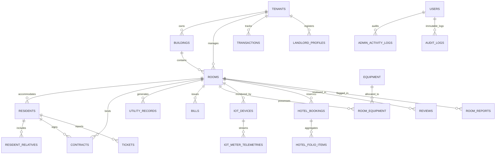
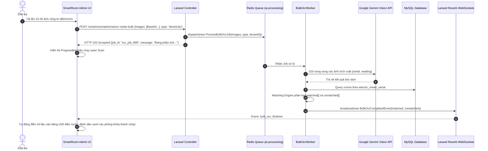
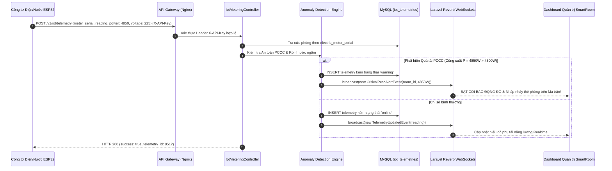

# TRƯỜNG CAO ĐẲNG CÔNG NGHỆ THỦ ĐỨC
## KHOA CÔNG NGHỆ THÔNG TIN

---

# BÁO CÁO ĐỒ ÁN CHUYÊN ĐỀ PHÁT TRIỂN WEB 1

### ĐỀ TÀI:
# HỆ THỐNG QUẢN LÝ NHÀ TRỌ, CHUNG CƯ, CĂN HỘ DỊCH VỤ VÀ KHÁCH SẠN THÔNG MINH (RENTRY & SMARTROOM)

| STT | Họ và Tên Sinh Viên | Mã Số Sinh Viên | Chức Vụ Trong Nhóm | Phân Hệ Phụ Trách Chính |
| :---: | :--- | :---: | :---: | :--- |
| **01** | **Nguyễn Thanh Hiền** | 24211TT3646 | **Nhóm Trưởng** | Kiến trúc Laravel 11, Docker, WebAuthn Passkey, Multi-tenancy, Bảo mật PII, Ký số Canvas + OTP, Duyệt KYC Admin & Audit Logs |
| **02** | **Huỳnh Văn Vĩnh Em** | 24211TT1288 | **Nhóm Phó** | Cổng Renty Portal, So sánh phòng, AI Chatbot RAG, Cổng cư dân, Sự cố Tickets, Khai báo tạm trú CT01, Lễ tân & Buồng phòng |
| **03** | **Nguyễn Anh Quý** | 24211TT3159 | **Thành Viên** | Quản lý Cơ sở & Phòng, Ma trận phòng Realtime Reverb, AI Bulk OCR + IoT Smart Metering, Hóa đơn VietQR, Sổ quỹ & Trang thiết bị |

**GIẢNG VIÊN HƯỚNG DẪN:** THẦY PHAN THANH NHUẦN  
**Niên khóa:** 2024 – 2026 | **Thời điểm nghiệm thu:** Năm 2026  
**Thành phố Hồ Chí Minh, Năm 2026**

---

# MỤC LỤC

- [DANH MỤC TỪ VIẾT TẮT](#danh-mục-từ-viết-tắt)
- [LỜI MỞ ĐẦU](#lời-mở-đầu)
- [I. KẾ HOẠCH LÀM VIỆC NHÓM](#i-kế-hoạch-làm-việc-nhóm)
  - [1. Bảng phân chia công việc chi tiết (Bảng 2)](#1-bảng-phân-chia-công-việc-chi-tiết-bảng-2)
  - [2. Bảng báo cáo phiên họp nhóm (Bảng 3)](#2-bảng-báo-cáo-phiên-họp-nhóm-bảng-3)
- [II. GIỚI THIỆU ĐỀ TÀI VÀ MÔ TẢ CHỨC NĂNG](#ii-giới-thiệu-đề-tài-và-mô-tả-chức-năng)
  - [1. Giới thiệu đề tài](#1-giới-thiệu-đề-tài)
  - [2. Bảng danh mục chức năng và Endpoint API hệ thống (Bảng 4)](#2-bảng-danh-mục-chức-năng-và-endpoint-api-hệ-thống-bảng-4)
- [III. DATABASE VÀ MÔ HÌNH ERD (48 MIGRATIONS)](#iii-database-và-mô-hình-erd-48-migrations)
  - [1. Mô hình ERD (Entity Relationship Diagram)](#1-mô-hình-erd-entity-relationship-diagram)
  - [2. Từ điển dữ liệu (Data Dictionary - 12 Thực thể cốt lõi)](#2-từ-điển-dữ-liệu-data-dictionary---12-thực-thể-cốt-lõi)
- [IV. ĐẶC TẢ KỸ THUẬT VÀ KỊCH BẢN XỬ LÝ LỖI (UI/UX SPECIFICATIONS)](#iv-đặc-tả-kỹ-thuật-và-kịch-bản-xử-lý-lỗi-uiux-specifications)
  - [A. PHÂN HỆ DO NGUYỄN THANH HIỀN (NHÓM TRƯỞNG) PHỤ TRÁCH](#a-phân-hệ-do-nguyễn-thanh-hiền-nhóm-trưởng-phụ-trách)
  - [B. PHÂN HỆ DO HUỲNH VĂN VĨNH EM (NHÓM PHÓ) PHỤ TRÁCH](#b-phân-hệ-do-huỳnh-văn-vĩnh-em-nhóm-phó-phụ-trách)
  - [C. PHÂN HỆ DO NGUYỄN ANH QUÝ (THÀNH VIÊN) PHỤ TRÁCH](#c-phân-hệ-do-nguyễn-anh-quý-thành-viên-phụ-trách)
- [TÀI LIỆU THAM KHẢO](#tài-liệu-tham-khảo)

---

# DANH MỤC TỪ VIẾT TẮT

| STT | Chữ Viết Tắt | Ý Nghĩa Tiếng Việt | Thuật Ngữ Tiếng Anh |
| :---: | :--- | :--- | :--- |
| 1 | **API** | Giao diện lập trình ứng dụng | Application Programming Interface |
| 2 | **AES-256-GCM** | Chuẩn mã hóa dữ liệu nâng cao 256-bit đối xứng Galois/Counter Mode | Advanced Encryption Standard Galois/Counter Mode |
| 3 | **AI** | Trí tuệ nhân tạo | Artificial Intelligence |
| 4 | **ANTT** | An ninh và trật tự an toàn xã hội | Security and Order |
| 5 | **CRUD** | Bốn thao tác dữ liệu cơ bản: Tạo, Đọc, Sửa, Xóa | Create, Read, Update, Delete |
| 6 | **CSDL** | Cơ sở dữ liệu | Database |
| 7 | **FIDO2 / WebAuthn** | Chuẩn xác thực web sinh trắc học không mật khẩu (Passkey) | Web Authentication / Fast Identity Online |
| 8 | **IoT** | Internet vạn vật đo xa công tơ điện nước thông minh | Internet of Things |
| 9 | **KYC** | Quy trình định danh và xác minh khách hàng/chủ trọ | Know Your Customer |
| 10 | **MVC** | Mô hình kiến trúc phần mềm Model - View - Controller | Model - View - Controller |
| 11 | **OCR** | Nhận dạng ký tự quang học qua hình ảnh | Optical Character Recognition |
| 12 | **PCCC** | Phòng cháy và chữa cháy | Fire Prevention and Fighting |
| 13 | **PII** | Dữ liệu thông tin nhận dạng cá nhân nhạy cảm | Personally Identifiable Information |
| 14 | **RAG** | Tăng cường truy xuất dữ liệu thực tế cho mô hình ngôn ngữ lớn | Retrieval-Augmented Generation |
| 15 | **RBAC** | Kiểm soát truy cập phân quyền đa tầng theo vai trò | Role-Based Access Control |
| 16 | **SSE** | Cơ chế truyền phát sự kiện từ máy chủ đến máy khách | Server-Sent Events |
| 17 | **UI / UX** | Giao diện và Trải nghiệm người dùng | User Interface / User Experience |
| 18 | **VietQR** | Chuẩn nhận diện thanh toán mã QR ngân hàng quốc gia NAPAS247 | Vietnam Quick Response Code |

---

# LỜI MỞ ĐẦU

Trong tiến trình chuyển đổi số và tốc độ đô thị hóa nhanh chóng tại Việt Nam hiện nay, nhu cầu tìm kiếm và thuê nhà trọ, căn hộ dịch vụ, chung cư mini của sinh viên và người lao động không ngừng gia tăng. Tuy nhiên, công tác quản lý và thị trường lưu trú truyền thống bộc lộ rất nhiều bất cập mang tính cố hữu:

1. **Đối với người thuê trọ và khách lưu trú:** Thường xuyên đối mặt với ma trận thông tin thiếu kiểm chứng trên mạng xã hội: tin đăng ảo, hình ảnh đã qua chỉnh sửa sai lệch, vị trí ảo nhằm lừa đảo tiền cọc. Khách hàng thiếu kênh đối chiếu giá cả minh bạch và khó khăn khi làm thủ tục tạm trú.
2. **Đối với chủ cơ sở lưu trú và ban quản lý:** Quy trình vận hành phần lớn vẫn dựa trên sổ sách giấy hoặc file Excel rời rạc. Việc chốt chỉ số điện nước cuối tháng tốn nhiều thời gian và dễ phát sinh tranh chấp. Việc kiểm soát an toàn phòng cháy chữa cháy (PCCC) do quá tải điện hoặc rò rỉ nước ngầm gần như không thể phát hiện kịp thời nếu không có công nghệ đo xa.
3. **Đối với an ninh trật tự và bảo mật dữ liệu:** Lưu trữ thông tin Căn cước công dân (CCCD), số điện thoại và tài khoản ngân hàng ở dạng văn bản thô (Plaintext) tiềm ẩn nguy cơ rò rỉ dữ liệu cá nhân nghiêm trọng, vi phạm Nghị định số 13/2023/NĐ-CP của Chính phủ.

Nhận thức rõ các bài toán thực tiễn trên, nhóm chúng em đã nghiên cứu và phát triển đề tài: **"HỆ THỐNG QUẢN LÝ NHÀ TRỌ, CHUNG CƯ, CĂN HỘ DỊCH VỤ VÀ KHÁCH SẠN THÔNG MINH (RENTRY & SMARTROOM)"** trong khuôn khổ môn học Chuyên đề phát triển Web 1 (Năm 2026).

Hệ thống tích hợp sâu các công nghệ tiên tiến nhất: **Trí tuệ nhân tạo (Google Gemini AI)** hỗ trợ tư vấn RAG và OCR nhận diện chỉ số công tơ; **Mạng lưới Internet vạn vật (IoT Smart Metering)** đo xa điện nước và cảnh báo sớm PCCC/rò rỉ thời gian thực; **WebSockets Realtime (Laravel Reverb)** đồng bộ sơ đồ phòng; **Sinh trắc học WebAuthn Passkey**; **Ký số hợp đồng Canvas Pad**; và **Mã hóa dữ liệu nhạy cảm AES-256-GCM**.

Nhóm chúng em xin bày tỏ lòng biết ơn chân thành và sâu sắc nhất đến **Thầy Phan Thanh Nhuần** – Giảng viên hướng dẫn môn học, người đã tận tình định hướng kiến trúc hệ thống và đóng góp những ý kiến chuyên môn quý báu giúp nhóm hoàn thiện đồ án này.

---

# I. KẾ HOẠCH LÀM VIỆC NHÓM

## 1. Bảng phân chia công việc chi tiết (Bảng 2)

| Thành Viên | STT | Tên Hạng Mục / Chức Năng | Thời Gian Bắt Đầu | Hạn Hoàn Thành | Tỷ Lệ Hoàn Thành | Ghi Chú Kỹ Thuật |
| :--- | :---: | :--- | :---: | :---: | :---: | :--- |
| **Nguyễn Thanh Hiền**<br>*(Nhóm Trưởng)* | 1 | Khởi tạo dự án Laravel 11, Docker, Git & 48 Migrations | 07/09/2026 | 11/09/2026 | 100% | PHP 8.3/8.5, Redis, Nginx, MySQL 8.0 |
| | 2 | Middleware RBAC & Multi-tenancy phân lập dữ liệu | 07/09/2026 | 12/09/2026 | 100% | Chặn truy cập chéo giữa các Tenant |
| | 3 | Đăng nhập/Đăng ký & Rate Limiting chống Brute-force | 07/09/2026 | 13/09/2026 | 100% | Khóa form 60s sau 5 lần nhập sai |
| | 4 | Chuẩn xác thực không mật khẩu WebAuthn FIDO2 Passkey | 08/09/2026 | 15/09/2026 | 100% | Thư viện `laragear/webauthn` |
| | 5 | Mã hóa bảo mật dữ liệu nhạy cảm PII (AES-256-GCM) | 09/09/2026 | 17/09/2026 | 100% | Mã hóa CCCD, SĐT + Blind Index HMAC |
| | 6 | Quản lý Hợp đồng & Ký số điện tử HTML5 Canvas Pad | 11/09/2026 | 20/09/2026 | 100% | Vẽ chữ ký cảm ứng, lưu Base64 hai bên |
| | 7 | Xác thực OTP ký hợp đồng & Xuất file PDF DomPDF | 14/09/2026 | 23/09/2026 | 100% | Mã OTP qua SMS/Zalo, nhúng chữ ký PDF |
| | 8 | Quy trình xác minh định danh chủ trọ KYC & Tích Xanh | 16/09/2026 | 25/09/2026 | 100% | Nộp ảnh CCCD 2 mặt & giấy phép PCCC |
| | 9 | Bảng kiểm duyệt Admin & Signed URL Watermark 5 phút | 18/09/2026 | 28/09/2026 | 100% | Link bảo mật TTL 300s chống lộ lọt |
| | 10 | Nhật ký kiểm toán bất biến (Immutable Audit Logs) | 20/09/2026 | 30/09/2026 | 100% | Chuỗi băm SHA-256 Hash Chain chống sửa |
| **Huỳnh Văn Vĩnh Em**<br>*(Nhóm Phó)* | 1 | Cổng tìm kiếm Renty Portal phong cách Glassmorphism | 07/09/2026 | 10/09/2026 | 100% | Chuẩn Responsive mọi thiết bị |
| | 2 | Bộ lọc thông minh trực quan & Thanh so sánh phòng nổi | 09/09/2026 | 13/09/2026 | 100% | So sánh đối chiếu song song tối đa 3 phòng |
| | 3 | Chi tiết phòng, Cảnh báo giá ảo & Review có xác thực | 12/09/2026 | 17/09/2026 | 100% | Chống đánh giá ảo nếu chưa từng thuê phòng |
| | 4 | Báo cáo phòng sai phạm (Room Reports) | 14/09/2026 | 19/09/2026 | 100% | Báo cáo lừa cọc, ảnh ảo gửi Admin duyệt |
| | 5 | Trợ lý ảo AI Renty Chatbot theo mô hình RAG | 16/09/2026 | 22/09/2026 | 100% | Gemini Flash kết nối CSDL phòng thực tế |
| | 6 | Cổng dịch vụ Cư dân & Khách lưu trú (Guest Portal) | 18/09/2026 | 24/09/2026 | 100% | Theo dõi hợp đồng, hóa đơn & mở mã VietQR |
| | 7 | Tiếp nhận sự cố kỹ thuật buồng phòng (Smart Tickets) | 20/09/2026 | 26/09/2026 | 100% | AI phân loại khẩn cấp (Điện, Nước, Khóa) |
| | 8 | Quản lý Cư dân & Thân nhân ở cùng (ResidentRelatives)| 21/09/2026 | 27/09/2026 | 100% | Quản lý thông tin tạm trú, nhân khẩu học |
| | 9 | Tự động kết xuất tờ khai tạm trú Mẫu CT01 Bộ Công An | 23/09/2026 | 28/09/2026 | 100% | Điền tự động biểu mẫu PDF chuẩn pháp lý |
| | 10 | Phân hệ Khách sạn / Lễ tân (Reception & Hospitality) | 24/09/2026 | 29/09/2026 | 100% | Check-in, Bảng kê Folio minibar, Check-out |
| | 11 | Phân hệ Buồng phòng (Housekeeping) mobile-first | 25/09/2026 | 30/09/2026 | 100% | Quản lý dọn buồng phòng nhanh chóng |
| | 12 | Trải nghiệm phòng ảo 3D (Renty 3D Room Tour) | 26/09/2026 | 30/09/2026 | 100% | Tương tác phối cảnh 3D trước khi xem phòng |
| **Nguyễn Anh Quý**<br>*(Thành Viên)* | 1 | CRUD Cơ sở lưu trú & Tòa nhà (Properties/Buildings) | 07/09/2026 | 09/09/2026 | 100% | SoftDeletes, Guard Check an toàn |
| | 2 | CRUD Phòng lưu trú đa mô hình (Rooms & Condos) | 07/09/2026 | 12/09/2026 | 100% | Optimistic Locking `version`, upload Media |
| | 3 | Sơ đồ ma trận phòng trực quan (Visual Room Matrix) | 09/09/2026 | 14/09/2026 | 100% | Mã màu Realtime, SSE Stream & Reverb |
| | 4 | **AI OCR Công tơ đơn lẻ & Bulk Match quét hàng loạt** | 12/09/2026 | 18/09/2026 | 100% | Gemini Vision bóc tách Số SX và Chỉ số |
| | 5 | **Hệ thống Đo xa IoT Smart Metering & Telemetry Ingest**| 17/09/2026 | 22/09/2026 | 100% | ESP32/LoRaWAN, cảnh báo rò rỉ & quá tải |
| | 6 | **Tự động đồng bộ số liệu IoT sang Hóa đơn (Sync Billing)**| 21/09/2026 | 24/09/2026 | 100% | Chốt cước 1-click không cần nhập tay |
| | 7 | Bộ máy tính cước tự động & Xuất hóa đơn VietQR | 15/09/2026 | 22/09/2026 | 100% | NAPAS247 động, DomPDF phiếu thanh toán |
| | 8 | Quét nợ tự động & Gửi tin nhắn Zalo/SMS nhắc tiền | 18/09/2026 | 25/09/2026 | 100% | Gửi tin 1 chạm kèm liên kết VietQR |
| | 9 | Quản lý Trang thiết bị & Tài sản kho (Equipment) | 20/09/2026 | 27/09/2026 | 100% | Bàn giao phòng & Thu hồi khấu trừ cọc |
| | 10 | Sổ quỹ tài chính thu - chi dòng tiền (Transactions) | 22/09/2026 | 29/09/2026 | 100% | Quản lý thu chi phát sinh ngoài tiền phòng |
| | 11 | AI Tự động sinh mô tả phòng chuẩn SEO Renty | 25/09/2026 | 30/09/2026 | 100% | Prompt Engineering tối ưu từ khóa |

---

## 2. Bảng báo cáo phiên họp nhóm (Bảng 3)

| STT | Ngày Họp | Hình Thức / Địa Điểm | Thành Phần | Nội Dung Phiên Họp | Kết Quả Đạt Được | Đánh Giá |
| :---: | :---: | :--- | :---: | :--- | :--- | :---: |
| **01** | 08/03/2026 | Phòng Lab CNTT, ĐH Thủ Đức | Cả nhóm (3/3) | Thống nhất đề tài, khảo sát bất cập quản lý trọ/khách sạn, phân chia các module. | Thống nhất đề tài, hoàn thiện SRS yêu cầu chức năng. | Tốt |
| **02** | 22/03/2026 | Google Meet trực tuyến | Cả nhóm (3/3) | Thiết kế kiến trúc Multi-tenancy, bảo vệ dữ liệu PII và hoàn thiện mô hình ERD. | Thống nhất sơ đồ quan hệ CSDL và kế hoạch 48 migrations. | Tốt |
| **03** | 12/04/2026 | Thư viện trường CĐ Công nghệ | Cả nhóm (3/3) | Nghiệm thu Sprint 1: Module Auth, Passkey, CRUD cơ sở lưu trú và Room Matrix. | Tích hợp thành công WebAuthn và phân quyền RBAC. | Tốt |
| **04** | 03/05/2026 | Google Meet trực tuyến | Cả nhóm (3/3) | Nghiệm thu Sprint 2: Chốt điện nước AI OCR, ký số Canvas, xuất VietQR và Mẫu CT01. | Tối ưu hóa độ chính xác bóc tách công tơ của Gemini Vision. | Tốt |
| **05** | 24/05/2026 | Phòng Lab CNTT | Cả nhóm (3/3) | Nghiệm thu Sprint 3: Tích hợp hệ thống IoT Smart Metering, Realtime Reverb, Lễ tân & Buồng phòng. | Hệ thống đo xa IoT tiếp nhận telemetry ổn định, chốt cước 1-click thành công. | Xuất Sắc |

---

# II. GIỚI THIỆU ĐỀ TÀI VÀ MÔ TẢ CHỨC NĂNG

## 1. Giới thiệu đề tài

### a. Mục tiêu của đề tài
Hệ thống xây dựng một nền tảng quản trị khép kín, kết nối liền mạch giữa:
* **Khách thuê & Cư dân (Renty Portal):** Tìm kiếm phòng trọ, căn hộ và đặt phòng khách sạn theo giờ/ngày minh bạch; đối chiếu giá cả thông minh; ký hợp đồng điện tử online; thanh toán VietQR tức thì và nhận thông báo phụ tải năng lượng phòng mình.
* **Chủ cơ sở & Ban quản lý (SmartRoom Management):** Quản lý đa mô hình (Nhà trọ, Chung cư mini, Căn hộ dịch vụ, Khách sạn); giám sát buồng phòng theo thời gian thực (Realtime Room Matrix); tự động hóa thu thập chỉ số điện nước thông qua **Giải pháp Tam Hợp (AI Vision OCR + AI Bulk Match + IoT Smart Metering)**; phát hiện sớm nguy cơ quá tải điện PCCC và rò rỉ nước ngầm; quản lý tài sản trang thiết bị và sổ quỹ tài chính minh bạch.
* **Quản trị viên sàn (Platform Admin):** Thẩm định hồ sơ định danh chủ cơ sở (KYC Căn cước công dân và Premium Tích Xanh thẩm định PCCC/ANTT); kiểm soát nhật ký truy cập bất biến (Immutable Audit Logs) tuân thủ Nghị định 13/2023/NĐ-CP.

### b. Công nghệ sử dụng trong dự án
* **Nền tảng Backend:** **PHP 8.3 / PHP 8.5** kết hợp framework **Laravel 11.31**.
* **Thời gian thực (Realtime WebSockets):** **Laravel Reverb (`laravel/reverb`)** phối hợp cùng **Laravel Echo** và `pusher-js`.
* **Bảo mật & Xác thực sinh trắc học:** **Laragear WebAuthn (`laragear/webauthn`)** chuẩn FIDO2 Passkey; **Laravel Sanctum** quản lý API tokens cho IoT và Mobile; **Mã hóa cấp ứng dụng AES-256-GCM** kết hợp **HMAC-SHA256 Blind Index** cho dữ liệu cá nhân PII.
* **Trí tuệ nhân tạo (Generative AI & Vision):** **Google Gemini API** (`gemini-2.5-flash`, `gemini-3.1-flash-lite`) xử lý RAG Chatbot tư vấn, bóc tách OCR công tơ điện nước hàng loạt và sinh điều khoản hợp đồng.
* **Giao tiếp phần cứng & Internet vạn vật (IoT):** Giao thức REST API / MQTT / Webhook qua vi điều khiển ESP32, vi mạch LoRaWAN và chuẩn công nghiệp Modbus-RS485.
* **Giao diện Frontend:** **Blade Template Engine**, **Tailwind CSS 3.4**, **Vanilla JS (ES6+)**, **Chart.js** (vẽ biểu đồ phụ tải và doanh thu) và **HTML5 Canvas API** (bảng vẽ chữ ký tay điện tử).
* **Kết xuất văn bản pháp lý:** **Barryvdh Laravel-DomPDF** xuất hóa đơn thanh toán VietQR và Hợp đồng thuê phòng có chứng thực chữ ký số.

---

## 2. Bảng danh mục chức năng và Endpoint API hệ thống (Bảng 4)

Bảng tổng hợp chi tiết toàn bộ các Endpoint được trích xuất trực tiếp từ mã nguồn [`routes/web.php`](file:///d:/smartgit/CDWEB1-2/routes/web.php) và [`routes/api.php`](file:///d:/smartgit/CDWEB1-2/routes/api.php):

| Phân Hệ | Tên Tính Năng | Method | Endpoint URL | Mô Tả Chi Tiết Chức Năng Nghiệp Vụ |
| :--- | :--- | :---: | :--- | :--- |
| **Public Renty** | Trang chủ Renty Portal | GET | `/renty` | Hiển thị danh sách phòng trọ, căn hộ, khách sạn, bộ lọc trực quan và đánh giá thực tế |
| **Public Renty** | Lấy danh sách phòng (API) | GET | `/api/renty/rooms` | API trả về danh sách phòng kèm cự ly, tiện ích, mức giá và huy hiệu kiểm định |
| **Public Renty** | Tìm kiếm thông minh (Smart Search)| GET | `/api/renty/rooms/smart-search` | Tìm kiếm phòng theo ngữ nghĩa từ khóa và gợi ý khu vực |
| **Public Renty** | Gợi ý từ khóa tìm kiếm | GET | `/api/renty/rooms/suggest` | Auto-complete từ khóa tên đường, trường đại học, địa điểm xung quanh |
| **Public Renty** | Bản đồ phòng trọ (Map API) | GET | `/api/renty/rooms/map` | Trả về tọa độ địa lý (Latitude/Longitude) của các cơ sở lưu trú |
| **Public Renty** | Chi tiết phòng lưu trú | GET | `/renty/room/{id}` | Xem chi tiết giá, bộ sưu tập ảnh/video góc rộng, tiện ích minibar/khóa từ |
| **Public Renty** | Trải nghiệm phòng ảo 3D | GET | `/renty/room-3d`<br>`/renty/room/{id}/3d` | Khám phá không gian thực tế ảo 3D trực quan trước khi liên hệ thuê |
| **Public Renty** | So sánh phòng trực quan | POST | `/api/renty/rooms/compare` | So sánh đối chiếu song song tối đa 3 phòng theo giá, an ninh, diện tích |
| **Public Renty** | Gửi đánh giá phòng trọ | POST | `/renty/room/{id}/review` | Khách gửi chấm điểm sao và bình luận thực tế (có kiểm tra điều kiện hợp đồng) |
| **Public Renty** | Báo cáo phòng sai phạm | POST | `/renty/room/{id}/report` | Gửi bằng chứng khiếu nại phòng lừa cọc, ảnh ảo hoặc sai lệch giá cả |
| **Public Renty** | Trợ lý ảo AI Renty Chatbot | POST | `/renty/chatbot/chat` | Chatbot tư vấn thuê phòng theo cơ chế RAG dựa trên CSDL phòng thực tế |
| **Public Renty** | Đặt lịch hẹn xem phòng | POST | `/renty/contact-request` | Khách gửi thông tin liên hệ hẹn ngày giờ đến xem phòng trực tiếp với chủ trọ |
| **Xác thực** | Đăng ký tài khoản mới | POST | `/api/auth/register` | Đăng ký tài khoản người dùng vào hệ thống |
| **Xác thực** | Đăng nhập hệ thống | POST | `/login` | Xác thực đăng nhập bằng Username/SĐT và mật khẩu hoặc WebAuthn Passkey |
| **Xác thực** | Đăng ký Onboarding Chủ trọ | GET/POST | `/landlord/register` | Quy trình Wizard 3 bước thiết lập nhanh cơ sở lưu trú ban đầu cho chủ trọ mới |
| **Xác thực** | Xác minh OTP Khách vãng lai | POST | `/guest/verify-otp` | Xác thực số điện thoại kích hoạt tài khoản bằng mã OTP |
| **Chủ trọ** | Bảng điều khiển Overview | GET | `/smartroom/admin` | Thống kê số phòng, tỷ lệ lấp đầy, công nợ, biểu đồ doanh thu tài chính |
| **Chủ trọ** | AI Phân tích Dashboard | POST | `/smartroom/admin/ai/dashboard-insight` | Gemini AI phân tích doanh thu, nhận diện rủi ro nợ và đề xuất giải pháp tối ưu |
| **Chủ trọ** | Trợ lý Quản lý SmartRoom | POST | `/smartroom/admin/ai/assistant` | Hỏi đáp tự nhiên với AI về tình trạng hợp đồng, hóa đơn và phòng trống |
| **Chủ trọ** | Danh sách cơ sở lưu trú | GET | `/smartroom/admin/buildings` | Quản lý danh sách các tòa nhà, chung cư, khách sạn; tìm kiếm và lọc trạng thái |
| **Chủ trọ** | Thêm mới cơ sở lưu trú | POST | `/smartroom/admin/buildings/store` | Nhập địa chỉ, số tầng, tải ảnh đại diện và chọn tiện ích chung |
| **Chủ trọ** | Cập nhật cơ sở lưu trú | POST | `/smartroom/admin/buildings/{id}/update` | Cập nhật số tầng, trạng thái hoạt động, quy chuẩn check-in/out |
| **Chủ trọ** | Xóa cơ sở lưu trú | DELETE | `/smartroom/admin/buildings/{id}/delete` | Xóa mềm cơ sở lưu trú (Guard Check: chặn xóa nếu tòa nhà còn phòng) |
| **Chủ trọ** | Danh sách phòng & Ma trận | GET | `/smartroom/admin/rooms` | Quản lý danh sách phòng đa mô hình và sơ đồ ma trận phòng trực quan theo tầng |
| **Chủ trọ** | Lưu mới phòng lưu trú | POST | `/smartroom/admin/rooms/store` | Thêm phòng, phân hạng (Standard/Deluxe/VIP), cấu hình Số SX công tơ điện nước |
| **Chủ trọ** | Cập nhật thông tin phòng | POST | `/smartroom/admin/rooms/{id}/update` | Sửa giá phòng, cọc, tiện ích, trạng thái phòng (Trống, Đang ở, Bảo trì...) |
| **Chủ trọ** | Đổi nhanh trạng thái phòng | POST | `/smartroom/admin/rooms/{id}/quick-status` | Cập nhật tức thời trạng thái phòng ngay trên thẻ ma trận |
| **Chủ trọ** | Stream ma trận phòng Realtime | GET | `/smartroom/admin/rooms/matrix/stream` | Cập nhật trạng thái phòng tức thời qua Server-Sent Events (SSE) & Reverb |
| **Chủ trọ** | AI Viết mô tả phòng chuẩn SEO | POST | `/smartroom/admin/rooms/description/ai` | AI tự động sinh bài giới thiệu phòng hấp dẫn dựa trên thông số tiện nghi |
| **Chủ trọ** | Xóa phòng lưu trú | DELETE | `/smartroom/admin/rooms/{id}/delete` | Xóa phòng (chỉ cho phép xóa đối với phòng đang ở trạng thái Trống) |
| **Chủ trọ** | Thêm mới cư dân thuê phòng | POST | `/smartroom/admin/resident` | Tiếp nhận thông tin cư dân, tự động chuyển trạng thái phòng sang Đang ở |
| **Chủ trọ** | Cập nhật hồ sơ cư dân | PUT | `/smartroom/admin/resident/{id}` | Cập nhật CCCD, quê quán, SĐT (dữ liệu được tự động mã hóa AES-256-GCM) |
| **Chủ trọ** | Trả phòng cho cư dân | DELETE | `/smartroom/admin/resident/{id}` | Làm thủ tục Check-out trả phòng, chuyển phòng về trạng thái Cần dọn dẹp |
| **Chủ trọ** | Xuất tờ khai tạm trú CT01 | GET | `/smartroom/admin/resident/{id}/export-ct01` | Kết xuất biểu mẫu thay đổi thông tin cư trú Mẫu CT01 của Bộ Công an |
| **Chủ trọ** | Quản lý người ở cùng phòng | GET/POST | `/smartroom/admin/resident/{id}/relatives` | Quản lý danh sách bạn cùng phòng, thân nhân của cư dân chính |
| **Chủ trọ** | Chốt số Điện - Nước định kỳ | POST | `/smartroom/admin/utility` | Nhập chỉ số mới, tự động nạp chỉ số cũ và tính thành tiền |
| **Chủ trọ** | Chốt điện nước hàng loạt | POST | `/smartroom/admin/utility/bulk` | Lưu dữ liệu chỉ số công tơ của toàn bộ phòng trong một thao tác |
| **Chủ trọ** | AI OCR Quét công tơ đơn lẻ | POST | `/smartroom/admin/ai/ocr-meter` | Nhận diện số trên mặt đồng hồ từ camera điện thoại với hiệu ứng laser scan |
| **Chủ trọ** | **AI Quét công tơ hàng loạt** | POST | `/smartroom/admin/ai/ocr-meter-bulk` | Tải lên cùng lúc 5 – 30 ảnh, AI bóc tách song song Số SX & Chỉ số để khớp phòng |
| **Chủ trọ** | **Thu thập Telemetry IoT** | POST | `/v1/iot/telemetry`<br>`/iot/telemetry` | API Webhook nhận dữ liệu đo xa tự động từ vi điều khiển ESP32/LoRaWAN |
| **Chủ trọ** | **Giám sát phụ tải Realtime** | GET | `/smartroom/admin/iot/rooms/{id}/realtime` | Biểu đồ chuỗi thời gian điện (W, V, A) và lưu lượng nước (L/phút) theo phòng |
| **Chủ trọ** | **Bảng tổng quan phụ tải IoT** | GET | `/smartroom/admin/iot/summary` | Thống kê số thiết bị Online/Offline, tổng công suất kW, lưu lượng nước m³/h |
| **Chủ trọ** | **Tự động đồng bộ số liệu IoT** | POST | `/smartroom/admin/iot/sync-billing` | Tự động lấy chỉ số công tơ IoT nạp vào kỳ chốt số `utility_records` và tính cước |
| **Chủ trọ** | In Hóa đơn PDF & VietQR | GET | `/smartroom/admin/utility/{id}/print` | Xuất phiếu thanh toán tiền phòng, điện nước nhúng mã VietQR động NAPAS247 |
| **Chủ trọ** | Xác nhận đã thanh toán | POST | `/smartroom/admin/utility/{id}/pay` | Đổi trạng thái hóa đơn sang Đã nộp, ghi nhận dòng tiền vào sổ quỹ |
| **Chủ trọ** | Nhắc nợ tự động Zalo/SMS | POST | `/smartroom/admin/utility/auto-remind` | Quét phòng trễ hạn và gửi tin nhắn Zalo kèm link quét mã VietQR |
| **Chủ trọ** | Tạo Hợp đồng thuê phòng | POST | `/smartroom/admin/contract` | Lập hợp đồng mới, cài đặt tiền cọc, thời hạn và quy chế tòa nhà |
| **Chủ trọ** | AI Soạn điều khoản hợp đồng | POST | `/smartroom/admin/ai/contract-terms` | Gemini AI phân tích yêu cầu sinh hoạt và sinh điều khoản pháp lý chuẩn xác |
| **Chủ trọ** | Gia hạn thời hạn hợp đồng | POST | `/smartroom/admin/contract/{id}/renew` | Kéo dài thời gian hiệu lực của hợp đồng khi hai bên thỏa thuận tiếp tục ở |
| **Chủ trọ** | Ký số hợp đồng (Bên cho thuê) | POST | `/smartroom/contract/{id}/lessor-sign` | Lưu trữ chữ ký vẽ tay điện tử Base64 của chủ trọ vào văn bản hợp đồng |
| **Chủ trọ** | Danh mục trang thiết bị kho | GET | `/smartroom/admin/equipment` | Thống kê danh mục tài sản vật tư trong kho (Điều hòa, Nóng lạnh, Tủ lạnh...) |
| **Chủ trọ** | Bàn giao thiết bị vào phòng | POST | `/smartroom/admin/equipment/allocate` | Gán tài sản, trang thiết bị vào một phòng cụ thể |
| **Chủ trọ** | Thu hồi thiết bị về kho | POST | `/smartroom/admin/equipment/recover` | Thu hồi thiết bị khi hỏng hóc hoặc cư dân làm thủ tục trả phòng |
| **Chủ trọ** | Sổ quỹ thu chi dòng tiền | GET | `/smartroom/admin/reports` | Quản lý các khoản thu chi ngoài tiền phòng (bảo trì, rác, mua sắm vật tư) |
| **Chủ trọ** | Nộp hồ sơ xác minh KYC | POST | `/smartroom/admin/verification/kyc` | Tải ảnh 2 mặt CCCD và tài khoản ngân hàng gửi Superadmin phê duyệt |
| **Chủ trọ** | Nộp hồ sơ Tích Xanh thẩm định | POST | `/smartroom/admin/verification/premium` | Nộp giấy chứng nhận thẩm duyệt PCCC và ANTT để xin cấp tích xanh |
| **Lễ tân** | Khách sạn nhận phòng (Check-in) | POST | `/smartroom/admin/hotel/check-in` | Tiếp nhận khách thuê theo giờ/ngày, tạo phiếu đặt phòng Booking và Folio |
| **Lễ tân** | Phụ thu Dịch vụ & Minibar | POST | `/smartroom/admin/hotel/folio/{bookingId}/items` | Ghi nhận chi phí nước uống minibar, giặt ủi vào bảng kê hóa đơn Folio |
| **Lễ tân** | Khách sạn trả phòng (Check-out) | POST | `/smartroom/admin/hotel/check-out/{bookingId}` | Chốt công nợ, in hóa đơn thanh toán và chuyển phòng sang Cần dọn buồng |
| **Lễ tân** | In bảng kê Folio khách sạn | GET | `/smartroom/admin/hotel/folio/{bookingId}` | Xuất phiếu kê chi tiết dịch vụ phòng phục vụ đối soát thanh toán |
| **Housekeeping**| Danh sách buồng phòng cần dọn | GET | `/smartroom/housekeeping` | Giao diện tối ưu di động cho nhân viên buồng phòng theo dõi phòng sạch/bẩn |
| **Housekeeping**| Cập nhật trạng thái dọn dẹp | POST | `/smartroom/housekeeping/{roomId}/status` | Đổi trạng thái: Cleaning (Đang dọn) -> Cleaned (Đã xong) -> Ready (Sẵn sàng) |
| **Cư dân** | Cổng dịch vụ Cư dân | GET | `/smartroom/resident` | Theo dõi thời hạn hợp đồng, danh sách hóa đơn tháng và bạn cùng phòng |
| **Cư dân** | Lấy mã VietQR thanh toán | GET | `/smartroom/resident/bills/{id}/qr` | Lấy mã QR chuyển khoản chính xác số tiền, STK chủ trọ và nội dung thanh toán |
| **Cư dân** | Gửi yêu cầu sửa chữa báo hỏng | POST | `/smartroom/resident/tickets` | Chụp ảnh hiện trạng sự cố, mô tả hư hỏng gửi ban quản lý tòa nhà |
| **Cư dân** | AI Phân tích sự cố báo hỏng | POST | `/smartroom/resident/tickets/analyze` | AI phân loại sự cố (Điện, Nước, Khóa), đánh giá độ khẩn và gợi ý xử lý |
| **Cư dân** | Giao diện ký hợp đồng online | GET | `/smartroom/contract/{id}/sign` | Xem toàn văn điều khoản hợp đồng và khung ký tên cảm ứng HTML5 Canvas |
| **Cư dân** | Gửi mã OTP xác nhận ký số | POST | `/smartroom/contract/{id}/send-otp` | Gửi mã OTP 6 số về điện thoại người thuê trước khi cho phép ký kết |
| **Cư dân** | Cư dân xác nhận ký hợp đồng | POST | `/smartroom/contract/{id}/sign` | Lưu chữ ký Base64 và mã OTP xác thực hợp đồng chính thức có hiệu lực |
| **Cư dân** | Tải file PDF Hợp đồng thuê | GET | `/smartroom/contract/{id}/pdf` | Tải bản PDF hợp đồng có chữ ký số của cả hai bên để lưu trữ |
| **Admin** | Danh sách duyệt hồ sơ chủ trọ | GET | `/admin/verifications` | Xem danh sách hồ sơ KYC và Premium Tích Xanh đang chờ phê duyệt |
| **Admin** | Phê duyệt hồ sơ chủ trọ | POST | `/admin/verifications/{id}/approve` | Cấp quyền chủ trọ, cấp huy hiệu Tích Xanh và mở cổng nhận tiền VietQR |
| **Admin** | Từ chối hồ sơ chủ trọ | POST | `/admin/verifications/{id}/reject` | Từ chối hồ sơ kèm lý do chi tiết gửi chủ cơ sở bổ sung giấy tờ |
| **Admin** | Xem tài liệu bảo mật Watermark | GET | `/admin/verification-documents/{id}` | Lấy liên kết Signed URL (TTL 5 phút) để xem ảnh CCCD có đóng dấu Watermark |
| **Admin** | Mở khóa xem tài liệu sau duyệt | POST | `/admin/verification-documents/{id}/unlock` | Yêu cầu mở khóa xem hồ sơ cũ kèm lý do bắt buộc để ghi vào Audit Log |
| **Admin** | Nhật ký kiểm toán Audit Log | GET | `/admin/audit-logs` | Xem lịch sử truy cập dữ liệu nhạy cảm bất biến (chống sửa/xóa) |
| **Admin** | Nhật ký hoạt động hệ thống | GET | `/smartroom/admin/activity-logs` | Theo dõi toàn bộ lịch sử thao tác đăng nhập, tạo, sửa, xóa của tài khoản |
| **Admin** | Quản lý người dùng hệ thống | GET | `/list` | Xem danh sách toàn bộ tài khoản người dùng trên hệ sinh thái |
| **Admin** | Phân quyền vai trò người dùng | POST | `/users/role` | Cập nhật vai trò (Admin, Landlord, Manager, Resident, Guest) |
| **Admin** | Khóa / Vô hiệu hóa tài khoản | DELETE | `/delete/{id}` | Khóa tài khoản có hành vi vi phạm tiêu chuẩn cộng đồng |

---

# III. DATABASE VÀ MÔ HÌNH ERD (48 MIGRATIONS)

## 1. Mô hình ERD (Entity Relationship Diagram)

Kiến trúc cơ sở dữ liệu được xây dựng chuẩn hóa cấp độ 3NF thông qua **48 bản ghi migration** đảm bảo toàn vẹn dữ liệu và phân lập dữ liệu đa chủ sở hữu (Multi-tenancy):



---

## 2. Từ điển dữ liệu (Data Dictionary - 12 Thực thể cốt lõi)

### a. Bảng `users` & `roles` (Tài khoản & Phân quyền)
Lưu trữ thông tin người dùng, chuẩn WebAuthn Passkey và quyền hạn.
* `phone`: TEXT, NULL (Mã hóa AES-256-GCM).
* `phone_blind_index`: VARCHAR(64), NULL, INDEX (HMAC-SHA256 phục vụ tìm kiếm chính xác).
* `role`: ENUM('admin','landlord','unverified_landlord','manager','resident','guest').

### b. Bảng `buildings` / `properties` (Cơ sở lưu trú: Trọ, Chung cư, Căn hộ, Khách sạn)
* `property_type`: ENUM('boarding','apartment','hotel','condo').
* `amenities`: JSON (thang máy, camera, bảo vệ 24/7, hầm xe, thiết bị PCCC).
* `management_fee_rate`: DECIMAL(10,2) (Cấu hình phí quản lý chung cư theo diện tích).
* `checkin_time` / `checkout_time`: TIME (Mốc giờ nhận/trả phòng khách sạn tiêu chuẩn).

### c. Bảng `rooms` (Phòng lưu trú, Căn hộ & Phòng khách sạn)
* `electric_meter_serial`: VARCHAR(100), NULL, INDEX (Số SX công tơ điện dập nổi phục vụ AI Bulk OCR và IoT).
* `water_meter_serial`: VARCHAR(100), NULL, INDEX (Số SX đồng hồ nước dập nổi phục vụ AI Bulk OCR và IoT).
* `version`: INT UNSIGNED, DEFAULT 1 (Khóa lạc quan Optimistic Locking chống đặt phòng đồng thời).
* `room_type`: ENUM('standard','deluxe','vip','studio').
* `rental_type`: ENUM('month','day','hour') (Thuê dài hạn theo tháng hoặc ngắn hạn theo giờ/ngày).
* `status`: ENUM('empty','occupied','cleaning','overdue','maintenance').

### d. Bảng `equipment` & `room_equipment` (Quản lý Tài sản - Trang thiết bị)
* `equipment`: `name`, `code` (UNIQUE), `quantity` (tồn kho), `price` (giá trị tài sản).
* `room_equipment`: Liên kết n-n giữa phòng và thiết bị, theo dõi `condition` (tình trạng hao mòn), `assigned_date`.

### e. Bảng `residents` & `resident_relatives` (Cư dân & Thân nhân lưu trú)
* Toàn bộ `phone`, `cccd` của cư dân và người ở cùng được mã hóa **AES-256-GCM** kèm `cccd_blind_index`.
* Đầy đủ quê quán (`hometown`), ngày sinh (`dob`), giới tính (`gender`) phục vụ trích xuất Mẫu CT01 tạm trú.

### f. Bảng `contracts` (Hợp đồng thuê phòng dài hạn)
* `signature`: LONGTEXT, NULL (Chữ ký số Base64 của cư dân thuê).
* `lessor_signature`: LONGTEXT, NULL (Chữ ký số Base64 của chủ cho thuê).
* `otp_code_hash`: Chuỗi băm mã OTP xác thực trước khi ký.
* `status`: ENUM('draft','active','expired','terminated').

### g. Bảng `hotel_bookings` & `hotel_folio_items` (Khách sạn & Minibar)
* `hotel_bookings`: Quản lý khách thuê theo giờ/ngày, giờ check-in thực tế, giờ check-out dự kiến, tiền cọc.
* `hotel_folio_items`: Ghi nhận các khoản phụ thu tiêu hao: đồ uống minibar, dịch vụ giặt ủi, phụ trội giờ.

### h. Bảng `iot_devices` & `iot_meter_telemetries` (Mạng lưới đo xa IoT)
* `iot_devices`: Quản lý thiết bị phần cứng, mã thiết bị, `meter_serial`, `protocol` (`esp32_wifi`, `lorawan`), `api_key` xác thực, trạng thái `online`/`offline`/`warning`, `last_reading`, `last_seen_at`.
* `iot_meter_telemetries`: Lưu trữ chuỗi thời gian dữ liệu: `reading` (chỉ số tích lũy), `voltage` (V), `current` (A), `power` (W), `flow_rate` (L/phút), `signal_quality` (RSSI), `recorded_at`.

### i. Bảng `utility_records` (Chốt số Điện - Nước định kỳ)
* `old_electricity`, `new_electricity`, `old_water`, `new_water`, `electricity_price`, `water_price`.
* `status`: ENUM('draft','sent','paid').

### j. Bảng `bills` & `transactions` (Hóa đơn VietQR & Sổ quỹ thu chi)
* `bills`: Quản lý công nợ tiền phòng định kỳ, hạn nộp `due_date`, mã `code` duy nhất nhúng vào mã VietQR.
* `transactions`: Sổ quỹ thu - chi dòng tiền vận hành: `type` (income/expense), `category`, `amount`, `description`.

### k. Bảng `tickets` & `room_reports` (Sự cố & Báo cáo sai phạm)
* `tickets`: Cư dân báo hỏng thiết bị, AI tự động phân loại `priority` (low, medium, high) và sinh `suggestion`.
* `room_reports`: Báo cáo phòng lừa cọc, ảnh ảo từ cộng đồng khách tìm phòng.

### l. Bảng `admin_activity_logs` & `audit_logs` (Nhật ký kiểm toán bất biến)
* `audit_logs`: Ghi nhận truy cập dữ liệu nhạy cảm PII, liên kết chuỗi băm `prev_hash` và `row_hash` chuẩn hóa chuỗi khối (Hash Chain) chống sửa xóa trái phép.

---

# IV. ĐẶC TẢ KỸ THUẬT VÀ KỊCH BẢN XỬ LÝ LỖI (TECHNICAL CONTRACT SPECIFICATIONS)

> **TIÊU CHUẨN THIẾT KẾ ĐẶC TẢ DOANH NGHIỆP (ENTERPRISE SPECIFICATION STANDARD):**
> Nhằm triệt tiêu 100% "vùng xám" (gray areas) để **"10 lập trình viên đọc spec thì 10 người code ra cùng một kết quả đồng nhất"** và **"lập trình viên nhìn vào là bắt tay vào code được ngay mà không cần hỏi lại Lead"**, toàn bộ hệ thống được quy chuẩn theo khung hợp đồng kỹ thuật 6 trụ cột:
> 1. **Endpoint & Middlewares:** Định danh Method, URL path, và Middleware pipeline (`auth`, `role`, `throttle`).
> 2. **Request Contract:** Bảng định nghĩa chi tiết trường, kiểu dữ liệu, bắt buộc/tùy chọn, và chính xác quy tắc Laravel Validation Rules.
> 3. **Thuật toán & Quy trình xử lý:** Từng bước truy vấn CSDL, điều kiện rẽ nhánh, công thức toán học và cơ chế chống xung đột.
> 4. **Hệ thống Mã Lỗi Nghiệp Vụ Chuẩn (`error_code`):** Mã lỗi độc lập ngôn ngữ, phân loại theo miền nghiệp vụ giúp Frontend/Mobile xử lý logic chính xác.
> 5. **Response Contract:** Khuôn mẫu JSON mẫu cho mọi trường hợp thành công (HTTP 200/201) và thất bại (HTTP 400, 401, 403, 404, 409, 422).
> 6. **Quy ước UI/UX & Kịch bản xử lý lỗi:** Mã màu CSS viền lỗi (`border-red-500`), văn bản thông báo, Toast phản hồi (`bg-emerald-500`) và xử lý bất đồng bộ.

---

### 0. KHUNG QUY CHUẨN KIẾN TRÚC DOANH NGHIỆP (ENTERPRISE FRAMEWORK)

#### a. Từ điển Mã Lỗi Nghiệp Vụ Chuẩn (Business Error Code Dictionary)
Mọi phản hồi lỗi (HTTP 4xx, 5xx) từ API bắt buộc phải tuân theo cấu trúc JSON chuẩn:
```json
{
  "success": false,
  "error_code": "STRING_ENUM_CODE",
  "message": "Thông điệp mô tả lỗi chi tiết dành cho người dùng",
  "errors": { "field_name": ["Lỗi validate cụ thể"] }
}
```

| Mã Lỗi (`error_code`) | HTTP Code | Miền Nghiệp Vụ | Nguyên Nhân Phát Sinh | Hành Động Phía Client / UI |
| :--- | :---: | :--- | :--- | :--- |
| `AUTH_INVALID_CREDENTIALS` | 401 | Xác thực | Sai Username/SĐT hoặc Mật khẩu | Viền đỏ ô password, hiển thị thông báo |
| `AUTH_ACCOUNT_LOCKED` | 403 | Xác thực | Tài khoản bị khóa do vi phạm | Hiển thị Modal thông báo liên hệ Admin |
| `AUTH_RATE_LIMIT_EXCEEDED`| 429 | Xác thực | Nhập sai quá 5 lần trong 60 giây | Khóa form, đếm lùi Countdown 60s |
| `AUTH_PASSKEY_FAILED` | 422 | Xác thực | Xác thực WebAuthn FIDO2 thất bại | Gợi ý chuyển sang đăng nhập mật khẩu |
| `BUILDING_HAS_ACTIVE_ROOMS`| 400 | Cơ sở | Chặn xóa cơ sở lưu trú khi còn phòng | Hiển thị Alert cảnh báo màu vàng |
| `ROOM_NUMBER_DUPLICATE` | 422 | Phòng | Trùng mã số phòng trong cùng tòa nhà | Highlight ô nhập số phòng |
| `ROOM_VERSION_CONFLICT` | 409 | Phòng | Xung đột ghi đè dữ liệu (Optimistic Lock)| Hiển thị thông báo, nút "Tải lại trang" |
| `CONTRACT_ALREADY_SIGNED` | 400 | Hợp đồng | Cố ký hợp đồng đã hoàn tất trước đó | Vô hiệu hóa Canvas, hiện nhãn "Đã ký" |
| `CONTRACT_OTP_INVALID` | 422 | Hợp đồng | Mã OTP 6 số không trùng khớp | Viền đỏ ô OTP, cho phép nhập lại |
| `CONTRACT_OTP_EXPIRED` | 422 | Hợp đồng | Mã OTP quá hạn 5 phút | Hiển thị nút "Gửi lại mã OTP mới" |
| `OCR_SERIAL_UNMATCHED` | 200 | AI OCR | Số SX công tơ không khớp phòng nào | Đưa vào danh sách "Cần gán phòng thủ công"|
| `OCR_IMAGE_CORRUPTED` | 422 | AI OCR | Ảnh mờ nhòe, không nhận dạng được số | Hiển thị yêu cầu chụp lại ảnh góc thẳng |
| `IOT_DEVICE_UNAUTHORIZED` | 401 | IoT | Sai hoặc thiếu header `X-API-Key` | Từ chối tiếp nhận telemetry |
| `IOT_POWER_OVERLOAD` | 200 | IoT | Công suất tức thời $P > 4500\text{ W}$ | Kích hoạt còi báo động PCCC trên Dashboard |
| `IOT_WATER_LEAK_NIGHT` | 200 | IoT | Rò rỉ nước đêm (01:00-05:00, $Q > 0.05$) | Đánh dấu cảnh báo rò rỉ bồn cầu/vỡ ống |
| `EQUIPMENT_STOCK_DEPLETED`| 422 | Tài sản | Tồn kho không đủ để bàn giao phòng | Hiển thị số lượng tồn kho khả dụng hiện tại |
| `KYC_REASON_MANDATORY` | 422 | KYC Admin | Từ chối hồ sơ KYC mà không nhập lý do | Bắt buộc nhập `reason` tối thiểu 10 ký tự |
| `HOTEL_ROOM_NOT_EMPTY` | 422 | Khách sạn | Check-in vào phòng đang ở hoặc đang bẩn | Yêu cầu buồng phòng dọn sạch trước |
| `HOTEL_BOOKING_CLOSED` | 400 | Khách sạn | Cố check-out phòng đã hoàn tất | Chặn xuất trùng lặp hóa đơn |
| `TICKET_FILE_TOO_LARGE` | 422 | Sự cố | Ảnh chụp hiện trạng vượt quá 3MB | Client kiểm tra chặn trước khi tải lên |

#### b. Kiến trúc Hàng đợi Bất đồng bộ (Async Queue & Worker Architecture)
Nhằm chống sập máy chủ vì hiện tượng `504 Gateway Timeout` khi xử lý các tác vụ AI và gửi thông báo hàng loạt, hệ thống phân định tuyệt đối giữa luồng đồng bộ (Sync) và luồng bất đồng bộ (Queue):

| Tên Hàng Đợi (Queue) | Job Class Phụ Trách | Trình Điều Khiển | Timeout | Cơ Chế Xử Lý Lỗi (Retry & Backoff) | Phương Thức Phản Hồi Client |
| :--- | :--- | :---: | :---: | :--- | :--- |
| `ai-processing` | `App\Jobs\ProcessBulkOcrJob` | Redis | 90s | `tries = 3`, backoff: 5s, 15s, 30s | Phát Event WebSockets qua Laravel Reverb |
| `notifications` | `App\Jobs\SendZaloPaymentReminderJob`| Redis | 30s | `tries = 2`, rate limit 10 msgs/s | Ghi nhật ký vào `notification_logs` |
| `iot-telemetry` | `App\Jobs\ProcessIotTelemetryJob` | Redis | 15s | `tries = 1` (High Priority FIFO) | Bắn SSE Event tức thời cập nhật Ma trận |
| `documents` | `App\Jobs\GenerateContractPdfJob` | Redis | 45s | `tries = 2`, giải phóng bộ nhớ DomPDF| Trả về link tải tệp qua Signed URL |

#### c. Ma trận Máy Trạng Thái Hữu Hạn (Finite State Machine - FSM Transition Matrix)
Mọi thực thể cốt lõi phải tuân thủ nghiêm ngặt ma trận chuyển đổi trạng thái. Nghiêm cấm mọi thao tác chuyển trạng thái không hợp lệ:

##### Ma trận Trạng thái Phòng Lưu trú (`rooms.status` & `cleaning_status`):
| Trạng Thái Hiện Tại | Trạng Thái Kế Tiếp Hợp Lệ | Tác Nhân Kích Hoạt | Điều Kiện Tiên Quyết (Pre-conditions) |
| :--- | :--- | :--- | :--- |
| `empty` (`clean`) | `occupied` | Check-in / Thêm cư dân | Đã nhận cọc, phòng đã dọn dẹp sạch sẽ (`clean`) |
| `occupied` | `overdue` | Hệ thống chốt cước tự động | Hóa đơn tiền phòng quá hạn chưa thanh toán |
| `overdue` | `occupied` | Cư dân thanh toán VietQR | Hóa đơn chuyển trạng thái `paid` |
| `occupied` / `overdue` | `empty` (`dirty`) | Khách trả phòng / Check-out | Quyết toán hoàn tất tiền phòng & minibar |
| `dirty` | `cleaning` | Nhân viên buồng phòng | Bấm nút "Bắt đầu dọn" trên giao diện Mobile |
| `cleaning` | `clean` | Nhân viên buồng phòng | Bấm "Hoàn thành dọn", thay ga gối khử khuẩn |
| Bất kỳ trạng thái | `maintenance` | Ban quản trị tòa nhà | Có ticket sự cố kỹ thuật khẩn cấp mức `high` |

##### Ma trận Trạng thái Hợp đồng (`contracts.status`):
$$\text{draft} \xrightarrow{\text{Gửi OTP}} \text{otp\_sent} \xrightarrow{\text{Ký Canvas + OTP}} \text{signed} \xrightarrow{\text{Chủ trọ xác nhận}} \text{active} \xrightarrow{\text{Hết hạn/Thanh lý}} \text{expired} / \text{terminated}$$

##### Ma trận Trạng thái Hóa đơn Tiện ích (`utility_records.status`):
$$\text{draft} \xrightarrow{\text{Chốt số/IoT Sync}} \text{sent} \xrightarrow{\text{Quét VietQR thành công}} \text{paid} \quad (\text{Nếu quá hạn: chuyển phòng sang } \text{overdue})$$

#### d. Chiến lược Bộ nhớ đệm (Redis Caching & Invalidation Strategy)
* **Cổng Renty Portal:** Danh sách phòng công cộng được lưu vào Redis Cache:
  - Cache Key: `renty:rooms:filter:{md5_query_params}`
  - Thời gian sống (TTL): **300 giây (5 phút)**.
  - Cơ chế tự động xóa Cache (Cache Invalidation): Khi có bất kỳ sự kiện tạo phòng mới, sửa giá, hoặc đổi trạng thái phòng (`RoomSavedEvent`, `RoomDeletedEvent`), hệ thống tự động xóa toàn bộ Tag `renty_rooms`.
* **Ma trận Phòng Realtime (Room Matrix):** Trạng thái 100% các phòng thuộc Tenant được nạp trên Redis Hash `tenant:{id}:rooms_matrix`. Mọi thao tác đổi trạng thái cập nhật trực tiếp trên Redis trước khi đồng bộ xuống MySQL.

---


## A. PHÂN HỆ DO NGUYỄN THANH HIỀN (NHÓM TRƯỞNG) PHỤ TRÁCH

### 1. ĐẶC TẢ KỸ THUẬT: KHỞI TẠO KIẾN TRÚC DỰ ÁN, DOCKER & HỆ THỐNG CƠ SỞ DỮ LIỆU

| Thông Tin Chung | Chi Tiết |
| :--- | :--- |
| **Mã Chức Năng (Feature Code)** | `FEAT-HIEN-01` |
| **Loại tác vụ (Type)** | Infrastructure / Database Architecture / CI-CD Pipeline |
| **Nhánh Git (Branches)** | `main`, `ci-cd`, `feature/env-setup-migrations` |
| **Người thực hiện (Assignee)** | Nguyễn Thanh Hiền (Nhóm Trưởng) |
| **Package / Standards** | Docker Compose v2, GitHub Actions, Laravel Pint, PHPUnit / Pest 3.x, MySQL 8.0 DDL |

#### 1. Phạm vi & Endpoints API / CLI Commands
| Method / CLI | Command / Path | Middlewares / Runners | Mô Tả Chức Năng Nghiệp Vụ |
| :---: | :--- | :--- | :--- |
| CLI | `docker compose up -d` | Docker Daemon | Khởi chạy 4 services: app (PHP 8.3-FPM), web (Nginx), db (MySQL 8.0), redis (Redis 7.2) |
| CLI | `php artisan migrate:fresh --seed` | Artisan Console | Tái thiết lập cấu trúc 48 bảng CSDL và nạp dữ liệu mẫu ban đầu |
| CI | `.github/workflows/ci.yml` | GitHub Ubuntu Runner | Tự động kiểm tra chất lượng code (Pint) và chạy 64/64 Unit & Feature Tests |
| GET | `/` (Port 8088 / 8000) | Web Pipeline | Trang chào mừng hệ thống Renty xác nhận ứng dụng boot thành công |

#### 2. Thuật toán & Luồng xử lý nghiệp vụ (Business Logic Flow)
```text
[Developer / Git Push]
         |
         v
[GitHub Actions Runner]
         |---> 1. Setup PHP 8.3 + Composer Dependencies
         |---> 2. Run Laravel Pint: `vendor/bin/pint --test` (Linting Check)
         |---> 3. Khởi tạo Service Containers: MySQL 8.0 + Redis 7.2
         |---> 4. Exec Migrations: 48 Database Migration Files (Thứ tự bảng cha -> bảng con)
         |---> 5. Execute Test Suite: `php artisan test` (64/64 Tests Pass)
         |
    [100% Passed] ---> Cho phép tạo Pull Request vào nhánh `main` (Branch Protection)
```
- **Thứ tự thực thi Migration:** Bảng cha tạo trước bảng con (`tenants` $\to$ `roles` $\to$ `users` $\to$ `buildings` $\to$ `rooms` $\to$ `residents` $\to$ `contracts` $\to$ `bills` $\to$ `utility_records` $\to$ `equipment` $\to$ `iot_devices` $\to$ `iot_meter_telemetries`...).
- **Ràng buộc toàn vẹn:** 100% Foreign Keys có indexing đầy đủ, thiết lập `onDelete('cascade')` hoặc `onDelete('restrict')` theo đúng logic nghiệp vụ.

#### 3. Hợp đồng Dữ liệu (API Contract)
##### 3.1. Output khi Khởi động Hệ thống Thành công
- **HTTP Status Code:** `200 OK`
- **Response Format:** Giao diện Web Renty Portal hoặc JSON Healthcheck:
```json
{
  "status": "healthy",
  "app_env": "production",
  "database": "connected",
  "redis": "connected",
  "migrations_count": 48
}
```
##### 3.2. Quy tắc Xác thực Cấu hình Môi trường (.env Configuration Rules)
| Tên Biến (KEY) | Kiểu Dữ Liệu | Bắt Buộc | Validation Rules | Thông Báo Lỗi Nghiệp Vụ (Message) |
| :--- | :--- | :---: | :--- | :--- |
| `APP_ENV` | String | Có | `in:local,production,testing` | Môi trường thực thi APP_ENV không hợp lệ. |
| `DB_CONNECTION` | String | Có | `in:mysql,sqlite` | Driver cơ sở dữ liệu không được hỗ trợ. |
| `DB_HOST` | String | Có | `required\|string` | Địa chỉ máy chủ MySQL (DB_HOST) không được để trống. |
| `PII_ENCRYPTION_KEY` | String | Có | `size:44\|starts_with:base64:` | Khóa mã hóa AES-256-GCM không đúng chuẩn Base64 256-bit. |
| `BLIND_INDEX_KEY` | String | Có | `required\|string\|min:32` | Khóa HMAC Blind Index phải có độ dài tối thiểu 32 ký tự. |

#### 4. Tương tác Cơ sở Dữ liệu & Quản lý Trạng thái (Database Interactions)
- **Tạo lập Schema:** Khởi tạo 48 bảng với Engine `InnoDB`, Charset `utf8mb4`, Collation `utf8mb4_unicode_ci`.
- **Ràng buộc DDL:** Khóa ngoại `tenant_id` tham chiếu `tenants(id)` bắt buộc có B-Tree Index trên tất cả bảng nghiệp vụ.
- **Transaction Gotcha:** MySQL tự động commit (Implicit Commit) với câu lệnh DDL (`CREATE/ALTER TABLE`), do đó không thể rollback migration dở dang nếu xảy ra lỗi giữa chừng. Bắt buộc dùng `php artisan migrate:fresh` khi sửa schema.

#### 5. Ma trận Xử lý Ngoại lệ (Exception & Error Handling)
##### A. Kịch bản Ngoại lệ & Kiểm thử Giao diện (UI/UX Edge Cases & Error States)
| Nguyên Nhân / Tình Huống Thao Tác | Hiện Tượng Lỗi & Hướng Khắc Phục UI/UX |
| :--- | :--- |
| Cổng 8088 bị xung đột do phần mềm khác đang chiếm dụng | Trình duyệt báo lỗi "Không thể kết nối máy chủ" (`ERR_CONNECTION_REFUSED`). Hiển thị hướng dẫn kỹ thuật kiểm tra cổng và đổi cổng ánh xạ sang 8000 trong `docker-compose.yml`. |
| Container MySQL đang khởi động chưa sẵn sàng khi chạy migrate | Script CLI báo lỗi `PDOException: [2002] Connection refused`. Script entrypoint tự động chờ qua lệnh `nc -z db 3306` hiển thị thông báo tiến độ xoay tròn trước khi chạy migrate. |
| Truy cập ứng dụng khi Nginx container chưa sẵn sàng | Trình duyệt trả về lỗi `502 Bad Gateway`. Hiển thị trang chờ dịch vụ đang khởi động kèm nút "Tải lại trang". |
| CI Pipeline Linting bị fail do sai định dạng code | GitHub Actions đánh dấu đỏ X, hiển thị log vị trí file vi phạm và khóa nút Merge Pull Request vào nhánh `main`. |
| Môi trường cục bộ thiếu tệp cấu hình `.env` | Giao diện hiển thị trang cảnh báo "No application encryption key has been specified", cung cấp nút tự động sinh khóa `php artisan key:generate`. |

##### B. Tầng Máy chủ Backend (Server-side / HTTP Response)
| Tình Huống Phát Sinh Lỗi | Mã HTTP | Error Code | Xử Lý Kỹ Thuật & Thông Báo Lỗi / Gotchas |
| :--- | :---: | :--- | :--- |
| Container MySQL chưa khởi động xong khi chạy migrate | 500 / CLI | `DB_CONNECTION_REFUSED` | Ném `PDOException: [2002] Connection refused`. Script entrypoint chờ MySQL ready qua lệnh `nc -z db 3306` trước khi migrate. |
| Sai thứ tự khóa ngoại (Bảng con tạo trước bảng cha) | CLI | `MIGRATION_FK_VIOLATION` | Ném `ForeignKeyConstraintViolationException`. Đổi lại timestamp trên tên file migration để bảng cha chạy trước. |
| Thiếu biến môi trường mã hóa PII | 500 | `CONFIG_PII_KEY_MISSING` | Ném ngoại lệ `InvalidConfigurationException` ngay khi boot Service Container: "Khóa PII_ENCRYPTION_KEY không hợp lệ!". |

#### 6. Tiêu chí Nghiệm thu (Definition of Done - DoD)
- [ ] Container `docker compose up -d` khởi chạy thành công 4 services không bị restart loop.
- [ ] Lệnh `php artisan migrate:fresh` tạo đủ 48 bảng kèm khóa ngoại không phát sinh lỗi.
- [ ] Pipeline GitHub Actions chạy xanh 100% (Pint pass + 64/64 test cases pass).
- [ ] Truy cập `http://localhost:8088` trả về HTTP Status 200 OK.

---

### 2. ĐẶC TẢ KỸ THUẬT: KIẾN TRÚC MULTI-TENANCY DỮ LIỆU & PHÂN QUYỀN ĐA TẦNG RBAC

| Thông Tin Chung | Chi Tiết |
| :--- | :--- |
| **Mã Chức Năng (Feature Code)** | `FEAT-HIEN-02` |
| **Loại tác vụ (Type)** | Security Architecture / Access Control / Multi-tenancy |
| **Nhánh Git (Branches)** | `main`, `feature/multi-tenancy-rbac` |
| **Người thực hiện (Assignee)** | Nguyễn Thanh Hiền (Nhóm Trưởng) |
| **Package / Standards** | Laravel Eloquent Global Scopes, Custom Middleware, OWASP Top 10 Broken Access Control |

#### 1. Phạm vi & Endpoints API
| Method | Endpoint URL | Middlewares | Mô Tả Chức Năng Nghiệp Vụ |
| :---: | :--- | :--- | :--- |
| ALL | `/smartroom/admin/*` | `auth`, `role:landlord,manager` | Phân hệ quản trị cơ sở lưu trú dành riêng cho Chủ trọ |
| ALL | `/smartroom/resident/*` | `auth`, `role:resident` | Phân hệ cổng thông tin dành riêng cho Cư dân thuê phòng |
| ALL | `/admin/*` | `auth`, `role:admin` | Phân hệ kiểm soát toàn sàn dành riêng cho Superadmin |

#### 2. Thuật toán & Luồng xử lý nghiệp vụ (Business Logic Flow)
```text
Client Request
      |
      v
[Authenticate Middleware] ---> Chưa đăng nhập: Redirect /login hoặc HTTP 401
      |
      v
[RoleMiddleware] ------------> auth()->user()->role không khớp: HTTP 403 Forbidden
      |
      v
[Eloquent Model Query]
      |
      +---> User KHÔNG PHẢI Superadmin:
      |        Global Scope tự động thêm: `WHERE tenant_id = auth()->user()->tenant_id`
      |        => Triệt tiêu 100% rủi ro rò rỉ dữ liệu chéo giữa các chủ cơ sở
      |
      +---> User LÀ Superadmin:
               Bỏ qua Global Scope => Xem được toàn bộ danh sách phòng toàn sàn
```

#### 3. Hợp đồng Dữ liệu (API Contract)
##### 3.1. Output khi Bị từ chối Quyền truy cập
- **HTTP Status Code:** `403 Forbidden`
```json
{
  "success": false,
  "error_code": "AUTH_FORBIDDEN_ACCESS",
  "message": "Truy cập bị từ chối. Bạn không có quyền thực hiện thao tác nghiệp vụ này!",
  "required_roles": ["landlord", "admin"]
}
```
##### 3.2. Quy tắc Xác thực Dữ liệu Đầu vào (Tenant Context)
| Tên Field | Kiểu Dữ Liệu | Bắt Buộc | Validation Rules (Laravel) | Thông Báo Lỗi Nghiệp Vụ (Message) |
| :--- | :--- | :---: | :--- | :--- |
| `tenant_id` | Integer | Có | `required\|integer\|exists:tenants,id` | Đơn vị lưu trú không tồn tại trên hệ thống. |
| `role` | String | Có | `required\|in:admin,landlord,manager,resident,guest` | Vai trò người dùng không hợp lệ. |

#### 4. Tương tác Cơ sở Dữ liệu & Quản lý Trạng thái (Database Interactions)
- **Trait `BelongsToTenant`:** Gắn vào 12 models chính (`Building`, `Room`, `Resident`, `Contract`, `Bill`, `UtilityRecord`, `Equipment`, `IotDevice`...).
- **Queue Jobs Execution:** Với Job xử lý ngầm (tính cước, IoT sync), gọi `TenantScope::withoutGlobalScope()` và truyền tường minh `tenant_id` trong câu lệnh query.

#### 5. Ma trận Xử lý Ngoại lệ (Exception & Error Handling)
##### A. Kịch bản Ngoại lệ & Kiểm thử Giao diện (UI/UX Edge Cases & Error States)
| Nguyên Nhân / Tình Huống Thao Tác | Hiện Tượng Lỗi & Hướng Khắc Phục UI/UX |
| :--- | :--- |
| Chủ trọ cố tình gõ URL truy cập phòng của chủ trọ khác | Hệ thống chặn hiển thị dữ liệu, trả về HTTP 404 hoặc 403. Giao diện hiển thị Toast cảnh báo: "Bạn không có quyền truy cập dữ liệu cơ sở này!" và tự động điều hướng về Dashboard. |
| Nhân viên buồng phòng cố tình truy cập menu Cấu hình giá | Ẩn hoàn toàn mục menu trên thanh Sidebar; nếu cố tình nhập URL trực tiếp sẽ chuyển hướng về trang 403 Forbidden với thông báo: "Khu vực giới hạn quyền quản trị." |
| Phiên làm việc hết hạn (Session Expired) khi đang thao tác form | Mở Modal pop-up yêu cầu nhập lại mật khẩu xác thực tại chỗ mà không tải lại trang, giữ nguyên 100% dữ liệu đang nhập trên form. |
| Người dùng chưa đăng nhập bấm vào đường link nội bộ | Chuyển hướng ngay lập tức về trang `/login` kèm tham số `?redirect_to=` để tự động quay lại đúng trang sau khi đăng nhập thành công. |
| Tài khoản chủ trọ mới chưa có bất kỳ dữ liệu cơ sở nào | Màn hình Dashboard hiển thị trạng thái trống (Empty State) với banner hướng dẫn thân thiện: "Chào mừng bạn! Hãy bấm vào đây để tạo cơ sở kinh doanh đầu tiên." |

##### B. Tầng Máy chủ Backend (Server-side / HTTP Response)
| Tình Huống Phát Sinh Lỗi | Mã HTTP | Error Code | Xử Lý Kỹ Thuật & Thông Báo Lỗi / Gotchas |
| :--- | :---: | :--- | :--- |
| Chủ trọ A cố truy vấn ID phòng của Chủ trọ B | 404 | `MODEL_NOT_FOUND` | Global Scope thêm `WHERE tenant_id = A`, câu truy vấn không tìm thấy bản ghi. Trả về HTTP 404 sạch sẽ, tuyệt đối không lộ 403 để che giấu ID tồn tại. |
| Request API thiếu token xác thực Sanctum | 401 | `AUTH_UNAUTHENTICATED` | Trả về JSON: `{"success": false, "error_code": "AUTH_UNAUTHENTICATED", "message": "Yêu cầu phiên đăng nhập hợp lệ."}` |

#### 6. Tiêu chí Nghiệm thu (Definition of Done - DoD)
- [ ] 100% câu lệnh truy vấn nghiệp vụ của chủ trọ tự động bổ sung điều kiện `tenant_id = ?`.
- [ ] Viết Unit Test chứng minh Chủ trọ A không thể xem, sửa hoặc xóa phòng của Chủ trọ B.
- [ ] Superadmin đăng nhập truy cập xem được toàn bộ danh sách phòng toàn sàn.
- [ ] Người dùng truy cập sai phân hệ bị chặn ngay tại Middleware với HTTP 403.

---

### 3. ĐẶC TẢ KỸ THUẬT: XÁC THỰC ĐĂNG KÝ, ĐĂNG NHẬP & CHỐNG TẤN CÔNG BRUTE-FORCE

| Thông Tin Chung | Chi Tiết |
| :--- | :--- |
| **Mã Chức Năng (Feature Code)** | `FEAT-HIEN-03` |
| **Loại tác vụ (Type)** | Core Security / Authentication / Rate Limiting |
| **Nhánh Git (Branches)** | `main`, `feature/auth-rate-limiting` |
| **Người thực hiện (Assignee)** | Nguyễn Thanh Hiền (Nhóm Trưởng) |
| **Package / Standards** | Laravel Fortify / Custom Auth, Redis Rate Limiter, Bcrypt (rounds = 12), HMAC Blind Index |

#### 1. Phạm vi & Endpoints API
| Method | Endpoint URL | Middlewares | Mô Tả Chức Năng Nghiệp Vụ |
| :---: | :--- | :--- | :--- |
| POST | `/api/auth/register` | `api`, `guest`, `throttle:10,1` | Đăng ký tài khoản người dùng mới (Chủ trọ hoặc Cư dân) |
| POST | `/login` | `web`, `guest`, `throttle:30,1` | Đăng nhập hệ thống bằng Username hoặc Số điện thoại di động |
| POST | `/logout` | `web`, `auth` | Đăng xuất phiên làm việc, hủy Cookie và Session bảo mật |

#### 2. Thuật toán & Luồng xử lý nghiệp vụ (Business Logic Flow)
```text
User Input: (Username/SĐT + Password)
                 |
                 v
     [Kiểm tra định dạng SĐT Việt Nam: /^(0[3|5|7|8|9])[0-9]{8}$/]
                 |
        +--------+--------+
        | Khớp            | Không khớp
        v                 v
[Tính Blind Index HMAC]  [Query theo cột username]
        |                 |
        +--------+--------+
                 |
                 v
      [Tìm thấy User trong CSDL?]
        |                        |
      Không                     Có
        |                        |
        v                        v
[Băm giả lập chống Timing Attack] [Tài khoản status == 'inactive'?]
        |                                |
        v                         +------+------+
[Ném lỗi: Sai thông tin]          | Có          | Không
                                  v             v
                         [HTTP 403 Khóa]  [Hash::check($password, $user->password)]
                                                |
                                       +--------+--------+
                                       | Sai             | Đúng
                                       v                 v
                              [Rate Limiter +1]   [Reset Limiter]
                              [>= 5 lần: 429]    [Auth::login($user)]
                                                 [Redirect theo Role]
```

#### 3. Hợp đồng Dữ liệu (API Contract)
##### 3.1. Output khi Đăng nhập Thành công
- **HTTP Status Code:** `200 OK` (hoặc `Redirect 302` đối với Web Request)
- **Response Format:**
```json
{
  "success": true,
  "message": "Đăng nhập thành công!",
  "user": {
    "id": 15,
    "name": "Nguyễn Văn A",
    "role": "landlord",
    "redirect_url": "/smartroom/admin"
  }
}
```
##### 3.2. Quy tắc Xác thực Dữ liệu Đầu vào (Request Validation Rules)
| Tên Field | Kiểu Dữ Liệu | Bắt Buộc | Validation Rules (Laravel) | Thông Báo Lỗi Nghiệp Vụ (Message) |
| :--- | :--- | :---: | :--- | :--- |
| `username` | String | Có | `required\|string\|max:100` | Tên đăng nhập hoặc số điện thoại không được để trống. |
| `password` | String | Có | `required\|string\|min:6` | Mật khẩu bắt buộc phải có tối thiểu 6 ký tự. |
| `remember` | Boolean | Không | `nullable\|boolean` | Giá trị ghi nhớ đăng nhập không hợp lệ. |

#### 4. Tương tác Cơ sở Dữ liệu & Quản lý Trạng thái (Database Interactions)
- **Truy vấn bảng `users`:** Tra cứu theo `username` hoặc `phone_blind_index`.
- **Ghi nhận Rate Limiter:** Khóa Redis `login_attempts:{ip}:{username}` với thời gian sống TTL 60 giây.
- **Tạo Tenant mới:** Nếu đăng ký `role === 'landlord'`, tạo bản ghi `tenants` trong cùng `DB::transaction` và gán `user.tenant_id`.

#### 5. Ma trận Xử lý Ngoại lệ (Exception & Error Handling)
##### A. Kịch bản Ngoại lệ & Kiểm thử Giao diện (UI/UX Edge Cases & Error States)
| Nguyên Nhân / Tình Huống Thao Tác | Hiện Tượng Lỗi & Hướng Khắc Phục UI/UX |
| :--- | :--- |
| Nhập sai mật khẩu liên tiếp quá 5 lần | Nút "Đăng nhập" bị khóa (disabled), xuất hiện đồng hồ đếm ngược 60 giây và dòng chữ đỏ: "Bạn đã nhập sai 5 lần. Vui lòng thử lại sau {sec} giây." |
| Để trống trường Email hoặc Mật khẩu khi bấm Đăng nhập | Viền đỏ ô input tức thì, hiển thị thông báo lỗi ngay dưới trường dữ liệu: "Vui lòng nhập đầy đủ thông tin tài khoản." |
| Nhập email sai định dạng (ví dụ: `abc@`) | Ô input chuyển viền cam kèm tooltip nhắc nhở: "Định dạng email chưa hợp lệ (ví dụ: user@renty.vn)." |
| Người dùng bấm nút Đăng ký nhiều lần liên tiếp do mạng chậm | Nút bấm chuyển sang trạng thái Loading (Spinner xoay tròn), hiển thị text "Đang xử lý..." và vô hiệu hóa click để chống tạo trùng tài khoản. |
| Đăng nhập tài khoản trên thiết bị lạ | Hiển thị Modal thông báo phát hiện đăng nhập mới kèm cảnh báo gửi về email đăng ký của người dùng. |

##### B. Tầng Máy chủ Backend (Server-side / HTTP Response)
| Tình Huống Phát Sinh Lỗi | Mã HTTP | Error Code | Xử Lý Kỹ Thuật & Thông Báo Lỗi / Gotchas |
| :--- | :---: | :--- | :--- |
| Thử sai mật khẩu lần thứ 6 liên tiếp | 429 | `AUTH_RATE_LIMIT_EXCEEDED` | Trả về Header `Retry-After: 60`. JSON: `{"success": false, "error_code": "AUTH_RATE_LIMIT_EXCEEDED", "retry_after": 60}`. |
| Tài khoản bị khóa vi phạm tiêu chuẩn | 403 | `AUTH_ACCOUNT_LOCKED` | Ngắt phiên, trả về mã lỗi `AUTH_ACCOUNT_LOCKED` kèm thông báo liên hệ Quản trị viên. |

#### 6. Tiêu chí Nghiệm thu (Definition of Done - DoD)
- [ ] Nhập sai mật khẩu 5 lần liên tiếp sẽ bị khóa form trong 60 giây.
- [ ] Đăng nhập thành công bằng cả Username và Số điện thoại di động Việt Nam.
- [ ] Mật khẩu được băm an toàn bằng thuật toán Bcrypt với `rounds = 12`.
- [ ] Điều hướng chính xác theo vai trò: Admin $\to$ `/list`, Landlord $\to$ `/smartroom/admin`, Resident $\to$ `/smartroom/resident`.

---

### 4. ĐẶC TẢ KỸ THUẬT: XÁC THỰC KHÔNG MẬT KHẨU BẰNG WEBAUTHN / FIDO2 PASSKEY (LOGIN)

| Thông Tin Chung | Chi Tiết |
| :--- | :--- |
| **Mã Chức Năng (Feature Code)** | `FEAT-HIEN-04` |
| **Loại tác vụ (Type)** | Security / Authentication Feature |
| **Nhánh Git (Branches)** | `main`, `feature/webauthn-passkey-login` |
| **Người thực hiện (Assignee)** | Nguyễn Thanh Hiền (Nhóm Trưởng) |
| **Package / Standards** | `laragear/webauthn` (Laravel 11), W3C WebAuthn Level 3 / FIDO2 |

#### 1. Phạm vi & Endpoints API
| Method | Endpoint URL | Middlewares | Mô Tả Chức Năng Nghiệp Vụ |
| :---: | :--- | :--- | :--- |
| POST | `/webauthn/login/options` | `web`, `throttle:30,1` | Tạo PublicKeyCredentialRequestOptions (Challenge ngẫu nhiên 32 bytes) |
| POST | `/webauthn/login` | `web`, `throttle:10,1` | Tiếp nhận và xác thực chữ ký số sinh trắc học từ Client |

#### 2. Thuật toán & Luồng xử lý nghiệp vụ (Business Logic Flow)
```text
Browser (Client)                                  Laravel Server (Laragear\WebAuthn)
      |                                                             |
      |-- 1. POST /webauthn/login/options ------------------------->|
      |                                                             |-- Sinh ngẫu nhiên Challenge 32 bytes
      |                                                             |-- Lưu Challenge + User Intent vào Session
      |<-- 2. HTTP 200 OK (PublicKeyCredentialRequestOptions) ------|
      |
      |-- 3. Gọi navigator.credentials.get({ publicKey: options })
      |      (Hiển thị prompt: Vân tay / FaceID / Windows Hello)
      |-- 4. Trình xác thực (Authenticator) ký Challenge bằng Private Key
      |
      |-- 5. POST /webauthn/login (Assertion Response) ------------>|
      |                                                             |-- 1. Kiểm tra Origin (RP ID) & Session Challenge
      |                                                             |-- 2. Tìm Public Key trong `webauthn_credentials`
      |                                                             |-- 3. Verify Asymmetric Signature
      |                                                             |-- 4. Check Counter: chống Replay / Cloning Attack
      |                                                             |-- 5. Cập nhật Counter mới & Auth::login($user)
      |<-- 6. HTTP 200 OK {'status': 'ok', 'redirect': '...'} ------|
```

#### 3. Hợp đồng Dữ liệu (API Contract)
##### 3.1. Output của POST /webauthn/login khi thành công
- **HTTP Status Code:** `200 OK`
- **Response Body:**
```json
{
  "status": "success",
  "message": "Xác thực Passkey thành công.",
  "redirect": "/smartroom/admin"
}
```
##### 3.2. Quy tắc xác thực dữ liệu đầu vào (Request Validation Rules) cho POST /webauthn/login
| Tên Field | Kiểu Dữ Liệu | Bắt Buộc | Validation Rules (Laravel) | Thông Báo Lỗi Nghiệp Vụ (Message) |
| :--- | :--- | :---: | :--- | :--- |
| `id` | String | Có | `required\|string` | ID định danh Passkey không hợp lệ. |
| `rawId` | String | Có | `required\|string` | Mã khóa gốc không hợp lệ. |
| `type` | String | Có | `required\|in:public-key` | Loại thông tin xác thực phải là public-key. |
| `response.clientDataJSON` | String | Có | `required\|string` | Thiếu clientDataJSON. |
| `response.authenticatorData` | String | Có | `required\|string` | Thiếu dữ liệu trạng thái bộ xác thực. |
| `response.signature` | String | Có | `required\|string` | Chữ ký điện tử sinh trắc học không hợp lệ. |
| `response.userHandle` | String | Không | `nullable\|string` | User Handle không hợp lệ. |

#### 4. Tương tác Cơ sở Dữ liệu & Quản lý Trạng thái (Database Interactions)
- **Bảng `webauthn_credentials`:**
  - Truy vấn theo `id` (credential ID) để lấy `public_key`, `counter`, `user_id`.
  - Ghi nhận: Cập nhật `counter = $incomingCounter`, `updated_at = NOW()`.
- **Bảng `users`:** Lấy thông tin user tương ứng qua `user_id` để thiết lập session đăng nhập (`Auth::login($user)`).

#### 5. Ma trận Xử lý Ngoại lệ (Exception & Error Handling)
##### A. Kịch bản Ngoại lệ & Kiểm thử Giao diện (UI/UX Edge Cases & Error States)
| Nguyên Nhân / Tình Huống Thao Tác | Hiện Tượng Lỗi & Hướng Khắc Phục UI/UX |
| :--- | :--- |
| Thiết bị hoặc trình duyệt không hỗ trợ WebAuthn sinh trắc học | Nút "Đăng nhập bằng Passkey" tự động ẩn hoặc bị mờ kèm tooltip giải thích: "Thiết bị chưa hỗ trợ Windows Hello / Touch ID." |
| Người dùng bấm nút "Hủy" trên hộp thoại quét vân tay / FaceID | Bắt lỗi `NotAllowedError` từ Web API, hiển thị Toast cảnh báo nhẹ nhàng: "Xác thực sinh trắc học bị hủy. Bạn có thể chọn đăng nhập bằng mật khẩu." |
| Thao tác quét vân tay bị quá hạn (Timeout > 60 giây) | Hộp thoại thông báo: "Quá thời gian chờ phản hồi sinh trắc học. Vui lòng bấm để thử lại!" kèm nút kích hoạt lại. |
| Người dùng mở trang web ở chế độ duyệt web ẩn danh (Incognito) | Hiển thị thông báo lưu ý: "Chế độ ẩn danh có thể không truy cập được khóa bảo mật phần cứng TPM." |
| Nhập tên tài khoản chưa từng đăng ký Passkey trên thiết bị này | Hiển thị gợi ý: "Tài khoản chưa kích hoạt Passkey trên máy này. Vui lòng đăng nhập mật khẩu trước để tạo khóa." |

##### B. Tầng Máy chủ Backend (Server-side / HTTP Response)
| Tình Huống Phát Sinh Lỗi | Mã HTTP | Error Code | Xử Lý Kỹ Thuật & Thông Báo Lỗi / Gotchas |
| :--- | :---: | :--- | :--- |
| Nhập sai mật khẩu tài khoản người yêu cầu | 403 | `PII_INVALID_PASSWORD` | Ném lỗi HTTP 403: "Mật khẩu xác thực không chính xác. Thao tác xem PII đã bị hủy!" |
| Tag GCM không khớp (Dữ liệu bị can thiệp) | 500 | `PII_TAMPER_DETECTED` | Ném `DecryptionException`: "Dữ liệu mã hóa đã bị thay đổi trái phép. Tính toàn vẹn bị vi phạm!" |

#### 6. Tiêu chí Nghiệm thu (Definition of Done - DoD)
- [ ] Dữ liệu CCCD, SĐT trong tệp Database Dump chỉ hiển thị chuỗi Base64 mã hóa.
- [ ] Tìm kiếm người dùng bằng Số điện thoại thực tế qua hàm Blind Index với tốc độ truy vấn $< 5\text{ ms}$.
- [ ] Gọi API Secure Reveal bắt buộc ghi nhận 1 dòng kiểm toán vào `audit_logs`.
- [ ] Cố tình sửa 1 byte trong ciphertext sẽ bị hàm giải mã ném lỗi bảo vệ toàn vẹn Tag tức thì.

---

---

### 5. ĐẶC TẢ KỸ THUẬT: BẢO MẬT DỮ LIỆU ĐỊNH DANH PII & API GIẢI MÃ AN TOÀN (SECURE REVEAL)

| Thông Tin Chung | Chi Tiết |
| :--- | :--- |
| **Mã Chức Năng (Feature Code)** | `FEAT-HIEN-05` |
| **Loại tác vụ (Type)** | Data Security / AES-256-GCM / Blind Index / PII Protection |
| **Nhánh Git (Branches)** | `main`, `feature/pii-aes-encryption-blind-index` |
| **Người thực hiện (Assignee)** | Nguyễn Thanh Hiền (Nhóm Trưởng) |
| **Package / Standards** | OpenSSL AES-256-GCM, Hash HMAC-SHA256, Nghị định số 13/2023/NĐ-CP |

#### 1. Phạm vi & Endpoints API
| Method | Endpoint URL | Middlewares | Mô Tả Chức Năng Nghiệp Vụ |
| :---: | :--- | :--- | :--- |
| POST | `/smartroom/admin/pii/reveal` | `auth`, `tenant.scope`, `throttle:5,1` | API giải mã an toàn số CCCD/STK hiển thị tạm thời có xác thực |

#### 2. Thuật toán & Luồng xử lý nghiệp vụ (Business Logic Flow)
- **Mã hóa Dữ liệu Nhạy cảm (AES-256-GCM):**
  - Mọi trường dữ liệu định danh (Số CCCD, Số tài khoản ngân hàng) được mã hóa bằng chuẩn AES-256-GCM trước khi ghi vào CSDL.
  - Mỗi bản ghi sinh ngẫu nhiên một Vector khởi tạo (IV - 12 bytes) và Authentication Tag (16 bytes) để chống can thiệp sửa đổi dữ liệu.
- **Tìm kiếm Không Cần Giải Mã (HMAC-SHA256 Blind Index):**
  - Tính chỉ mục ẩn Blind Index: $BIndex = \text{HMAC-SHA256}(Value, K_{\text{bindex}})$.
  - Khi chủ trọ tìm kiếm số CCCD: Hệ thống băm giá trị tìm kiếm và truy vấn theo cột `id_card_number_bindex` với độ phức tạp $O(1)$, không cần quét toàn bảng và không cần giải mã.

#### 3. Hợp đồng Dữ liệu (API Contract)
##### 3.1. Output khi Giải Mã Thành Công
- **HTTP Status Code:** `200 OK`
```json
{
  "success": true,
  "revealed_value": "079098012345",
  "expires_in_seconds": 30,
  "message": "Dữ liệu PII đã được giải mã an toàn. Thông tin sẽ tự động ẩn sau 30 giây."
}
```
##### 3.2. Quy tắc Xác thực Dữ liệu Đầu vào (`POST /smartroom/admin/pii/reveal`)
| Tên Field | Kiểu Dữ Liệu | Bắt Buộc | Validation Rules (Laravel) | Thông Báo Lỗi Nghiệp Vụ (Message) |
| :--- | :--- | :---: | :--- | :--- |
| `entity_type` | String | Có | `required|in:tenant,landlord` | Thực thể cần giải mã không hợp lệ. |
| `entity_id` | Integer | Có | `required|integer` | ID đối tượng không được để trống. |
| `field_name` | String | Có | `required|in:id_card_number,bank_account` | Trường dữ liệu yêu cầu giải mã không hợp lệ. |
| `auth_password` | String | Có | `required|string` | Mật khẩu xác thực bắt buộc để giải mã dữ liệu PII. |

#### 4. Tương tác Cơ sở Dữ liệu & Quản lý Trạng thái (Database Interactions)
- **Bảng tác động:** `tenants` (cột `id_card_number_encrypted`, `id_card_number_bindex`), `audit_logs` (ghi nhận sự kiện giải mã PII).

#### 5. Ma trận Xử lý Ngoại lệ (Exception & Error Handling)
##### A. Kịch bản Ngoại lệ & Kiểm thử Giao diện (UI/UX Edge Cases & Error States)
| Nguyên Nhân / Tình Huống Thao Tác | Hiện Tượng Lỗi & Hướng Khắc Phục UI/UX |
| :--- | :--- |
| Số CCCD hiển thị trên giao diện quản trị mặc định | Tự động che định dạng `079******123`, tuyệt đối không để lộ 12 số thực trên màn hình chung. |
| Bấm biểu tượng "Con mắt" để xem số CCCD gốc | Hiển thị Modal yêu cầu nhập mật khẩu cấp 2 hoặc mã PIN xác thực trước khi kích hoạt API giải mã an toàn. |
| Sau 30 giây hiển thị số CCCD thực tế | Giao diện tự động làm mờ và ẩn lại số CCCD bằng dấu sao `*` để chống nhìn trộm khi rời màn hình. |
| API giải mã gặp sự cố hoặc khóa mã hóa bị lỗi | Hiển thị nhãn bảo mật xám: "[Dữ liệu mã hóa không khả dụng]" thay vì hiển thị chữ `null` hoặc làm sập giao diện. |
| Thao tác in trang web hoặc chụp ảnh màn hình | Áp dụng CSS `@media print` tự động che đen toàn bộ các trường thông tin nhận dạng cá nhân PII. |

##### B. Tầng Máy chủ Backend (Server-side / HTTP Response)
| Tình Huống Phát Sinh Lỗi | Mã HTTP | Error Code | Xử Lý Kỹ Thuật & Thông Báo Lỗi / Gotchas |
| :--- | :---: | :--- | :--- |
| Nhập sai mật khẩu xác thực giải mã PII | 401 | `PII_AUTH_FAILED` | Ném lỗi: "Mật khẩu xác thực giải mã PII không chính xác." |
| Bấm giải mã PII quá 5 lần trong 1 phút | 429 | `PII_RATE_LIMIT_EXCEEDED` | Throttling `throttle:5,1` khóa truy cập tạm thời 60 giây và ghi log cảnh báo an ninh. |

#### 6. Tiêu chí Nghiệm thu (Definition of Done - DoD)
- [ ] Dữ liệu CCCD được lưu dưới dạng bản mã AES-256-GCM trong CSDL, không thể đọc trộm khi dump database.
- [ ] Tìm kiếm cư dân theo CCCD hoạt động chuẩn xác qua Blind Index $O(1)$.
- [ ] API Reveal giải mã an toàn, tự động ẩn sau 30 giây trên giao diện.

### 6. ĐẶC TẢ KỸ THUẬT: QUẢN LÝ HỢP ĐỒNG THUÊ ĐIỆN TỬ & KÝ SỐ CANVAS PAD + OTP

| Thông Tin Chung | Chi Tiết |
| :--- | :--- |
| **Mã Chức Năng (Feature Code)** | `FEAT-HIEN-06` |
| **Loại tác vụ (Type)** | Core Business / Digital Contract / Digital Signature & OTP |
| **Nhánh Git (Branches)** | `main`, `feature/e-contract-canvas-otp` |
| **Người thực hiện (Assignee)** | Nguyễn Thanh Hiền (Nhóm Trưởng) |
| **Package / Standards** | HTML5 Canvas API, Twilio / Zalo ZNS SMS Gateway, Barryvdh DomPDF |

#### 1. Phạm vi & Endpoints API
| Method | Endpoint URL | Middlewares | Mô Tả Chức Năng Nghiệp Vụ |
| :---: | :--- | :--- | :--- |
| POST | `/smartroom/admin/contract` | `auth`, `role:landlord` | Khởi tạo hợp đồng thuê mới ở trạng thái `draft` |
| POST | `/smartroom/contract/{id}/send-otp` | `web`, `throttle:5,1` | Gửi mã OTP 6 số xác thực về số điện thoại cư dân |
| POST | `/smartroom/contract/{id}/sign` | `web`, `throttle:10,1` | Tiếp nhận ảnh chữ ký Canvas và mã OTP, kích hoạt hợp đồng |
| GET | `/smartroom/contract/{id}/pdf` | `auth` | Xuất và tải tệp hợp đồng PDF có đầy đủ chữ ký số |

#### 2. Thuật toán & Luồng xử lý nghiệp vụ (Business Logic Flow)
```text
Cư dân xem hợp đồng online -> Bấm "Gửi mã xác thực"
             |
             v
[POST /smartroom/contract/{id}/send-otp]
             |---> Sinh mã OTP ngẫu nhiên 6 chữ số: mt_rand(100000, 999999)
             |---> contracts.otp_code = Hash::make($otp), otp_expires_at = now() + 5 min
             |---> Gửi SMS/Zalo ZNS đến SĐT cư dân
             |
Cư dân vẽ chữ ký tay trên Canvas + Nhập mã OTP 6 số
             |
             v
[POST /smartroom/contract/{id}/sign]
             |---> 1. Kiểm tra: contract.is_signed == false
             |---> 2. Kiểm tra: Hash::check($otp, contract.otp_code) && !otp_expires_at.isPast()
             |---> 3. DB::transaction:
             |          contracts.signature = $signature_base64
             |          contracts.is_signed = true
             |          contracts.status = 'active'
             |          contracts.signed_at = now()
             |          contracts.signer_ip = request()->ip()
             |---> 4. Dispatch Job: GenerateContractPdfJob (Queue: documents)
             |<--- Trả về HTTP 200 {status: "success", pdf_url: "..."}
```

#### 3. Hợp đồng Dữ liệu (API Contract)
##### 3.1. Output khi Ký Hợp đồng Thành công
- **HTTP Status Code:** `200 OK`
```json
{
  "success": true,
  "message": "Ký hợp đồng thuê phòng điện tử thành công!",
  "contract": {
    "id": 85,
    "status": "active",
    "is_signed": true,
    "signed_at": "2026-10-01 14:00:00",
    "pdf_download_url": "/smartroom/contract/85/pdf"
  }
}
```
##### 3.2. Quy tắc Xác thực Dữ liệu Đầu vào (`POST /smartroom/contract/{id}/sign`)
| Tên Field | Kiểu Dữ Liệu | Bắt Buộc | Validation Rules (Laravel) | Thông Báo Lỗi Nghiệp Vụ (Message) |
| :--- | :--- | :---: | :--- | :--- |
| `signature` | String | Có | `required\|string\|starts_with:data:image/png;base64,` | Chữ ký vẽ tay bắt buộc phải là định dạng ảnh Base64 PNG. |
| `otp_code` | String | Có | `required\|string\|size:6` | Mã OTP xác thực phải gồm đúng 6 chữ số. |

#### 4. Tương tác Cơ sở Dữ liệu & Quản lý Trạng thái (Database Interactions)
- **Bảng `contracts`:** Cập nhật `signature`, `is_signed`, `signed_at`, `status = 'active'`, `signer_ip`. Hủy `otp_code = null`.
- **Bảng `rooms`:** Chuyển trạng thái phòng sang `status = 'occupied'`.
- **Hàng đợi Redis:** Đẩy tác vụ `GenerateContractPdfJob` vào hàng đợi `documents` để xử lý xuất PDF bất đồng bộ.

#### 5. Ma trận Xử lý Ngoại lệ (Exception & Error Handling)
##### A. Kịch bản Ngoại lệ & Kiểm thử Giao diện (UI/UX Edge Cases & Error States)
| Nguyên Nhân / Tình Huống Thao Tác | Hiện Tượng Lỗi & Hướng Khắc Phục UI/UX |
| :--- | :--- |
| Bấm nút "Hoàn tất hợp đồng" khi chưa ký vào khung Canvas | Viền đỏ khung ký, rung lắc nhẹ kèm thông báo: "Vui lòng ký tên vào khung cảm ứng trước khi xác nhận!" |
| Nhập mã OTP 6 số sai hoặc mã đã hết hạn 5 phút | Ô nhập OTP báo lỗi màu đỏ, xóa sạch các ô nhập và hiển thị nút bấm: "Gửi lại mã OTP mới qua SMS/Zalo". |
| Bấm nút "Tải tệp PDF hợp đồng" khi máy chủ đang render | Hiển thị thanh tiến trình (ProgressBar) "Đang kết xuất tệp PDF có chữ ký số...", tránh người dùng bấm liên tục. |
| Ký hợp đồng trên màn hình điện thoại xoay dọc | Giao diện tự động gợi ý xoay ngang màn hình (Landscape Mode) để mở rộng vùng vẽ chữ ký thoải mái. |
| Trình duyệt không hỗ trợ mở xem trực tiếp file PDF | Tự động kích hoạt cơ chế tải về tệp tin `.pdf` trực tiếp vào thư mục Downloads của thiết bị. |

##### B. Tầng Máy chủ Backend (Server-side / HTTP Response)
| Tình Huống Phát Sinh Lỗi | Mã HTTP | Error Code | Xử Lý Kỹ Thuật & Thông Báo Lỗi / Gotchas |
| :--- | :---: | :--- | :--- |
| Cố ký hợp đồng đã hoàn tất trước đó | 400 | `CONTRACT_ALREADY_SIGNED` | Chặn lại: "Hợp đồng này đã được ký số hoàn tất trước đó. Không thể ký lại!" |
| Nhập sai mã OTP | 422 | `CONTRACT_OTP_INVALID` | Tăng bộ đếm sai OTP. Quá 3 lần: Hủy mã OTP cũ, bắt buộc yêu cầu cấp lại mã mới. |

#### 6. Tiêu chí Nghiệm thu (Definition of Done - DoD)
- [ ] Nhập đúng mã OTP và vẽ chữ ký kích hoạt hợp đồng sang `active`.
- [ ] Mã OTP tự động hết hiệu lực sau đúng 300 giây (5 phút).
- [ ] Tệp Hợp đồng PDF kết xuất chứa đầy đủ điều khoản pháp lý, thông tin 2 bên và chữ ký số rõ nét.
- [ ] Ghi nhận địa chỉ IP và dấu thời gian ký tên làm bằng chứng pháp lý trong CSDL.

---

### 7. ĐẶC TẢ KỸ THUẬT: THẨM ĐỊNH KYC CHỦ TRỌ, SIGNED URL WATERMARK & AUDIT LOGS BẤT BIẾN

| Thông Tin Chung | Chi Tiết |
| :--- | :--- |
| **Mã Chức Năng (Feature Code)** | `FEAT-HIEN-07` |
| **Loại tác vụ (Type)** | Admin Moderation / Document Security / Immutable Audit Logs |
| **Nhánh Git (Branches)** | `main`, `feature/kyc-signed-url-audit-log` |
| **Người thực hiện (Assignee)** | Nguyễn Thanh Hiền (Nhóm Trưởng) |
| **Package / Standards** | Laravel Signed URLs, PHP GD Watermarking, MySQL SHA-256 Hash Chain Triggers |

#### 1. Phạm vi & Endpoints API
| Method | Endpoint URL | Middlewares | Mô Tả Chức Năng Nghiệp Vụ |
| :---: | :--- | :--- | :--- |
| POST | `/admin/verifications/{id}/approve` | `auth`, `role:admin` | Phê duyệt hồ sơ KYC, cấp Tích Xanh thẩm định và mở cổng VietQR |
| POST | `/admin/verifications/{id}/reject` | `auth`, `role:admin` | Từ chối hồ sơ kèm lý do chi tiết yêu cầu bổ sung |
| GET | `/admin/verification-documents/{id}/stream` | `auth`, `signed` | Xem tài liệu định danh bảo mật có đóng dấu Watermark chéo 45 độ |
| GET | `/admin/audit-logs` | `auth`, `role:admin` | Xem nhật ký kiểm toán chuỗi băm bất biến (Immutable Hash Chain) |

#### 2. Thuật toán & Luồng xử lý nghiệp vụ (Business Logic Flow)
```text
Admin yêu cầu xem ảnh CCCD KYC
               |
               v
[Xác thực Middleware `signed` (HMAC SHA-256 trên URL, TTL 300s)]
        |                                    |
      Hết hạn / Sai URL                     Hợp lệ
        |                                    |
        v                                    v
 [HTTP 403 Forbidden]               [Đọc ảnh từ Storage an toàn]
                                             |
                                             v
                           [PHP GD: Áp dấu Watermark chéo 45 độ]
                           "[XEM BỞI: ADMIN_{ID} - {IP} - {DATETIME}]"
                                             |
                                             v
                           [Ghi nhận Hash Chain vào bảng audit_logs]
                           row_hash = SHA256(id + model + action + prev_hash)
                                             |
                                             v
                           [Stream ảnh nhị phân trực tiếp về Trình duyệt]
```

#### 3. Hợp đồng Dữ liệu (API Contract)
##### 3.1. Output khi Phê duyệt KYC Thành công
- **HTTP Status Code:** `200 OK`
```json
{
  "success": true,
  "message": "Đã phê duyệt hồ sơ định danh KYC thành công. Chủ cơ sở đã được cấp Tích Xanh thẩm định!",
  "badge": "verified",
  "can_receive_vietqr": true
}
```
##### 3.2. Quy tắc Xác thực Dữ liệu Đầu vào (`POST /admin/verifications/{id}/reject`)
| Tên Field | Kiểu Dữ Liệu | Bắt Buộc | Validation Rules (Laravel) | Thông Báo Lỗi Nghiệp Vụ (Message) |
| :--- | :--- | :---: | :--- | :--- |
| `reason` | String | Có | `required\|string\|min:10\|max:500` | Lý do từ chối hồ sơ KYC bắt buộc phải có từ 10 đến 500 ký tự. |
| `reject_fields` | Array | Có | `required\|array\|min:1` | Danh sách giấy tờ không đạt chuẩn bắt buộc phải có ít nhất 1 mục. |

#### 4. Tương tác Cơ sở Dữ liệu & Quản lý Trạng thái (Database Interactions)
- **Bảng `landlord_profiles`:** `status = 'approved'`.
- **Bảng `tenants`:** `verification_status = 'kyc_verified'`, `listing_badge = 'verified'`.
- **Database Triggers trên `audit_logs`:**
  ```sql
  CREATE TRIGGER trg_audit_logs_no_update BEFORE UPDATE ON audit_logs FOR EACH ROW SIGNAL SQLSTATE '45000' SET MESSAGE_TEXT = 'Audit log is immutable!';
  CREATE TRIGGER trg_audit_logs_no_delete BEFORE DELETE ON audit_logs FOR EACH ROW SIGNAL SQLSTATE '45000' SET MESSAGE_TEXT = 'Audit log is immutable!';
  ```

#### 5. Ma trận Xử lý Ngoại lệ (Exception & Error Handling)
##### A. Kịch bản Ngoại lệ & Kiểm thử Giao diện (UI/UX Edge Cases & Error States)
| Nguyên Nhân / Tình Huống Thao Tác | Hiện Tượng Lỗi & Hướng Khắc Phục UI/UX |
| :--- | :--- |
| Bảng danh sách hồ sơ KYC đang tải từ máy chủ | Hiển thị hiệu ứng Skeleton loading 5 dòng nhấp nháy xám thay vì để bảng trắng trơn gây hiểu lầm. |
| Quản trị viên bấm "Từ chối hồ sơ" nhưng không nhập lý do | Khóa nút gửi, bôi đỏ trường nhập lý do và yêu cầu bắt buộc nhập tối thiểu 10 ký tự giải thích lý do từ chối. |
| Ảnh CCCD chụp bị xoay ngang hoặc xoay ngược | Cung cấp công cụ xoay ảnh (Rotate 90/180/270 độ) và phóng to (Zoom) trực tiếp trên Modal kiểm duyệt. |
| Chọn ngày bắt đầu lớn hơn ngày kết thúc trên bộ lọc Audit Log | Báo lỗi ngay lập tức dưới bộ chọn ngày: "Ngày bắt đầu lọc không được lớn hơn ngày kết thúc." |
| Bảng nhật ký Audit Log có trên 1.000 bản ghi | Tự động kích hoạt phân trang kết hợp cuộn ảo (Virtual Scrolling) đảm bảo giao diện cuộn mượt mà 60fps. |

##### B. Tầng Máy chủ Backend (Server-side / HTTP Response)
| Tình Huống Phát Sinh Lỗi | Mã HTTP | Error Code | Xử Lý Kỹ Thuật & Thông Báo Lỗi / Gotchas |
| :--- | :---: | :--- | :--- |
| Signed URL bị can thiệp tham số | 403 | `INVALID_SIGNATURE` | Trả về lỗi: "Chữ ký xác thực URL không hợp lệ hoặc liên kết đã quá hạn." |
| Cố tình chạy lệnh UPDATE hoặc DELETE trên `audit_logs` | SQLSTATE 45000 | `DB_TRIGGER_IMMUTABLE` | Trigger chặn đứng câu lệnh và ném exception: "Audit log is immutable!". Không thể xóa log ngay cả khi chiếm quyền admin. |

#### 6. Tiêu chí Nghiệm thu (Definition of Done - DoD)
- [ ] Thử thực hiện lệnh `DELETE FROM audit_logs` trong MySQL Console, hệ thống báo lỗi SQLSTATE 45000 và giữ nguyên dữ liệu.
- [ ] Truy cập đường dẫn xem ảnh KYC không có chữ ký số hợp lệ bị chặn với HTTP 403.
- [ ] Tệp ảnh tài liệu mở qua Signed URL có dòng Watermark chéo hiển thị rõ thông tin Admin ID và IP.
- [ ] Phê duyệt KYC thành công cập nhật trạng thái hồ sơ và hiển thị Tích Xanh trên Cổng Renty.

---

### 8. ĐẶC TẢ KỸ THUẬT: TRỢ LÝ AI TỰ ĐỘNG PHÂN TÍCH RỦI RO & SINH ĐIỀU KHOẢN HỢP ĐỒNG

| Thông Tin Chung | Chi Tiết |
| :--- | :--- |
| **Mã Chức Năng (Feature Code)** | `FEAT-HIEN-08` |
| **Loại tác vụ (Type)** | Generative AI / Legal Automation / Prompt Engineering |
| **Nhánh Git (Branches)** | `main`, `feature/ai-contract-legal-clauses` |
| **Người thực hiện (Assignee)** | Nguyễn Thanh Hiền (Nhóm Trưởng) |
| **Package / Standards** | Google Gemini 2.5 Flash API, Laravel HTTP Client, JSON Schema Parser, Civil Code 2015 |

#### 1. Phạm vi & Endpoints API
| Method | Endpoint URL | Middlewares | Mô Tả Chức Năng Nghiệp Vụ |
| :---: | :--- | :--- | :--- |
| POST | `/smartroom/admin/ai/generate-clauses` | `auth`, `role:landlord`, `throttle:15,1` | Phân tích quy định riêng của chủ trọ và sinh điều khoản pháp lý chuẩn |

#### 2. Thuật toán & Luồng xử lý nghiệp vụ (Business Logic Flow)
- **Bước 1:** Chủ cơ sở nhập quy chế riêng (ví dụ: Giờ giới nghiêm 23h, cấm nuôi chó mèo, phạt trễ tiền phòng 50k/ngày).
- **Bước 2:** Hệ thống gửi Prompt đến Google Gemini 2.5 Flash kèm System Instructions chuyên gia luật hợp đồng:
  - So khớp với Bộ luật Dân sự 2015 và Luật Nhà ở.
  - Chuyển đổi ngôn ngữ đời thường thành các điều khoản pháp lý chặt chẽ.
  - Đánh giá chỉ số rủi ro (Risk Score: 1-10) và gắn cảnh báo nếu có điều khoản trái pháp luật.
- **Bước 3:** Nếu Gemini API timeout quá 6 giây: Tự động kích hoạt cơ chế Fallback nạp bộ điều khoản mẫu chuẩn hóa sẵn có trong CSDL.

#### 3. Hợp đồng Dữ liệu (API Contract)
##### 3.1. Output khi Sinh Điều khoản Thành công
- **HTTP Status Code:** `200 OK`
```json
{
  "success": true,
  "risk_score": 2,
  "risk_level": "low",
  "clauses": [
    {
      "clause_number": "Điều 5.1",
      "title": "Thời gian ra vào và an ninh trật tự",
      "content": "Bên B có trách nhiệm bảo đảm trật tự chung sau 23h00 hàng ngày; trường hợp có khách lưu trú qua đêm phải đăng ký trước với Bên A theo quy định tạm trú."
    }
  ],
  "warnings": [],
  "used_ai": true
}
```
##### 3.2. Quy tắc Xác thực Dữ liệu Đầu vào (`POST /smartroom/admin/ai/generate-clauses`)
| Tên Field | Kiểu Dữ Liệu | Bắt Buộc | Validation Rules (Laravel) | Thông Báo Lỗi Nghiệp Vụ (Message) |
| :--- | :--- | :---: | :--- | :--- |
| `house_rules` | String | Có | `required\|string\|min:10\|max:1500` | Nội dung quy chế riêng bắt buộc từ 10 đến 1500 ký tự. |
| `rental_type` | String | Có | `required\|in:month,day,hour` | Hình thức cho thuê không hợp lệ. |

#### 4. Tương tác Cơ sở Dữ liệu & Quản lý Trạng thái (Database Interactions)
- **Lưu trữ CSDL:** Khi chủ trọ chấp nhận điều khoản, lưu chuỗi JSON điều khoản vào cột `contracts.custom_clauses`.

#### 5. Ma trận Xử lý Ngoại lệ (Exception & Error Handling)
##### A. Kịch bản Ngoại lệ & Kiểm thử Giao diện (UI/UX Edge Cases & Error States)
| Nguyên Nhân / Tình Huống Thao Tác | Hiện Tượng Lỗi & Hướng Khắc Phục UI/UX |
| :--- | :--- |
| Quá trình AI phân tích kéo dài 3-5 giây | Hiển thị hiệu ứng quét Laser và dòng trạng thái: "Gemini AI đang rà soát 24 điều khoản pháp lý...". |
| API Gemini bị quá tải hoặc phản hồi chậm (> 10s) | Tự động kích hoạt bộ quy chuẩn pháp lý dự phòng ngoại tuyến, thông báo Toast: "Đã phân tích theo bộ quy tắc chuẩn." |
| Hợp đồng không phát hiện điều khoản rủi ro nào | Hiển thị huy hiệu xanh lá cây: "Hợp đồng an toàn - Không phát hiện điều khoản bất lợi cho người thuê." |
| Phát hiện điều khoản phạt cọc vi phạm pháp luật | Bôi đỏ đoạn văn bản vi phạm và hiển thị thẻ cảnh báo ghi rõ căn cứ pháp luật theo Bộ luật Dân sự 2015. |
| Nhấn nút "Sao chép khuyến nghị chỉnh sửa" | Hiển thị Toast thông báo màu xanh: "Đã sao chép nội dung sửa đổi vào bộ nhớ tạm!" trong 2 giây. |

##### B. Tầng Máy chủ Backend (Server-side / HTTP Response)
| Tình Huống Phát Sinh Lỗi | Mã HTTP | Error Code | Xử Lý Kỹ Thuật & Thông Báo Lỗi / Gotchas |
| :--- | :---: | :--- | :--- |
| Mất mạng hoặc Gemini API timeout > 6s | 200 | `FALLBACK_TEMPLATE_USED` | Bắt lỗi `ConnectionException`. Kích hoạt Fallback nạp mẫu điều khoản chuẩn. Trả về cờ `"used_ai": false`. Tuyệt đối không ném lỗi 500 ra client. |
| Phát hiện điều khoản vi phạm pháp luật dân sự | 200 | `LEGAL_RISK_WARNING` | Gắn nhãn cảnh báo đỏ: "Điều khoản tự ý tịch thu đồ đạc vi phạm pháp luật dân sự. AI đã tự động điều chỉnh thành cơ chế niêm phong có biên bản." |

#### 6. Tiêu chí Nghiệm thu (Definition of Done - DoD)
- [ ] Sinh các điều khoản pháp lý hoàn chỉnh từ văn bản đời thường trong dưới 4 giây.
- [ ] Khi ngắt kết nối mạng của Gemini, hệ thống tự động fallback sang mẫu chuẩn không ném lỗi 500.
- [ ] Chèn các điều khoản đã sinh vào mẫu hợp đồng chính thức chỉ với 1 click.

---

### 9. ĐẶC TẢ KỸ THUẬT: QUY TRÌNH ONBOARDING THIẾT LẬP NHANH CƠ SỞ LƯU TRÚ BAN ĐẦU

| Thông Tin Chung | Chi Tiết |
| :--- | :--- |
| **Mã Chức Năng (Feature Code)** | `FEAT-HIEN-09` |
| **Loại tác vụ (Type)** | User Onboarding / Wizard Setup / Bulk Room Generation |
| **Nhánh Git (Branches)** | `main`, `feature/landlord-onboarding-wizard` |
| **Người thực hiện (Assignee)** | Nguyễn Thanh Hiền (Nhóm Trưởng) |
| **Package / Standards** | Multi-step Blade Wizard, Alpine.js, Laravel Database Transactions |

#### 1. Phạm vi & Endpoints API
| Method | Endpoint URL | Middlewares | Mô Tả Chức Năng Nghiệp Vụ |
| :---: | :--- | :--- | :--- |
| GET | `/landlord/register` | `auth` | Hiển thị giao diện Wizard 3 bước thiết lập nhanh cơ sở lưu trú |
| POST | `/landlord/onboarding/complete` | `auth` | Xử lý hoàn tất Wizard, sinh hàng loạt tòa nhà, phòng và bảng giá |

#### 2. Thuật toán & Luồng xử lý nghiệp vụ (Business Logic Flow)
- **Bước 1 (Tòa nhà):** Nhập tên cơ sở, địa chỉ, số tầng.
- **Bước 2 (Sinh phòng hàng loạt):** Nhập số phòng mỗi tầng và giá mặc định $\to$ Sinh tự động mã phòng theo công thức `Tầng + STT` (P.101, P.102...).
- **Bước 3 (Đơn giá dịch vụ):** Nhập giá điện/kWh, giá nước/$m^3$.
- Bọc toàn bộ quy trình tạo bản ghi `buildings`, `rooms`, `utility_pricing` trong `DB::transaction()`. Nếu có bất kỳ lỗi nào, rollback 100% dữ liệu.

#### 3. Hợp đồng Dữ liệu (API Contract)
##### 3.1. Output khi Hoàn tất Onboarding
- **HTTP Status Code:** `201 Created`
```json
{
  "success": true,
  "message": "Thiết lập cơ sở lưu trú ban đầu thành công!",
  "total_rooms_created": 20,
  "redirect_url": "/smartroom/admin"
}
```
##### 3.2. Quy tắc Xác thực Dữ liệu Đầu vào (`POST /landlord/onboarding/complete`)
| Tên Field | Kiểu Dữ Liệu | Bắt Buộc | Validation Rules (Laravel) | Thông Báo Lỗi Nghiệp Vụ (Message) |
| :--- | :--- | :---: | :--- | :--- |
| `building_name` | String | Có | `required\|string\|max:255` | Tên cơ sở lưu trú không được để trống. |
| `address` | String | Có | `required\|string\|max:255` | Địa chỉ tòa nhà không được để trống. |
| `floors` | Integer | Có | `required\|integer\|min:1\|max:20` | Số tầng cơ sở phải từ 1 đến 20 tầng. |
| `rooms_per_floor` | Integer | Có | `required\|integer\|min:1\|max:50` | Số phòng mỗi tầng tối đa 50 phòng. |
| `default_rent_price` | Integer | Có | `required\|integer\|min:500000` | Mức giá thuê mặc định tối thiểu từ 500.000 VNĐ. |
| `electricity_rate` | Integer | Có | `required\|integer\|min:1000` | Đơn giá điện sinh hoạt tối thiểu 1.000 VNĐ/kWh. |
| `water_rate` | Integer | Có | `required\|integer\|min:5000` | Đơn giá nước sinh hoạt tối thiểu 5.000 VNĐ/m³. |

#### 4. Tương tác Cơ sở Dữ liệu & Quản lý Trạng thái (Database Interactions)
- **Tạo `buildings`:** Lưu thông tin tòa nhà của tenant hiện tại.
- **Tạo hàng loạt `rooms`:** Vòng lặp sinh tự động `rooms` với `status = 'empty'`, `cleaning_status = 'clean'`.
- **Cập nhật `users`:** Chuyển vai trò từ `unverified_landlord` sang `landlord`.

#### 5. Ma trận Xử lý Ngoại lệ (Exception & Error Handling)
##### A. Kịch bản Ngoại lệ & Kiểm thử Giao diện (UI/UX Edge Cases & Error States)
| Nguyên Nhân / Tình Huống Thao Tác | Hiện Tượng Lỗi & Hướng Khắc Phục UI/UX |
| :--- | :--- |
| Bấm nút "Tiếp tục" ở Bước 1 khi chưa nhập Tên tòa nhà | Chặn chuyển bước, tự động cuộn đến trường Tên cơ sở và viền đỏ báo lỗi: "Vui lòng nhập tên tòa nhà." |
| Tải ảnh đại diện cơ sở vượt quá kích thước 5MB | Client kiểm tra dung lượng ngay khi chọn tệp, báo lỗi: "Dung lượng ảnh tối đa 5MB. Vui lòng chọn tệp khác!" |
| Người dùng vô tình bấm F5 tải lại trang khi đang ở Bước 2 | Dữ liệu các bước trước đã được lưu tạm trong `localStorage`, form tự động khôi phục dữ liệu không bị mất. |
| Nhập số tầng hoặc số phòng là số âm hoặc chữ | Input mask tự động chặn ký tự chữ, hiển thị cảnh báo: "Vui lòng nhập số nguyên dương hợp lệ." |
| Hoàn tất thành công Bước 3 của Onboarding | Hiển thị hiệu ứng pháo hoa chúc mừng (Confetti) và tự động chuyển hướng vào Sơ đồ ma trận phòng. |

##### B. Tầng Máy chủ Backend (Server-side / HTTP Response)
| Tình Huống Phát Sinh Lỗi | Mã HTTP | Error Code | Xử Lý Kỹ Thuật & Thông Báo Lỗi / Gotchas |
| :--- | :---: | :--- | :--- |
| Lỗi gián đoạn mạng giữa chừng khi đang tạo phòng | 500 | `ONBOARDING_TX_FAILED` | `DB::rollBack()` tự động thu hồi toàn bộ bản ghi đã tạo dở dang, không để lại dữ liệu rác mồ côi. |

#### 6. Tiêu chí Nghiệm thu (Definition of Done - DoD)
- [ ] Hoàn thành Wizard 3 bước tạo thành công 1 tòa nhà và 20 phòng hoàn chỉnh trong CSDL.
- [ ] Tự động gán bảng giá điện nước vào cấu hình Tenant.
- [ ] Chuyển trạng thái người dùng từ `unverified_landlord` sang `landlord` và điều hướng về Dashboard.

---

## B. PHÂN HỆ DO HUỲNH VĂN VĨNH EM (NHÓM PHÓ) PHỤ TRÁCH

### 1. ĐẶC TẢ KỸ THUẬT: CỔNG RENTY PORTAL, BỘ LỌC TIỆN ÍCH & SO SÁNH PHÒNG ĐA TIÊU CHÍ

| Thông Tin Chung | Chi Tiết |
| :--- | :--- |
| **Mã Chức Năng (Feature Code)** | `FEAT-VINHEM-01` |
| **Loại tác vụ (Type)** | Public Portal / UI-UX / Multi-criteria Algorithm |
| **Nhánh Git (Branches)** | `main`, `feature/renty-portal-filters-compare` |
| **Người thực hiện (Assignee)** | Huỳnh Văn Vĩnh Em (Nhóm Phó) |
| **Package / Standards** | Tailwind CSS 3.4 (Glassmorphism), Vanilla JS (ES6+), Redis Cache Tags |

#### 1. Phạm vi & Endpoints API
| Method | Endpoint URL | Middlewares | Mô Tả Chức Năng Nghiệp Vụ |
| :---: | :--- | :--- | :--- |
| GET | `/renty` | `web` | Trang chủ tìm kiếm phòng phong cách Glassmorphism |
| GET | `/api/renty/rooms` | `api`, `throttle:60,1` | API lấy danh sách phòng công cộng kèm bộ lọc đa tiêu chí |
| POST | `/api/renty/rooms/compare` | `api`, `throttle:30,1` | So sánh đối chiếu song song từ 2 đến 3 phòng được chọn |

#### 2. Thuật toán & Luồng xử lý nghiệp vụ (Business Logic Flow)
- **Truy vấn danh sách phòng công cộng:** Lọc theo khoảng giá, quận/huyện, tiện ích (gác lửng, ban công, thú cưng). Kết quả được lưu Redis Cache theo key `renty:rooms:filter:{md5_query}` với TTL 300 giây.
- **Động cơ Tính điểm So sánh Đa tiêu chí (Thang điểm 10):**
  1. $Score_{price} = \max\left(0, \min\left(10, \frac{5.000.000 - Price}{300.000} + 2\right)\right)$
  2. $Score_{dist} = \max\left(0, \min\left(10, (2.0 - Distance) \times 6\right)\right)$
  3. $Score_{sec} = Stars_{sec} \times 2$
  4. $Score_{owner} = Stars_{owner} \times 2$

#### 3. Hợp đồng Dữ liệu (API Contract)
##### 3.1. Output khi So sánh Thành công
- **HTTP Status Code:** `200 OK`
```json
{
  "success": true,
  "data": [
    {
      "id": 101,
      "room_number": "P.101",
      "price": 3200000,
      "price_formatted": "3.200.000đ",
      "distance": 0.5,
      "scores": {
        "price": 8.0,
        "distance": 9.0,
        "security": 10.0,
        "owner": 10.0
      },
      "amenities": ["Gác lửng", "Ban công", "Thú cưng"]
    }
  ]
}
```
##### 3.2. Quy tắc Xác thực Dữ liệu Đầu vào (`POST /api/renty/rooms/compare`)
| Tên Field | Kiểu Dữ Liệu | Bắt Buộc | Validation Rules (Laravel) | Thông Báo Lỗi Nghiệp Vụ (Message) |
| :--- | :--- | :---: | :--- | :--- |
| `ids` | Array | Có | `required\|array\|min:2\|max:3` | Danh sách phòng so sánh bắt buộc từ 2 đến 3 phòng. |
| `ids.*` | Integer | Có | `integer\|exists:rooms,id` | Một trong các phòng được chọn không tồn tại trong CSDL. |

#### 4. Tương tác Cơ sở Dữ liệu & Quản lý Trạng thái (Database Interactions)
- **Truy vấn bảng `rooms`:** Tìm các phòng có `status == 'empty'`.
- **Cache Invalidation:** Xóa toàn bộ Redis tag `renty_rooms` khi có sự kiện `RoomSavedEvent` hoặc `RoomDeletedEvent`.

#### 5. Ma trận Xử lý Ngoại lệ (Exception & Error Handling)
##### A. Kịch bản Ngoại lệ & Kiểm thử Giao diện (UI/UX Edge Cases & Error States)
| Nguyên Nhân / Tình Huống Thao Tác | Hiện Tượng Lỗi & Hướng Khắc Phục UI/UX |
| :--- | :--- |
| Người dùng chọn quá 3 phòng để so sánh | Khóa checkbox của các phòng còn lại, hiển thị Toast cảnh báo: "Bạn chỉ có thể so sánh đối đầu tối đa 3 phòng." |
| Nhấn nút "So sánh ngay" khi mới chọn 1 phòng | Nút bấm bị mờ (disabled), hiển thị Tooltip nhắc nhở: "Vui lòng chọn thêm ít nhất 1 phòng nữa để so sánh." |
| Bộ lọc tìm kiếm không có kết quả phù hợp (Empty State) | Hiển thị hình minh họa kính lúp rỗng kèm thông báo: "Không tìm thấy phòng phù hợp" và nút "Đặt lại bộ lọc". |
| Giá thuê phòng hiển thị chuỗi số dính liền không phân cách | Tự động format định dạng tiền tệ Việt Nam `3.500.000đ` có dấu chấm phân cách hàng nghìn rõ ràng. |
| Chuyển trang danh sách phòng khi đang cuộn ở cuối trang | Tự động cuộn mượt (Smooth Scroll) lên đầu danh sách sau khi dữ liệu trang mới tải xong. |

##### B. Tầng Máy chủ Backend (Server-side / HTTP Response)
| Tình Huống Phát Sinh Lỗi | Mã HTTP | Error Code | Xử Lý Kỹ Thuật & Thông Báo Lỗi / Gotchas |
| :--- | :---: | :--- | :--- |
| Gửi mảng `ids` rỗng hoặc sai số lượng | 422 | `COMPARE_INVALID_COUNT` | Trả về lỗi: "Danh sách phòng cần so sánh bắt buộc phải từ 2 đến 3 phòng." |

#### 6. Tiêu chí Nghiệm thu (Definition of Done - DoD)
- [ ] Giao diện Renty Portal tải nhanh dưới 1.5 giây, chuẩn Responsive 100% không lỗi vỡ khung.
- [ ] So sánh đối đầu 2-3 phòng trả về bảng điểm và biểu đồ Radar trực quan.
- [ ] Danh sách phòng được cache trên Redis với tag `renty_rooms`, tự động xóa khi có thay đổi giá.

---

### 2. ĐẶC TẢ KỸ THUẬT: CHI TIẾT PHÒNG, CẢNH BÁO GIÁ ẢO & REVIEW CƯ DÂN CÓ XÁC THỰC

| Thông Tin Chung | Chi Tiết |
| :--- | :--- |
| **Mã Chức Năng (Feature Code)** | `FEAT-VINHEM-02` |
| **Loại tác vụ (Type)** | Anti-Fraud / Rating & Review System / Room Details |
| **Nhánh Git (Branches)** | `main`, `feature/room-detail-reviews-fraud-detection` |
| **Người thực hiện (Assignee)** | Huỳnh Văn Vĩnh Em (Nhóm Phó) |
| **Package / Standards** | Swiper Carousel, Anti-Fraud Mathematical Bounds, Blade Components |

#### 1. Phạm vi & Endpoints API
| Method | Endpoint URL | Middlewares | Mô Tả Chức Năng Nghiệp Vụ |
| :---: | :--- | :--- | :--- |
| GET | `/renty/room/{id}` | `web` | Trang chi tiết phòng lưu trú, tiện ích, ảnh 360 và hồ sơ chủ trọ |
| POST | `/renty/room/{id}/review` | `auth`, `throttle:5,1` | Gửi đánh giá chấm sao và bình luận thực tế (có kiểm tra hợp đồng) |

#### 2. Thuật toán & Luồng xử lý nghiệp vụ (Business Logic Flow)
- **Phát hiện Giá ảo (Price Anomaly Detection):**
  - Tính giá trung bình quận: $\overline{P}_{\text{district}}$.
  - Nếu giá niêm yết $P < 0.5 \times \overline{P}_{\text{district}}$: Gắn huy hiệu vàng cảnh báo lừa cọc.
- **Xác minh Quyền Review (Verified Reviews Guard):**
  - Kiểm tra `Contract::where('room_id', $id)->where('user_id', auth()->id())->whereIn('status', ['active', 'completed'])->exists()`.
  - Nếu không tồn tại: Chặn ngay lập tức với mã lỗi `AUTH_UNAUTHORIZED_REVIEW`.

#### 3. Hợp đồng Dữ liệu (API Contract)
##### 3.1. Output khi Gửi Đánh giá Thành công
- **HTTP Status Code:** `201 Created`
```json
{
  "success": true,
  "message": "Cảm ơn bạn đã gửi đánh giá! Đánh giá đã được ghi nhận và hiển thị công khai.",
  "new_average_rating": 4.8
}
```
##### 3.2. Quy tắc Xác thực Dữ liệu Đầu vào (`POST /renty/room/{id}/review`)
| Tên Field | Kiểu Dữ Liệu | Bắt Buộc | Validation Rules (Laravel) | Thông Báo Lỗi Nghiệp Vụ (Message) |
| :--- | :--- | :---: | :--- | :--- |
| `rating` | Integer | Có | `required\|integer\|min:1\|max:5` | Điểm đánh giá chất lượng phải từ 1 đến 5 sao. |
| `comment` | String | Có | `required\|string\|min:10\|max:500` | Nội dung nhận xét phải từ 10 đến 500 ký tự. |
| `cleanliness_rating` | Integer | Không | `nullable\|integer\|min:1\|max:5` | Đánh giá độ sạch sẽ buồng phòng từ 1 đến 5 sao. |

#### 4. Tương tác Cơ sở Dữ liệu & Quản lý Trạng thái (Database Interactions)
- **Bảng `reviews`:** `INSERT` bản ghi mới với `is_verified_tenant = true`.
- **Bảng `rooms`:** Tự động tính lại và cập nhật điểm trung bình `average_rating`.

#### 5. Ma trận Xử lý Ngoại lệ (Exception & Error Handling)
##### A. Kịch bản Ngoại lệ & Kiểm thử Giao diện (UI/UX Edge Cases & Error States)
| Nguyên Nhân / Tình Huống Thao Tác | Hiện Tượng Lỗi & Hướng Khắc Phục UI/UX |
| :--- | :--- |
| Giá niêm yết thấp bất thường (< 50% mặt bằng quận) | Hiển thị dải băng cảnh báo màu vàng nổi bật: "Cảnh báo giá ảo - Vui lòng kiểm tra kỹ trước khi đặt cọc!" |
| Khách chưa từng thuê phòng bấm gửi đánh giá | Chặn form đánh giá, hiển thị thông báo: "Chỉ cư dân có hợp đồng hoàn tất tại phòng này mới có thể gửi đánh giá." |
| Gửi đánh giá nhưng chưa chọn số sao | Viền đỏ khu vực chấm sao và rung lắc nhẹ: "Vui lòng chọn từ 1 đến 5 sao trước khi gửi." |
| Album ảnh phòng độ phân giải cao tải chậm | Hiển thị ảnh xem trước mờ (Blur-up Placeholder) trước khi nạp xong ảnh sắc nét gốc. |
| Đánh giá chứa từ ngữ thô tục hoặc spam link | Bộ lọc ngôn từ phía client tự động phát hiện và cảnh báo: "Nội dung đánh giá chứa từ ngữ chưa chuẩn mực." |

##### B. Tầng Máy chủ Backend (Server-side / HTTP Response)
| Tình Huống Phát Sinh Lỗi | Mã HTTP | Error Code | Xử Lý Kỹ Thuật & Thông Báo Lỗi / Gotchas |
| :--- | :---: | :--- | :--- |
| Người dùng vãng lai cố tình gửi review qua Postman | 403 | `AUTH_UNAUTHORIZED_REVIEW` | Trả về HTTP 403: "Chỉ cư dân từng lưu trú mới có quyền gửi đánh giá phòng này." |

#### 6. Tiêu chí Nghiệm thu (Definition of Done - DoD)
- [ ] Phòng có giá thấp bất thường hiển thị cảnh báo giá ảo nổi bật.
- [ ] Chặn đứng 100% đánh giá ảo từ các tài khoản chưa có hợp đồng hợp lệ.
- [ ] Điểm trung bình sao của phòng được cập nhật tự động ngay khi có đánh giá mới.

---

### 3. ĐẶC TẢ KỸ THUẬT: BÁO CÁO PHÒNG SAI PHẠM & XỬ LÝ KHIẾU NẠI LỪA ĐẢO

| Thông Tin Chung | Chi Tiết |
| :--- | :--- |
| **Mã Chức Năng (Feature Code)** | `FEAT-VINHEM-03` |
| **Loại tác vụ (Type)** | Moderation / Consumer Protection / Trust & Safety |
| **Nhánh Git (Branches)** | `main`, `feature/room-violation-reports` |
| **Người thực hiện (Assignee)** | Huỳnh Văn Vĩnh Em (Nhóm Phó) |
| **Package / Standards** | Laravel Storage API, Image Validation, Moderation Workflow |

#### 1. Phạm vi & Endpoints API
| Method | Endpoint URL | Middlewares | Mô Tả Chức Năng Nghiệp Vụ |
| :---: | :--- | :--- | :--- |
| POST | `/renty/room/{id}/report` | `web`, `throttle:5,1` | Khách gửi báo cáo phòng sai phạm kèm bằng chứng hình ảnh |
| POST | `/admin/reports/{id}/resolve` | `auth`, `role:admin` | Superadmin xử lý khiếu nại (Gỡ phòng, cảnh cáo, bác bỏ) |

#### 2. Thuật toán & Luồng xử lý nghiệp vụ (Business Logic Flow)
- Khách gửi báo cáo $\to$ Lưu vào `room_reports` với `status = 'pending'`.
- Superadmin xem xét:
  - Nếu vi phạm nghiêm trọng (lừa cọc, ảnh giả mạo): Chuyển `rooms.status = 'inactive'`, gỡ khỏi Cổng Renty.

#### 3. Hợp đồng Dữ liệu (API Contract)
##### 3.1. Output khi Gửi Báo cáo Thành công
- **HTTP Status Code:** `201 Created`
```json
{
  "success": true,
  "message": "Cảm ơn bạn đã gửi báo cáo. Ban quản trị Renty sẽ tiến hành thẩm tra và xử lý trong vòng 24 giờ!"
}
```
##### 3.2. Quy tắc Xác thực Dữ liệu Đầu vào (`POST /renty/room/{id}/report`)
| Tên Field | Kiểu Dữ Liệu | Bắt Buộc | Validation Rules (Laravel) | Thông Báo Lỗi Nghiệp Vụ (Message) |
| :--- | :--- | :---: | :--- | :--- |
| `reason` | String | Có | `required\|in:fake_price,fake_photo,scam_deposit,wrong_address,other` | Lý do báo cáo vi phạm không hợp lệ. |
| `description` | String | Có | `required\|string\|min:20\|max:1000` | Mô tả chi tiết sự việc phải có ít nhất 20 ký tự. |
| `evidence_file` | File | Không | `nullable\|image\|mimes:jpeg,jpg,png,webp\|max:5120` | Ảnh bằng chứng không được vượt quá 5MB. |

#### 4. Tương tác Cơ sở Dữ liệu & Quản lý Trạng thái (Database Interactions)
- **Bảng `room_reports`:** Tạo bản ghi mới.
- **Bảng `rooms`:** Cập nhật `status = 'inactive'` nếu Superadmin duyệt gỡ phòng.

#### 5. Ma trận Xử lý Ngoại lệ (Exception & Error Handling)
##### A. Kịch bản Ngoại lệ & Kiểm thử Giao diện (UI/UX Edge Cases & Error States)
| Nguyên Nhân / Tình Huống Thao Tác | Hiện Tượng Lỗi & Hướng Khắc Phục UI/UX |
| :--- | :--- |
| Khách bấm nút "Hủy giao dịch" trên cổng thanh toán VNPAY | Chuyển hướng về trang phòng kèm thông báo vàng: "Giao dịch cọc đã hủy. Phòng vẫn giữ chỗ cho bạn trong 15 phút." |
| Tiền đã trừ ở ngân hàng nhưng Webhook chưa kịp phản hồi | Hiển thị màn hình chờ: "Hệ thống đang đồng bộ với cổng VNPAY..." kèm Spinner xoay tròn và polling kiểm tra trạng thái. |
| Số dư thẻ ngân hàng không đủ thanh toán | Cổng hiển thị thông báo chi tiết: "Giao dịch không thành công do số dư không đủ. Vui lòng chọn phương thức khác." |
| Người dùng bấm nút "Thanh toán cọc" 2 lần liên tiếp | Nút bấm lập tức bị khóa sau cú click đầu tiên, hiển thị text "Đang tạo giao dịch..." để tránh trùng lặp. |
| Hết thời gian giữ chỗ 15 phút mà chưa thanh toán | Đồng hồ đếm ngược về 00:00, phòng tự động hủy giữ chỗ và mở lại trạng thái `empty` cho khách khác đặt. |

##### B. Tầng Máy chủ Backend (Server-side / HTTP Response)
| Tình Huống Phát Sinh Lỗi | Mã HTTP | Error Code | Xử Lý Kỹ Thuật & Thông Báo Lỗi / Gotchas |
| :--- | :---: | :--- | :--- |
| Spam gửi báo cáo phá hoại đối thủ | 429 | `REPORT_RATE_LIMIT_EXCEEDED` | Giới hạn tối đa 3 báo cáo / 1 giờ trên mỗi IP/User. Trả về HTTP 429. |

#### 6. Tiêu chí Nghiệm thu (Definition of Done - DoD)
- [ ] Gửi báo cáo kèm ảnh bằng chứng lưu thành công vào CSDL.
- [ ] Superadmin có giao diện duyệt báo cáo và thực hiện gỡ phòng sai phạm 1-click.
- [ ] Phòng bị gỡ lập tức biến mất khỏi Cổng Renty Portal.

---

### 4. ĐẶC TẢ KỸ THUẬT: TRỢ LÝ ẢO AI RENTY CHATBOT THEO MÔ HÌNH RAG

| Thông Tin Chung | Chi Tiết |
| :--- | :--- |
| **Mã Chức Năng (Feature Code)** | `FEAT-VINHEM-04` |
| **Loại tác vụ (Type)** | Generative AI / RAG Chatbot / Natural Language Processing |
| **Nhánh Git (Branches)** | `main`, `feature/ai-rag-renty-chatbot` |
| **Người thực hiện (Assignee)** | Huỳnh Văn Vĩnh Em (Nhóm Phó) |
| **Package / Standards** | Google Gemini 2.5 Flash, Entity Extraction, Full-text Search, Redis Throttle |

#### 1. Phạm vi & Endpoints API
| Method | Endpoint URL | Middlewares | Mô Tả Chức Năng Nghiệp Vụ |
| :---: | :--- | :--- | :--- |
| POST | `/renty/chatbot/chat` | `web`, `throttle:60,1` | Hỏi đáp tự nhiên với trợ lý ảo RAG dựa trên CSDL phòng thực tế |

#### 2. Thuật toán & Luồng xử lý nghiệp vụ (Business Logic Flow)
```text
Guest: "Tìm phòng dưới 4 triệu ở Thủ Đức có ban công"
                    |
                    v
         [POST /renty/chatbot/chat]
                    |
                    v
    [Entity Extraction: searchRooms(prompt)]
    Khoảng giá: <= 4.000.000đ | Khu vực: Thủ Đức | Tiện ích: Ban công
                    |
                    v
[Query MySQL: Tìm tối đa 5 phòng trống (status == 'empty') phù hợp]
                    |
                    v
[Nạp CSDL phòng thực tế vào System Prompt của Google Gemini 2.5 Flash]
"BẠN LÀ TRỢ LÝ RENTY AI. CHỈ DÙNG DỮ LIỆU ĐƯỢC CẤP Ở ĐÂY, KHÔNG TỰ BỊA ĐẶT PHÒNG."
                    |
                    v
[Gemini phản hồi trong 5 giây? (Timeout: 5s)]
        |                              |
       Có                             Không (hoặc Lỗi)
        |                              |
        v                              v
[Lời khuyên tự nhiên]           [Fallback Template câu trả lời tĩnh]
        |                              |
        +--------------+---------------+
                       |
                       v
   [Trả về: Văn bản trả lời + Carousel Rich Room Cards]
```

#### 3. Hợp đồng Dữ liệu (API Contract)
##### 3.1. Output khi Chatbot Phản hồi Thành công
- **HTTP Status Code:** `200 OK`
```json
{
  "success": true,
  "response": "Renty tìm thấy phòng P.201 tại Thủ Đức rất phù hợp với ngân sách dưới 4 triệu của bạn!",
  "rooms": [
    {
      "id": 201,
      "room_number": "201",
      "price": 3500000,
      "address": "45 Lê Văn Việt, Tăng Nhơn Phú A, TP. Thủ Đức",
      "cover_image": "/storage/rooms/p201.jpg"
    }
  ],
  "used_ai": true
}
```
##### 3.2. Quy tắc Xác thực Dữ liệu Đầu vào (`POST /renty/chatbot/chat`)
| Tên Field | Kiểu Dữ Liệu | Bắt Buộc | Validation Rules (Laravel) | Thông Báo Lỗi Nghiệp Vụ (Message) |
| :--- | :--- | :---: | :--- | :--- |
| `prompt` | String | Có | `required\|string\|min:2\|max:300` | Câu hỏi tìm phòng bắt buộc từ 2 đến 300 ký tự. |

#### 4. Tương tác Cơ sở Dữ liệu & Quản lý Trạng thái (Database Interactions)
- **Truy vấn bảng `rooms`:** Tìm kiếm kết hợp `price <= ?` và `address LIKE ?` và `amenities LIKE ?`.

#### 5. Ma trận Xử lý Ngoại lệ (Exception & Error Handling)
##### A. Kịch bản Ngoại lệ & Kiểm thử Giao diện (UI/UX Edge Cases & Error States)
| Nguyên Nhân / Tình Huống Thao Tác | Hiện Tượng Lỗi & Hướng Khắc Phục UI/UX |
| :--- | :--- |
| Trợ lý ảo AI đang suy nghĩ và soạn câu trả lời | Hiển thị hiệu ứng 3 dấu chấm nhấp nháy (Typing Indicator) kèm text "Renty AI đang tìm phòng phù hợp...". |
| Khách hỏi những câu hỏi ngoài nghiệp vụ thuê phòng | Chatbot lịch sự phản hồi: "Em là trợ lý tìm phòng Renty, em chỉ hỗ trợ các câu hỏi về phòng trọ và tiện ích ạ!" |
| Khách nhập tin nhắn quá dài vượt quá 500 ký tự | Hiển thị số đếm ký tự màu đỏ ở góc ô chat: "Đã vượt quá 500 ký tự quy định." |
| Mất kết nối WebSocket khi đang nhắn tin với bot | Góc trên hộp thoại chat hiển thị chấm đỏ "Mất kết nối", hệ thống tự động kết nối lại sau mỗi 3 giây. |
| Bấm vào thẻ phòng trong câu trả lời của Chatbot | Mở tab mới dẫn thẳng đến trang chi tiết phòng lưu trú với đầy đủ ảnh 360 và mức giá. |

##### B. Tầng Máy chủ Backend (Server-side / HTTP Response)
| Tình Huống Phát Sinh Lỗi | Mã HTTP | Error Code | Xử Lý Kỹ Thuật & Thông Báo Lỗi / Gotchas |
| :--- | :---: | :--- | :--- |
| Mất mạng hoặc Gemini API timeout > 5s | 200 | `FALLBACK_CHATBOT_TEMPLATE` | Tự động kích hoạt câu trả lời tĩnh từ Template, không bao giờ để lộ lỗi 500 ra giao diện. |

#### 6. Tiêu chí Nghiệm thu (Definition of Done - DoD)
- [ ] Chatbot phản hồi trung bình dưới 2.5 giây.
- [ ] 100% phòng được gợi ý là phòng có thật trong CSDL và đang ở trạng thái trống (`empty`).
- [ ] Giao diện trả về kèm Rich Room Cards có thể click xem chi tiết ngay lập tức.

---

### 5. ĐẶC TẢ KỸ THUẬT: CỔNG CƯ DÂN & THEO DÕI HÓA ĐƠN THANH TOÁN VIETQR

| Thông Tin Chung | Chi Tiết |
| :--- | :--- |
| **Mã Chức Năng (Feature Code)** | `FEAT-VINHEM-05` |
| **Loại tác vụ (Type)** | Resident Portal / Payment Integration / VietQR NAPAS247 |
| **Nhánh Git (Branches)** | `main`, `feature/resident-guest-portal-vietqr` |
| **Người thực hiện (Assignee)** | Huỳnh Văn Vĩnh Em (Nhóm Phó) |
| **Package / Standards** | Mobile-first Portal, NAPAS247 VietQR Standard, Session Auth |

#### 1. Phạm vi & Endpoints API
| Method | Endpoint URL | Middlewares | Mô Tả Chức Năng Nghiệp Vụ |
| :---: | :--- | :--- | :--- |
| GET | `/smartroom/resident` | `auth`, `role:resident` | Cổng thông tin cá nhân dành riêng cho Cư dân thuê phòng |
| GET | `/smartroom/resident/bills` | `auth`, `role:resident` | Xem danh sách hóa đơn tiền phòng và mở mã VietQR thanh toán |

#### 2. Thuật toán & Luồng xử lý nghiệp vụ (Business Logic Flow)
- Cư dân đăng nhập $\to$ Hệ thống nạp danh sách hóa đơn thuộc `resident_id`.
- Với hóa đơn chưa thanh toán (`status IN ('sent', 'overdue')`), tự động tạo URL VietQR chuẩn NAPAS247:
  `https://img.vietqr.io/image/{bank_bin}-{bank_account_no}-compact.png?amount={amount}&addInfo={addInfo}&accountName={accountName}`

#### 3. Hợp đồng Dữ liệu (API Contract)
##### 3.1. Output khi Xem Hóa đơn Thành công
- **HTTP Status Code:** `200 OK`
```json
{
  "success": true,
  "unpaid_bills_count": 1,
  "bills": [
    {
      "id": 142,
      "billing_month": "2026-09",
      "room_number": "P.201",
      "total_amount": 4250000,
      "status": "sent",
      "vietqr_url": "https://img.vietqr.io/image/970422-0123456789-compact.png?amount=4250000&addInfo=TT%20TIEN%20PHONG%20P201%20THANG%2009/2026&accountName=NGUYEN%20VAN%20A"
    }
  ]
}
```
##### 3.2. Quy tắc Xác thực Phiên làm việc
- Bắt buộc đăng nhập với vai trò `role:resident`, ràng buộc `resident_id = auth()->user()->resident_id`.

#### 4. Tương tác Cơ sở Dữ liệu & Quản lý Trạng thái (Database Interactions)
- **Truy vấn bảng `utility_records` & `bills`:** Lọc theo `resident_id` của phiên hiện tại.

#### 5. Ma trận Xử lý Ngoại lệ (Exception & Error Handling)
##### A. Kịch bản Ngoại lệ & Kiểm thử Giao diện (UI/UX Edge Cases & Error States)
| Nguyên Nhân / Tình Huống Thao Tác | Hiện Tượng Lỗi & Hướng Khắc Phục UI/UX |
| :--- | :--- |
| Cư dân chưa có hóa đơn cước phí nào cần thanh toán | Thẻ hóa đơn hiển thị huy hiệu xanh lá cây: "Bạn đã hoàn thành toàn bộ nghĩa vụ tài chính tháng này." |
| Ngày đến hạn đóng tiền hiển thị sai múi giờ UTC | Tự động chuyển đổi hiển thị chuẩn múi giờ Việt Nam: `Hạn đóng: 23:59 ngày 05/10/2026`. |
| Hồ sơ cư dân chưa được xác thực thông tin CCCD | Banner màu cam trên đầu trang nhắc nhở: "Vui lòng cập nhật CCCD để ban quản lý hoàn tất đăng ký tạm trú." |
| Ảnh mã VietQR thanh toán tải chậm do mạng yếu | Hiển thị khung chờ Skeleton hình vuông kích thước 250x250px tránh vỡ layout trang. |
| Nhấn nút "Gọi Hotline Ban quản lý" trên điện thoại | Tự động kích hoạt ứng dụng cuộc gọi điện thoại di động với số hotline đã lưu của tòa nhà. |

##### B. Tầng Máy chủ Backend (Server-side / HTTP Response)
| Tình Huống Phát Sinh Lỗi | Mã HTTP | Error Code | Xử Lý Kỹ Thuật & Thông Báo Lỗi / Gotchas |
| :--- | :---: | :--- | :--- |
| Cố tình truy vấn ID hóa đơn của phòng khác | 403 | `TENANT_DATA_MISMATCH` | Scope tự động chặn và ném lỗi 403: "Bạn không có quyền truy cập vào hóa đơn của phòng này." |

#### 6. Tiêu chí Nghiệm thu (Definition of Done - DoD)
- [ ] Cư dân xem đúng thông tin phòng và hóa đơn của chính mình.
- [ ] Quét mã VietQR trên App ngân hàng tự động điền đúng 100% Số tài khoản, Số tiền và Cú pháp.
- [ ] Giao diện tối ưu hoàn hảo cho màn hình điện thoại di động (Mobile-first).

---

### 6. ĐẶC TẢ KỸ THUẬT: TIẾP NHẬN SỰ CỐ KỸ THUẬT SMART TICKETS & AI PHÂN LOẠI KHẨN CẤP

| Thông Tin Chung | Chi Tiết |
| :--- | :--- |
| **Mã Chức Năng (Feature Code)** | `FEAT-VINHEM-06` |
| **Loại tác vụ (Type)** | Maintenance / AI Text Classification / Incident Management |
| **Nhánh Git (Branches)** | `main`, `feature/smart-tickets-ai-priority` |
| **Người thực hiện (Assignee)** | Huỳnh Văn Vĩnh Em (Nhóm Phó) |
| **Package / Standards** | Google Gemini Text Classifier, Storage API, Laravel Reverb WebSockets |

#### 1. Phạm vi & Endpoints API
| Method | Endpoint URL | Middlewares | Mô Tả Chức Năng Nghiệp Vụ |
| :---: | :--- | :--- | :--- |
| POST | `/smartroom/resident/tickets` | `auth`, `role:resident` | Cư dân gửi báo hỏng hóc thiết bị kèm ảnh hiện trạng |
| POST | `/smartroom/resident/tickets/analyze` | `auth`, `role:resident` | AI phân tích độ khẩn cấp (High/Med/Low) và gợi ý an toàn |

#### 2. Thuật toán & Luồng xử lý nghiệp vụ (Business Logic Flow)
- Tiếp nhận mô tả sự cố $\to$ Nạp vào Gemini AI:
  - `high`: Chập điện, bốc khói, nhảy aptomat, vỡ ống nước chính (nguy cơ cháy nổ, ngập lụt).
  - `medium`: Tắc bồn cầu, máy lạnh chảy nước.
  - `low`: Cháy bóng đèn, kẹt khóa tủ.
- Ticket mức `high` lập tức phát WebSockets qua Laravel Reverb, làm nhấp nháy thẻ cảnh báo đỏ `animate-pulse` trên Dashboard của Ban quản lý tòa nhà.

#### 3. Hợp đồng Dữ liệu (API Contract)
##### 3.1. Output khi Gửi Ticket Thành công
- **HTTP Status Code:** `201 Created`
```json
{
  "success": true,
  "message": "Gửi yêu cầu hỗ trợ sửa chữa thành công!",
  "ticket": {
    "id": 142,
    "title": "Chập điện ổ cắm khu vực bếp",
    "priority": "high",
    "status": "pending",
    "ai_suggestion": "Ngắt ngay aptomat khu vực bếp để đảm bảo an toàn PCCC!"
  }
}
```
##### 3.2. Quy tắc Xác thực Dữ liệu Đầu vào (`POST /smartroom/resident/tickets`)
| Tên Field | Kiểu Dữ Liệu | Bắt Buộc | Validation Rules (Laravel) | Thông Báo Lỗi Nghiệp Vụ (Message) |
| :--- | :--- | :---: | :--- | :--- |
| `title` | String | Có | `required\|string\|max:150` | Tiêu đề sự cố không được để trống. |
| `description` | String | Có | `required\|string\|min:10\|max:1000` | Mô tả hiện trạng hư hỏng bắt buộc từ 10 đến 1000 ký tự. |
| `category` | String | Có | `required\|in:electric,water,furniture,maintenance,other` | Hạng mục sự cố không hợp lệ. |
| `image` | File | Không | `nullable\|image\|mimes:jpeg,jpg,png,webp\|max:3072` | Ảnh chụp hiện trạng không vượt quá 3MB. |

#### 4. Tương tác Cơ sở Dữ liệu & Quản lý Trạng thái (Database Interactions)
- **Bảng `tickets`:** Tạo bản ghi mới với `status = 'pending'`, `priority` do AI phân loại.
- **Sự kiện WebSockets:** Bắn `CriticalTicketCreatedEvent` qua Reverb khi `priority === 'high'`.

#### 5. Ma trận Xử lý Ngoại lệ (Exception & Error Handling)
##### A. Kịch bản Ngoại lệ & Kiểm thử Giao diện (UI/UX Edge Cases & Error States)
| Nguyên Nhân / Tình Huống Thao Tác | Hiện Tượng Lỗi & Hướng Khắc Phục UI/UX |
| :--- | :--- |
| Tải ảnh hiện trạng sự cố hỏng hóc vượt quá 3MB | Client kiểm tra kích thước trước khi tải lên, báo lỗi: "Kích thước ảnh tối đa 3MB. Vui lòng chọn ảnh nhẹ hơn!" |
| Chưa chọn mức độ khẩn cấp của sự cố (Gấp / Thường) | Tự động gán mức "Thường" làm mặc định để không gây gián đoạn quá trình gửi phản ánh. |
| Sự cố đã được kỹ thuật viên xử lý và thay thế vật tư | Thẻ ticket chuyển sang màu xanh lá "Đã khắc phục", hiển thị nút "Đánh giá chất lượng phục vụ". |
| Kỹ thuật viên chưa đính kèm ảnh nghiệm thu sau sửa | Chặn thao tác bấm "Hoàn tất ticket", yêu cầu tải lên ít nhất 1 ảnh chụp hiện trạng đã sửa xong. |
| Danh sách phản ánh sự cố trống (Empty State) | Hiển thị hình minh họa cờ lê và thông báo: "Không có sự cố kỹ thuật nào đang chờ xử lý." |

##### B. Tầng Máy chủ Backend (Server-side / HTTP Response)
| Tình Huống Phát Sinh Lỗi | Mã HTTP | Error Code | Xử Lý Kỹ Thuật & Thông Báo Lỗi / Gotchas |
| :--- | :---: | :--- | :--- |
| Lỗi dịch vụ AI phân tích độ khẩn cấp | 200 | `TICKET_AI_FALLBACK` | Tự động gán mặc định `priority = 'medium'`, lưu ticket bình thường, không làm gián đoạn việc gửi báo cáo. |

#### 6. Tiêu chí Nghiệm thu (Definition of Done - DoD)
- [ ] Gửi ticket kèm ảnh thành công, lưu bản ghi vào CSDL.
- [ ] AI tự động phân loại đúng mức `high` đối với các từ khóa chập điện, vỡ ống nước.
- [ ] Ticket khẩn cấp hiển thị huy hiệu đỏ nhấp nháy trên màn hình Ban quản lý.

---

### 7. ĐẶC TẢ KỸ THUẬT: QUẢN LÝ HỒ SƠ CƯ DÂN & THÂN NHÂN LƯU TRÚ (RESIDENT RELATIVES)

| Thông Tin Chung | Chi Tiết |
| :--- | :--- |
| **Mã Chức Năng (Feature Code)** | `FEAT-VINHEM-07` |
| **Loại tác vụ (Type)** | Resident Demographics / Relatives Management / Privacy Protection |
| **Nhánh Git (Branches)** | `main`, `feature/resident-relatives-management` |
| **Người thực hiện (Assignee)** | Huỳnh Văn Vĩnh Em (Nhóm Phó) |
| **Package / Standards** | Eloquent One-to-Many, OpenSSL AES-256-GCM |

#### 1. Phạm vi & Endpoints API
| Method | Endpoint URL | Middlewares | Mô Tả Chức Năng Nghiệp Vụ |
| :---: | :--- | :--- | :--- |
| GET | `/smartroom/admin/resident/{id}/relatives` | `auth`, `role:landlord` | Lấy danh sách thân nhân, người ở cùng của cư dân chính |
| POST | `/smartroom/admin/resident/{id}/relatives` | `auth`, `role:landlord` | Thêm mới người ở cùng phòng (mã hóa thông tin CCCD) |

#### 2. Thuật toán & Luồng xử lý nghiệp vụ (Business Logic Flow)
- Thêm thân nhân $\to$ Mã hóa số CCCD và SĐT bằng AES-256-GCM.
- Tính toán tổng nhân khẩu: $N_{\text{total}} = 1 + \text{count}(\text{relatives})$.
- Cập nhật số lượng nhân khẩu lên thẻ phòng trên Sơ đồ Ma trận.

#### 3. Hợp đồng Dữ liệu (API Contract)
##### 3.1. Output khi Thêm Thân nhân Thành công
- **HTTP Status Code:** `201 Created`
```json
{
  "success": true,
  "message": "Thêm thân nhân ở cùng phòng thành công!",
  "total_occupants": 3
}
```
##### 3.2. Quy tắc Xác thực Dữ liệu Đầu vào (`POST /smartroom/admin/resident/{id}/relatives`)
| Tên Field | Kiểu Dữ Liệu | Bắt Buộc | Validation Rules (Laravel) | Thông Báo Lỗi Nghiệp Vụ (Message) |
| :--- | :--- | :---: | :--- | :--- |
| `name` | String | Có | `required\|string\|max:255` | Họ và tên người ở cùng không được để trống. |
| `relationship` | String | Có | `required\|string\|max:50` | Mối quan hệ với người thuê chính không được để trống. |
| `cccd_number` | String | Không | `nullable\|string\|regex:/^[0-9]{12}$/` | Số CCCD phải gồm đúng 12 chữ số. |
| `phone` | String | Không | `nullable\|string\|regex:/^(0[3\|5\|7\|8\|9])[0-9]{8}$/` | Số điện thoại di động không đúng định dạng. |

#### 4. Tương tác Cơ sở Dữ liệu & Quản lý Trạng thái (Database Interactions)
- **Bảng `resident_relatives`:** `INSERT` bản ghi mới liên kết `resident_id`.

#### 5. Ma trận Xử lý Ngoại lệ (Exception & Error Handling)
##### A. Kịch bản Ngoại lệ & Kiểm thử Giao diện (UI/UX Edge Cases & Error States)
| Nguyên Nhân / Tình Huống Thao Tác | Hiện Tượng Lỗi & Hướng Khắc Phục UI/UX |
| :--- | :--- |
| Đăng ký thân nhân với số CCCD đã tồn tại trong CSDL | Ô nhập CCCD viền đỏ, hiển thị lỗi: "Số CCCD này đã được đăng ký cho một cư dân khác trong hệ thống." |
| Bỏ trống trường Mối quan hệ với chủ hộ thuê | Bắt buộc chọn từ Dropdown (Bố mẹ, Vợ/Chồng, Con cái, Bạn cùng phòng) trước khi bấm Lưu. |
| Danh sách cư dân dài hàng trăm người | Cung cấp ô tìm kiếm tức thời (Instant Search) lọc nhanh theo Tên, Số phòng hoặc SĐT mà không tải lại trang. |
| Cư dân đã hết hạn hợp đồng nhưng chưa làm thủ tục trả phòng | Tên cư dân gắn huy hiệu màu vàng cảnh báo: "Hợp đồng đã quá hạn - Chờ thanh lý." |
| Bấm nút "Xuất danh sách cư dân ra Excel" | Nút bấm hiển thị trạng thái "Đang xuất..." và tự động kích hoạt tải tệp `.xlsx` có dấu tiếng Việt chuẩn UTF-8. |

##### B. Tầng Máy chủ Backend (Server-side / HTTP Response)
| Tình Huống Phát Sinh Lỗi | Mã HTTP | Error Code | Xử Lý Kỹ Thuật & Thông Báo Lỗi / Gotchas |
| :--- | :---: | :--- | :--- |
| Số nhân khẩu vượt quá `rooms.max_occupants` | 422 | `ROOM_CAPACITY_EXCEEDED` | Trả về HTTP 422: "Số lượng người ở vượt quá giới hạn sức chứa tối đa của phòng." |

#### 6. Tiêu chí Nghiệm thu (Definition of Done - DoD)
- [ ] Thêm, sửa, xóa thông tin thân nhân ở cùng mượt mà.
- [ ] Dữ liệu CCCD thân nhân được mã hóa AES-256 an toàn trong CSDL.
- [ ] Tổng số người ở hiển thị chính xác trên Ma trận phòng.

---

### 8. ĐẶC TẢ KỸ THUẬT: TỰ ĐỘNG ĐIỀN & KẾT XUẤT TỜ KHAI TẠM TRÚ MẪU CT01 (BỘ CÔNG AN)

| Thông Tin Chung | Chi Tiết |
| :--- | :--- |
| **Mã Chức Năng (Feature Code)** | `FEAT-VINHEM-08` |
| **Loại tác vụ (Type)** | Legal Automation / Public Administration / PDF Generation |
| **Nhánh Git (Branches)** | `main`, `feature/export-ct01-police-form` |
| **Người thực hiện (Assignee)** | Huỳnh Văn Vĩnh Em (Nhóm Phó) |
| **Package / Standards** | Barryvdh Laravel-DomPDF, Thông tư 56/2021/TT-BCA, UTF-8 Diacritics Engine |

#### 1. Phạm vi & Endpoints API
| Method | Endpoint URL | Middlewares | Mô Tả Chức Năng Nghiệp Vụ |
| :---: | :--- | :--- | :--- |
| GET | `/smartroom/admin/resident/{id}/export-ct01` | `auth`, `role:landlord,manager` | Tự động điền dữ liệu và xuất tờ khai tạm trú Mẫu CT01 file PDF |

#### 2. Thuật toán & Luồng xử lý nghiệp vụ (Business Logic Flow)
- Ánh xạ tự động 4 mục theo Thông tư 56/2021/TT-BCA:
  - Mục 1: Người kê khai (`name`, `dob`, `gender`, `cccd` giải mã AES-256, `phone`).
  - Mục 2: Nơi thường trú (`hometown`).
  - Mục 3: Nơi tạm trú (`building.address` + " - Phòng " + `room_number`).
  - Mục 4: Chủ cơ sở (`landlord_profile.full_name`, `cccd_number`).
- Thiết lập DomPDF: Khổ A4 đứng, căn lề 15mm, nhúng font `DejaVu Sans` chống lỗi dấu tiếng Việt.

#### 3. Hợp đồng Dữ liệu (API Contract)
##### 3.1. Output khi Kết xuất Thành công
- **HTTP Status Code:** `200 OK`
- **Headers:** `Content-Type: application/pdf`, `Content-Disposition: attachment; filename="CT01_{name}_{date}.pdf"`.

#### 4. Tương tác Cơ sở Dữ liệu & Quản lý Trạng thái (Database Interactions)
- **Truy vấn bảng `residents`, `buildings`, `rooms`, `landlord_profiles`:** Nạp dữ liệu giải mã PII phục vụ in ấn.

#### 5. Ma trận Xử lý Ngoại lệ (Exception & Error Handling)
##### A. Kịch bản Ngoại lệ & Kiểm thử Giao diện (UI/UX Edge Cases & Error States)
| Nguyên Nhân / Tình Huống Thao Tác | Hiện Tượng Lỗi & Hướng Khắc Phục UI/UX |
| :--- | :--- |
| Hồ sơ cư dân bị thiếu Quê quán hoặc Dân tộc | Bôi đỏ các ô dữ liệu bị thiếu và hiện cảnh báo: "Vui lòng cập nhật đủ thông tin trước khi in tờ khai CT01." |
| Bấm xem trước tờ khai Mẫu CT01 | Mở cửa sổ Modal Preview khổ A4 chuẩn biểu mẫu của Bộ Công an kèm thông tin đã điền sẵn. |
| Bấm nút "In tờ khai CT01" | Gọi lệnh `window.print()` với CSS ẩn toàn bộ menu và thanh công cụ website, chỉ in nội dung tờ khai. |
| Chọn nhiều cư dân để kết xuất tờ khai hàng loạt | Hệ thống tự động ghép nối thành một tệp PDF duy nhất gồm nhiều trang (mỗi người 1 trang A4 chuẩn). |
| Số định danh cá nhân CCCD không đủ 12 chữ số | Báo lỗi ngay dưới ô nhập liệu: "Số định danh cá nhân bắt buộc phải có đúng 12 chữ số." |

##### B. Tầng Máy chủ Backend (Server-side / HTTP Response)
| Tình Huống Phát Sinh Lỗi | Mã HTTP | Error Code | Xử Lý Kỹ Thuật & Thông Báo Lỗi / Gotchas |
| :--- | :---: | :--- | :--- |
| Thiếu trường bắt buộc trong hồ sơ cư dân | 422 | `CT01_INCOMPLETE_PROFILE` | Trả về HTTP 422: "Hồ sơ cư dân chưa đầy đủ thông tin pháp lý để xuất tờ khai CT01." |

#### 6. Tiêu chí Nghiệm thu (Definition of Done - DoD)
- [ ] 1-Click xuất file PDF Mẫu CT01 hoàn chỉnh trong dưới 1.5 giây.
- [ ] Khớp 100% bố cục các trường theo quy định của Bộ Công An.
- [ ] Dấu tiếng Việt hiển thị sắc nét, in ra giấy đạt chuẩn pháp lý.

---

### 9. ĐẶC TẢ KỸ THUẬT: PHÂN HỆ LỄ TÂN KHÁCH SẠN & QUẢN LÝ BẢNG KÊ MINIBAR FOLIO

| Thông Tin Chung | Chi Tiết |
| :--- | :--- |
| **Mã Chức Năng (Feature Code)** | `FEAT-VINHEM-09` |
| **Loại tác vụ (Type)** | Hospitality Management / Dynamic Pricing / Folio Billing |
| **Nhánh Git (Branches)** | `main`, `feature/hotel-reception-minibar-folio` |
| **Người thực hiện (Assignee)** | Huỳnh Văn Vĩnh Em (Nhóm Phó) |
| **Package / Standards** | Hospitality Pricing Engine, Eloquent Relations (`HotelBooking`, `HotelFolioItem`) |

#### 1. Phạm vi & Endpoints API
| Method | Endpoint URL | Middlewares | Mô Tả Chức Năng Nghiệp Vụ |
| :---: | :--- | :--- | :--- |
| POST | `/smartroom/admin/hotel/check-in` | `auth`, `role:landlord,manager` | Tiếp nhận khách thuê theo giờ hoặc theo ngày, nhận tiền cọc |
| POST | `/smartroom/admin/hotel/folio/{bookingId}/items` | `auth`, `role:landlord,manager` | Thêm dịch vụ tiêu hao minibar, giặt ủi vào bảng kê Folio |
| POST | `/smartroom/admin/hotel/check-out/{bookingId}` | `auth`, `role:landlord,manager` | Quyết toán cước, in hóa đơn và chuyển phòng sang `dirty` |

#### 2. Thuật toán & Luồng xử lý nghiệp vụ (Business Logic Flow)
- **Thuật toán Động cơ Tính cước Phòng (Hospitality Pricing Engine):**
  - $\Delta T = \text{ceil}((\text{now}() - \text{check\_in\_at}) / 3600)$.
  - Nếu `rental_type === 'hour'`:
    - $\Delta T \le 2$: Tiền phòng = $100.000$đ.
    - $2 < \Delta T < 8$: Tiền phòng = $100.000 + (\Delta T - 2) \times 30.000$đ.
    - $\Delta T \ge 8$: Áp dụng giá ngày = $350.000$đ.
  - Nếu `rental_type === 'day'`: Tiền phòng = $\max(1, \text{ceil}((\text{now}() - \text{check\_in\_at}) / 86400)) \times 350.000$đ.
  - $\text{Phải thanh toán} = \text{Tiền phòng} + \sum \text{Dịch vụ Minibar} - \text{Tiền cọc}$.

#### 3. Hợp đồng Dữ liệu (API Contract)
##### 3.1. Output khi Check-out Thành công
- **HTTP Status Code:** `200 OK`
```json
{
  "success": true,
  "booking_id": 482,
  "duration_hours": 4,
  "room_charge": 160000,
  "minibar_total": 45000,
  "deposit_deducted": 100000,
  "total_due": 105000,
  "room_status": "dirty",
  "message": "Check-out hoàn tất. Phòng đã chuyển sang trạng thái chờ dọn buồng!"
}
```
##### 3.2. Quy tắc Xác thực Dữ liệu Đầu vào (`POST /smartroom/admin/hotel/check-in`)
| Tên Field | Kiểu Dữ Liệu | Bắt Buộc | Validation Rules (Laravel) | Thông Báo Lỗi Nghiệp Vụ (Message) |
| :--- | :--- | :---: | :--- | :--- |
| `room_id` | Integer | Có | `required\|integer\|exists:rooms,id` | Phòng khách sạn cần check-in không hợp lệ. |
| `guest_name` | String | Có | `required\|string\|max:255` | Họ và tên khách lưu trú không được để trống. |
| `rental_type` | String | Có | `required\|in:hour,day` | Hình thức thuê phòng phải là theo Giờ (hour) hoặc theo Ngày (day). |
| `deposit_amount` | Integer | Có | `required\|integer\|min:0` | Tiền cọc tạm ứng không được là số âm. |

#### 4. Tương tác Cơ sở Dữ liệu & Quản lý Trạng thái (Database Interactions)
- **Bảng `hotel_bookings`:** `status = 'completed'`, `check_out_at = now()`.
- **Bảng `rooms`:** `status = 'empty'`, `cleaning_status = 'dirty'`.

#### 5. Ma trận Xử lý Ngoại lệ (Exception & Error Handling)
##### A. Kịch bản Ngoại lệ & Kiểm thử Giao diện (UI/UX Edge Cases & Error States)
| Nguyên Nhân / Tình Huống Thao Tác | Hiện Tượng Lỗi & Hướng Khắc Phục UI/UX |
| :--- | :--- |
| Lễ tân bấm Check-in vào phòng đang có khách hoặc bẩn | Khóa nút Check-in, hiển thị cảnh báo đỏ: "Phòng P.102 hiện đang có khách hoặc chưa được dọn dẹp sạch sẽ!" |
| Nhập số lượng Minibar tiêu thụ lớn hơn số có trong tủ | Báo lỗi: "Số lượng sử dụng không được lớn hơn số lượng tồn thực tế trong Minibar phòng." |
| Thanh toán hóa đơn Folio tổng hợp khi trả phòng | Tự động cộng tiền phòng, tiền nước ngọt/bia Minibar và trừ tiền cọc; làm tròn số tiền về số nguyên. |
| In phiếu thanh toán cho khách lưu trú | Kết xuất phiếu hóa đơn định dạng in nhiệt khổ K80 gọn gàng, rõ nét tên phòng và chi tiết đồ dùng. |
| Bấm Check-out khi khách còn nợ tiền dịch vụ | Mở Modal cảnh báo đỏ: "Khách còn nợ 350.000đ. Bạn có chắc chắn muốn cho khách check-out không?" |

##### B. Tầng Máy chủ Backend (Server-side / HTTP Response)
| Tình Huống Phát Sinh Lỗi | Mã HTTP | Error Code | Xử Lý Kỹ Thuật & Thông Báo Lỗi / Gotchas |
| :--- | :---: | :--- | :--- |
| Check-in vào phòng đang có khách hoặc bẩn | 422 | `HOTEL_ROOM_NOT_EMPTY` | Ném lỗi: "Không thể check-in. Phòng hiện đang có khách ở hoặc chưa được dọn dẹp sạch sẽ!" |
| Cố tình check-out booking đã hoàn tất | 400 | `HOTEL_BOOKING_CLOSED` | Chặn lại: "Lượt đặt phòng này đã được quyết toán trước đó." |

#### 6. Tiêu chí Nghiệm thu (Definition of Done - DoD)
- [ ] Tính toán cước theo giờ/ngày lũy tiến chính xác 100% theo công thức toán.
- [ ] Bảng kê Minibar cộng dồn chuẩn xác, tự động trừ tiền cọc đã thu trước.
- [ ] Phòng tự động chuyển sang trạng thái chờ dọn dẹp (`dirty`) ngay sau khi check-out.

---

### 10. ĐẶC TẢ KỸ THUẬT: PHÂN HỆ BUỒNG PHÒNG & MÁY TRẠNG THÁI DỌN DẸP (FSM)

| Thông Tin Chung | Chi Tiết |
| :--- | :--- |
| **Mã Chức Năng (Feature Code)** | `FEAT-VINHEM-10` |
| **Loại tác vụ (Type)** | Housekeeping / Finite State Machine / Realtime Dispatching |
| **Nhánh Git (Branches)** | `main`, `feature/housekeeping-fsm-workflow` |
| **Người thực hiện (Assignee)** | Huỳnh Văn Vĩnh Em (Nhóm Phó) |
| **Package / Standards** | Mobile Web UI, Finite State Machine, Laravel Reverb WebSockets |

#### 1. Phạm vi & Endpoints API
| Method | Endpoint URL | Middlewares | Mô Tả Chức Năng Nghiệp Vụ |
| :---: | :--- | :--- | :--- |
| GET | `/smartroom/housekeeping` | `auth`, `role:landlord,manager` | Giao diện di động danh sách buồng phòng cần dọn dẹp |
| POST | `/smartroom/housekeeping/{roomId}/status` | `auth`, `role:landlord,manager` | Cập nhật trạng thái dọn buồng theo ma trận FSM |

#### 2. Thuật toán & Luồng xử lý nghiệp vụ (Business Logic Flow)
- **Ma trận Chuyển trạng thái Buồng phòng (FSM):**
  $$\text{dirty} \xrightarrow{\text{Bấm "Bắt đầu dọn"}} \text{cleaning} \xrightarrow{\text{Bấm "Hoàn tất dọn"}} \text{clean}$$
- Nghiêm cấm mọi hành vi nhảy cóc trạng thái (từ `dirty` nhảy thẳng sang `occupied`).
- Khi phòng chuyển sang `clean`: Lập tức phát WebSockets thông báo cho Lễ tân và kích hoạt hiển thị phòng trống trên Cổng Renty.

#### 3. Hợp đồng Dữ liệu (API Contract)
##### 3.1. Output khi Cập nhật Trạng thái Thành công
- **HTTP Status Code:** `200 OK`
```json
{
  "success": true,
  "room_id": 105,
  "cleaning_status": "clean",
  "message": "Phòng P.105 đã dọn sạch sẽ và sẵn sàng đón khách mới!"
}
```
##### 3.2. Quy tắc Xác thực Dữ liệu Đầu vào (`POST /smartroom/housekeeping/{roomId}/status`)
| Tên Field | Kiểu Dữ Liệu | Bắt Buộc | Validation Rules (Laravel) | Thông Báo Lỗi Nghiệp Vụ (Message) |
| :--- | :--- | :---: | :--- | :--- |
| `status` | String | Có | `required\|in:dirty,cleaning,clean` | Trạng thái buồng phòng không hợp lệ. |
| `notes` | String | Không | `nullable\|string\|max:255` | Ghi chú dọn dẹp tối đa 255 ký tự. |

#### 4. Tương tác Cơ sở Dữ liệu & Quản lý Trạng thái (Database Interactions)
- **Bảng `rooms`:** Cập nhật `cleaning_status = $status`, `updated_at = now()`.
- **Sự kiện WebSockets:** Bắn `RoomCleaningStatusChangedEvent` qua Reverb.

#### 5. Ma trận Xử lý Ngoại lệ (Exception & Error Handling)
##### A. Kịch bản Ngoại lệ & Kiểm thử Giao diện (UI/UX Edge Cases & Error States)
| Nguyên Nhân / Tình Huống Thao Tác | Hiện Tượng Lỗi & Hướng Khắc Phục UI/UX |
| :--- | :--- |
| Bấm nút "Hoàn tất dọn" khi phòng chưa chuyển sang "Đang dọn" | Chặn thao tác trái quy trình FSM, yêu cầu nhân viên bấm nút "Bắt đầu dọn dẹp" trước. |
| Hai nhân viên buồng phòng cùng bấm nhận dọn 1 phòng | Hệ thống khóa phòng cho người bấm trước, người sau nhận thông báo: "Phòng này đã được tiếp nhận bởi nhân viên khác." |
| Thao tác trên điện thoại di động bằng một tay | Nút bấm "Bắt đầu" và "Hoàn tất" thiết kế kích thước lớn tối thiểu 50px, đặt ở vị trí thuận tiện ngón tay cái. |
| Mất sóng Internet khi đang bấm chuyển trạng thái buồng phòng | Lưu trạng thái vào bộ nhớ cục bộ (Offline storage) và tự động đồng bộ lên máy chủ ngay khi có mạng trở lại. |
| Phòng có ghi chú dọn dẹp đặc biệt (Khách dị ứng phấn hoa) | Thẻ phòng hiển thị icon chuông cảnh báo màu cam nhấp nháy để nhân viên lưu ý thay ga gối riêng. |

##### B. Tầng Máy chủ Backend (Server-side / HTTP Response)
| Tình Huống Phát Sinh Lỗi | Mã HTTP | Error Code | Xử Lý Kỹ Thuật & Thông Báo Lỗi / Gotchas |
| :--- | :---: | :--- | :--- |
| Chuyển trạng thái trái quy tắc FSM | 422 | `FSM_INVALID_TRANSITION` | Trả về HTTP 422: "Không thể chuyển trực tiếp trạng thái. Vui lòng tuân thủ quy trình dọn dẹp!" |

#### 6. Tiêu chí Nghiệm thu (Definition of Done - DoD)
- [ ] Thao tác chuyển trạng thái phản hồi tức thì dưới 300ms.
- [ ] Thẻ phòng trên màn hình Lễ tân và Dashboard tự động đổi màu không cần reload trang.
- [ ] Ghi nhận thời gian bắt đầu và kết thúc dọn dẹp để đo lường KPI nhân viên.

---

### 11. ĐẶC TẢ KỸ THUẬT: TIỆN ÍCH ĐĂNG KÝ NHẬN CHUÔNG BÁO PHÒNG TRỐNG

| Thông Tin Chung | Chi Tiết |
| :--- | :--- |
| **Mã Chức Năng (Feature Code)** | `FEAT-VINHEM-11` |
| **Loại tác vụ (Type)** | Customer Engagement / Automated Notifications / Waitlist Queue |
| **Nhánh Git (Branches)** | `main`, `feature/room-availability-bell-alerts` |
| **Người thực hiện (Assignee)** | Huỳnh Văn Vĩnh Em (Nhóm Phó) |
| **Package / Standards** | Async Redis Queue (`notifications`), Zalo ZNS / SMS Gateway |

#### 1. Phạm vi & Endpoints API
| Method | Endpoint URL | Middlewares | Mô Tả Chức Năng Nghiệp Vụ |
| :---: | :--- | :--- | :--- |
| POST | `/renty/room/{id}/subscribe-alert` | `web`, `throttle:5,1` | Khách đăng ký nhận chuông báo khi phòng đang ở chuyển sang trống |

#### 2. Thuật toán & Luồng xử lý nghiệp vụ (Business Logic Flow)
- Khách để lại SĐT/Email $\to$ Lưu vào `room_availability_subscribers`.
- Khi phòng chuyển sang `clean` $\to$ Hệ thống kích hoạt Event, đẩy Job vào hàng đợi `notifications` gửi tin nhắn Zalo/SMS đến khách đăng ký kèm link xem phòng.

#### 3. Hợp đồng Dữ liệu (API Contract)
##### 3.1. Output khi Đăng ký Thành công
- **HTTP Status Code:** `200 OK`
```json
{
  "success": true,
  "message": "Đăng ký nhận chuông báo thành công! Renty sẽ thông báo ngay khi phòng sẵn sàng."
}
```
##### 3.2. Quy tắc Xác thực Dữ liệu Đầu vào (`POST /renty/room/{id}/subscribe-alert`)
| Tên Field | Kiểu Dữ Liệu | Bắt Buộc | Validation Rules (Laravel) | Thông Báo Lỗi Nghiệp Vụ (Message) |
| :--- | :--- | :---: | :--- | :--- |
| `phone` | String | Có | `required\|string\|regex:/^(0[3\|5\|7\|8\|9])[0-9]{8}$/` | Số điện thoại nhận tin nhắn không đúng định dạng. |
| `email` | String | Không | `nullable\|email\|max:255` | Địa chỉ email không đúng định dạng. |

#### 4. Tương tác Cơ sở Dữ liệu & Quản lý Trạng thái (Database Interactions)
- **Bảng `room_availability_subscribers`:** `INSERT` bản ghi mới kèm `subscribed_at = now()`.

#### 5. Ma trận Xử lý Ngoại lệ (Exception & Error Handling)
##### A. Kịch bản Ngoại lệ & Kiểm thử Giao diện (UI/UX Edge Cases & Error States)
| Nguyên Nhân / Tình Huống Thao Tác | Hiện Tượng Lỗi & Hướng Khắc Phục UI/UX |
| :--- | :--- |
| Khách đăng ký nhận chuông báo cho phòng đang còn trống | Báo Toast thông báo: "Phòng này hiện đang trống sẵn! Bạn có thể liên hệ đặt phòng ngay mà không cần chờ chuông." |
| Nhập số điện thoại nhận tin nhắn không đúng 10 số | Viền đỏ ô số điện thoại, báo lỗi: "Số điện thoại không hợp lệ (bắt buộc gồm 10 chữ số)." |
| Một số điện thoại đăng ký nhận tin 2 lần cho cùng 1 phòng | Hiển thị thông báo: "Số điện thoại của bạn đã nằm trong danh sách nhận thông báo phòng này trước đó." |
| Khách muốn hủy nhận tin nhắn chuông báo phòng trống | Cung cấp đường link "Hủy đăng ký" trực tiếp trong tin nhắn Zalo/SMS gửi đến khách hàng. |
| Đăng ký chuông báo thành công | Mở Modal hiển thị icon chuông rung kèm thông điệp cảm ơn và cam kết thông báo ngay khi phòng sẵn sàng. |

##### B. Tầng Máy chủ Backend (Server-side / HTTP Response)
| Tình Huống Phát Sinh Lỗi | Mã HTTP | Error Code | Xử Lý Kỹ Thuật & Thông Báo Lỗi / Gotchas |
| :--- | :---: | :--- | :--- |
| Phòng đang trống nhưng vẫn gọi API đăng ký | 422 | `ROOM_ALREADY_AVAILABLE` | Trả về HTTP 422: "Phòng hiện đang có sẵn, không cần đăng ký chuông báo." |

#### 6. Tiêu chí Nghiệm thu (Definition of Done - DoD)
- [ ] Đăng ký chuông báo mượt mà, lưu vào CSDL.
- [ ] Khi phòng chuyển sang `clean`, tin nhắn thông báo được dispatch vào hàng đợi tự động.
- [ ] Khách nhận được tin nhắn Zalo kèm đường link trực tiếp đến chi tiết phòng.

---

### 12. ĐẶC TẢ KỸ THUẬT: KHÔNG GIAN THỰC TẾ ẢO 3D TRỰC QUAN (RENTY 3D ROOM TOUR)

| Thông Tin Chung | Chi Tiết |
| :--- | :--- |
| **Mã Chức Năng (Feature Code)** | `FEAT-VINHEM-12` |
| **Loại tác vụ (Type)** | Frontend 3D Graphics / Virtual Tour / WebGL |
| **Nhánh Git (Branches)** | `main`, `feature/renty-3d-room-tour` |
| **Người thực hiện (Assignee)** | Huỳnh Văn Vĩnh Em (Nhóm Phó) |
| **Package / Standards** | Three.js / Panolens.js, HTML5 WebGL, Equirectangular 360 Panorama |

#### 1. Phạm vi & Endpoints API
| Method | Endpoint URL | Middlewares | Mô Tả Chức Năng Nghiệp Vụ |
| :---: | :--- | :--- | :--- |
| GET | `/renty/room/{id}/3d` | `web` | Giao diện xem phòng thực tế ảo 3D 360 độ tương tác không gian |

#### 2. Thuật toán & Luồng xử lý nghiệp vụ (Business Logic Flow)
- Nạp ảnh toàn cảnh Panorama 360 vào khối cầu `SphereGeometry` của Three.js.
- Hỗ trợ xoay tự do qua chuột hoặc cảm biến con quay hồi chuyển (Gyroscope) trên smartphone.
- Gắn các Interactive Hotspots (Bấm để xem góc bếp, WC, ban công).

#### 3. Hợp đồng Dữ liệu (API Contract)
##### 3.1. Output khi Tải Phòng 3D Thành công
- **HTTP Status Code:** `200 OK`
```json
{
  "success": true,
  "room_id": 102,
  "panorama_url": "/storage/rooms/3d/p102_equirectangular.jpg",
  "hotspots": [
    {"pitch": 10.5, "yaw": -45.2, "title": "Gác lửng đúc cao 2m"},
    {"pitch": -15.0, "yaw": 110.8, "title": "Bếp từ và bồn rửa inox"}
  ]
}
```

#### 4. Tương tác Cơ sở Dữ liệu & Quản lý Trạng thái (Database Interactions)
- **Bảng `rooms`:** Đọc đường dẫn `panorama_3d_path`.

#### 5. Ma trận Xử lý Ngoại lệ (Exception & Error Handling)
##### A. Kịch bản Ngoại lệ & Kiểm thử Giao diện (UI/UX Edge Cases & Error States)
| Nguyên Nhân / Tình Huống Thao Tác | Hiện Tượng Lỗi & Hướng Khắc Phục UI/UX |
| :--- | :--- |
| Trình duyệt hoặc thiết bị cũ không hỗ trợ WebGL | Tự động chuyển đổi về chế độ xem bộ sưu tập ảnh góc rộng thông thường kèm thông báo: "Thiết bị không hỗ trợ 3D Viewer." |
| Ảnh toàn cảnh Panorama 360 dung lượng lớn tải chậm | Hiển thị thanh đo phần trăm nạp dữ liệu (Loading 0% - 100%) và hiển thị ảnh mờ trước trong khi chờ tải ảnh HD. |
| Bấm vào các điểm tương tác (Hotspot) trong phòng | Mở Popup nhỏ giới thiệu thông tin chi tiết: "Gác lửng đúc cao 2m", "Bếp từ và bồn rửa inox". |
| Xoay màn hình cảm ứng bị giật hoặc trễ khung hình | Áp dụng cơ chế làm mượt quán tính (Inertia Damping) giúp chuyển động xoay 360 độ đạt tốc độ mượt mà 60fps. |
| Nút chuyển đổi qua lại giữa chế độ 3D và xem ảnh phẳng | Thiết kế nút gạt Toggle trực quan ở góc màn hình, chuyển đổi giao diện tức thời không cần tải lại trang. |

##### B. Tầng Máy chủ Backend (Server-side / HTTP Response)
| Tình Huống Phát Sinh Lỗi | Mã HTTP | Error Code | Xử Lý Kỹ Thuật & Thông Báo Lỗi / Gotchas |
| :--- | :---: | :--- | :--- |
| Phòng chưa có dữ liệu ảnh 360 | 404 | `PANORAMA_NOT_FOUND` | Điều hướng về trang chi tiết phòng thông thường kèm thông báo: "Phòng này chưa cập nhật ảnh 3D." |

#### 6. Tiêu chí Nghiệm thu (Definition of Done - DoD)
- [ ] Quả cầu 3D tương tác mượt mà đạt tốc độ 60fps trên Chrome và Safari mobile.
- [ ] Xoay mượt mà theo cảm ứng vuốt tay hoặc con quay hồi chuyển trên điện thoại.
- [ ] Chuyển đổi qua lại trơn tru giữa chế độ xem 3D và xem ảnh phẳng thông thường.

---

## C. PHÂN HỆ DO NGUYỄN ANH QUÝ (THÀNH VIÊN) PHỤ TRÁCH

### 1. ĐẶC TẢ KỸ THUẬT: CRUD QUẢN LÝ CƠ SỞ LƯU TRÚ & CƠ CHẾ GUARD CHECK AN TOÀN

| Thông Tin Chung | Chi Tiết |
| :--- | :--- |
| **Mã Chức Năng (Feature Code)** | `FEAT-QUY-01` |
| **Loại tác vụ (Type)** | Property Management / Data Integrity / SoftDeletes |
| **Nhánh Git (Branches)** | `main`, `feature/building-management-guard-checks` |
| **Người thực hiện (Assignee)** | Nguyễn Anh Quý (Thành Viên) |
| **Package / Standards** | Laravel Eloquent SoftDeletes, FormRequest Validation, Multi-tenancy Scope |

#### 1. Phạm vi & Endpoints API
| Method | Endpoint URL | Middlewares | Mô Tả Chức Năng Nghiệp Vụ |
| :---: | :--- | :--- | :--- |
| GET | `/smartroom/admin/buildings` | `auth`, `tenant.scope` | Danh sách cơ sở lưu trú (Tòa nhà / Khách sạn / Dãy trọ) |
| POST | `/smartroom/admin/buildings/store` | `auth`, `tenant.scope` | Thêm mới cơ sở lưu trú kèm cấu hình tiện ích và ảnh đại diện |
| POST | `/smartroom/admin/buildings/{id}/update` | `auth`, `tenant.scope` | Cập nhật thông tin cơ sở lưu trú |
| DELETE | `/smartroom/admin/buildings/{id}/delete` | `auth`, `tenant.scope` | Xóa cơ sở lưu trú (Cơ chế Guard Check chặn khi còn phòng) |

#### 2. Thuật toán & Luồng xử lý nghiệp vụ (Business Logic Flow)
- **Quản trị Cơ sở Lưu trú Đa mô hình:** Cho phép chủ tài khoản quản lý danh mục nhiều tòa nhà độc lập, gán tiện ích chung (Thang máy, Bảo vệ 24/7, Camera an ninh, Hệ thống PCCC đạt chuẩn).
- **Cơ chế Xóa An Toàn (Safety Guard Check Logic):**
  1. Khi người dùng gửi yêu cầu xóa tòa nhà (`DELETE /smartroom/admin/buildings/{id}/delete`):
  2. Hệ thống kiểm tra: `$activeRoomsCount = Room::where('building_id', $id)->count();`.
  3. Nếu `$activeRoomsCount > 0`: Lập tức chặn đứng thao tác, ném ngoại lệ với mã lỗi `BUILDING_HAS_ACTIVE_ROOMS` và phản hồi HTTP 400 Bad Request.
  4. Nếu `$activeRoomsCount == 0`: Tiến hành thực hiện SoftDeletes (`$building->delete()`), ghi nhận nhật ký vào `audit_logs` và trả về thông báo thành công.

#### 3. Hợp đồng Dữ liệu (API Contract)
##### 3.1. Output khi Thêm Mới Cơ Sở Thành Công
- **HTTP Status Code:** `201 Created`
```json
{
  "success": true,
  "message": "Thêm cơ sở lưu trú mới thành công!",
  "data": {
    "id": 12,
    "name": "Tòa Nhà Sunrise Thủ Đức",
    "address": "128 Võ Văn Ngân, TP. Thủ Đức",
    "total_floors": 5,
    "status": "active",
    "rooms_count": 0,
    "created_at": "2026-10-01 14:20:00"
  }
}
```
##### 3.2. Quy tắc Xác thực Dữ liệu Đầu vào (`POST /smartroom/admin/buildings/store`)
| Tên Field | Kiểu Dữ Liệu | Bắt Buộc | Validation Rules (Laravel) | Thông Báo Lỗi Nghiệp Vụ (Message) |
| :--- | :--- | :---: | :--- | :--- |
| `name` | String | Có | `required\|string\|max:255` | Tên cơ sở lưu trú bắt buộc nhập và tối đa 255 ký tự. |
| `address` | String | Có | `required\|string\|max:255` | Địa chỉ cơ sở bắt buộc nhập. |
| `phone` | String | Không | `nullable\|string\|max:50` | Hotline liên hệ cơ sở lưu trú. |
| `total_floors` | Integer | Có | `required\|integer\|min:1\|max:100` | Tổng số tầng tối thiểu từ 1 đến 100 tầng. |
| `status` | String | Có | `required\|in:active,maintenance,inactive` | Trạng thái hoạt động không hợp lệ. |
| `amenities` | Array | Không | `nullable\|array` | Tiện ích tòa nhà phải là mảng hợp lệ. |
| `image_file` | File | Không | `nullable\|image\|mimes:jpeg,png,jpg,webp\|max:5120` | Ảnh đại diện tòa nhà tối đa 5MB. |

#### 4. Tương tác Cơ sở Dữ liệu & Quản lý Trạng thái (Database Interactions)
- **Bảng tác động:** `buildings` (lưu thông tin cơ sở), `rooms` (đối soát khóa ngoại `building_id`).
- **Phạm vi bảo mật Multi-tenancy:** Tự động áp dụng Global Scope `tenant_id` tránh can thiệp cơ sở của tài khoản khác.

#### 5. Ma trận Xử lý Ngoại lệ (Exception & Error Handling)
##### A. Kịch bản Ngoại lệ & Kiểm thử Giao diện (UI/UX Edge Cases & Error States)
| Nguyên Nhân / Tình Huống Thao Tác | Hiện Tượng Lỗi & Hướng Khắc Phục UI/UX |
| :--- | :--- |
| Nhấp nút Xóa cơ sở lưu trú khi bên trong vẫn còn phòng | Chặn hoàn toàn thao tác, mở Modal cảnh báo màu đỏ: "Không thể xóa cơ sở lưu trú này vì vẫn còn {count} phòng trọ trực thuộc! Vui lòng chuyển hoặc xóa hết phòng trước." |
| Nhập trùng tên cơ sở lưu trú trong cùng tài khoản | Báo lỗi ngay dưới ô nhập liệu: "Bạn đã có một cơ sở lưu trú trùng tên này. Vui lòng đặt tên phân biệt!" |
| Nhập tổng số tầng bằng 0 hoặc lớn hơn 100 tầng | Viền đỏ ô số tầng kèm thông báo: "Tổng số tầng hợp lệ từ 1 đến 100 tầng." |
| Tải ảnh đại diện tòa nhà không đúng định dạng (.pdf, .exe) | Báo lỗi ngay khi chọn tệp: "Định dạng tệp không hợp lệ. Vui lòng chọn ảnh JPG, PNG hoặc WebP." |
| Danh sách cơ sở lưu trú chưa có dữ liệu nào (Empty State) | Hiển thị thẻ trống với nút bấm lớn ở giữa: "Thêm cơ sở đầu tiên để bắt đầu quản lý kinh doanh." |

##### B. Tầng Máy chủ Backend (Server-side / HTTP Response)
| Tình Huống Phát Sinh Lỗi | Mã HTTP | Error Code | Xử Lý Kỹ Thuật & Thông Báo Lỗi / Gotchas |
| :--- | :---: | :--- | :--- |
| Cố tình xóa cơ sở khi còn phòng trực thuộc | 400 | `BUILDING_HAS_ACTIVE_ROOMS` | Ném lỗi: "Không thể xóa cơ sở lưu trú này vì vẫn còn {count} phòng trọ trực thuộc! Vui lòng chuyển hoặc xóa các phòng trước." |
| Trùng tên cơ sở lưu trú trong cùng tài khoản | 422 | `BUILDING_NAME_DUPLICATE` | Báo lỗi: "Bạn đã có một cơ sở lưu trú trùng tên này. Vui lòng đặt tên phân biệt!" |

#### 6. Tiêu chí Nghiệm thu (Definition of Done - DoD)
- [ ] CRUD cơ sở lưu trú hoạt động chuẩn xác, lưu ảnh vào storage an toàn.
- [ ] Guard Check chặn đứng thao tác xóa tòa nhà đang có phòng với mã HTTP 400.
- [ ] Cơ chế SoftDeletes bảo tồn dữ liệu cho phép khôi phục khi cần thiết.

---

### 2. ĐẶC TẢ KỸ THUẬT: CRUD QUẢN LÝ PHÒNG LƯU TRÚ & KIỂM SOÁT XUNG ĐỘT (OPTIMISTIC LOCKING)

| Thông Tin Chung | Chi Tiết |
| :--- | :--- |
| **Mã Chức Năng (Feature Code)** | `FEAT-QUY-02` |
| **Loại tác vụ (Type)** | Core Room Inventory / Concurrency Control / Optimistic Locking |
| **Nhánh Git (Branches)** | `main`, `feature/room-crud-optimistic-locking` |
| **Người thực hiện (Assignee)** | Nguyễn Anh Quý (Thành Viên) |
| **Package / Standards** | Optimistic Locking (`version` column), Multi-photo Upload, Laravel Eloquent |

#### 1. Phạm vi & Endpoints API
| Method | Endpoint URL | Middlewares | Mô Tả Chức Năng Nghiệp Vụ |
| :---: | :--- | :--- | :--- |
| GET | `/smartroom/admin/rooms` | `auth`, `tenant.scope` | Danh sách phòng lưu trú kèm bộ lọc tòa nhà, tầng và trạng thái |
| POST | `/smartroom/admin/rooms/store` | `auth`, `tenant.scope` | Thêm mới buồng phòng kèm số seri công tơ điện nước |
| POST | `/smartroom/admin/rooms/{id}/update` | `auth`, `tenant.scope` | Cập nhật phòng với cơ chế kiểm soát xung đột Optimistic Locking |
| DELETE | `/smartroom/admin/rooms/{id}/delete` | `auth`, `tenant.scope` | Xóa phòng (chỉ cho phép khi phòng trống và không còn công nợ) |

#### 2. Thuật toán & Luồng xử lý nghiệp vụ (Business Logic Flow)
- **Kiểm soát Xung đột Ghi đè Đồng thời (Optimistic Locking Flow):**
  1. Mỗi bản ghi trong bảng `rooms` chứa cột `version` (INT, khởi tạo = 1).
  2. Khi Client mở form chỉnh sửa phòng P.101, nhận `version` hiện tại (ví dụ: `version = 3`).
  3. Khi gửi yêu cầu cập nhật (`POST /smartroom/admin/rooms/{id}/update`), gửi kèm giá trị `version: 3`.
  4. Máy chủ thực hiện câu lệnh kiểm tra nguyên tử:
     `UPDATE rooms SET price = ?, version = version + 1 WHERE id = ? AND version = ?;`
  5. Nếu số bản ghi cập nhật = 0 (do quản trị viên khác đã sửa và tăng version lên 4 trước đó):
     - Hệ thống ném ngoại lệ `HTTP 409 Conflict` kèm thông báo lỗi và phiên bản mới nhất.
  6. Nếu hợp lệ: Cập nhật thành công và trả về dữ liệu phòng mới với `version = 4`.

#### 3. Hợp đồng Dữ liệu (API Contract)
##### 3.1. Output khi Xảy Ra Xung Đột Dữ Liệu
- **HTTP Status Code:** `409 Conflict`
```json
{
  "success": false,
  "error_code": "ROOM_VERSION_CONFLICT",
  "message": "Dữ liệu phòng P.101 đã bị sửa đổi bởi một quản trị viên khác trong lúc bạn thao tác. Vui lòng tải lại trang để xem thông tin mới nhất!",
  "current_version": 4
}
```
##### 3.2. Quy tắc Xác thực Dữ liệu Đầu vào (`POST /smartroom/admin/rooms/{id}/update`)
| Tên Field | Kiểu Dữ Liệu | Bắt Buộc | Validation Rules (Laravel) | Thông Báo Lỗi Nghiệp Vụ (Message) |
| :--- | :--- | :---: | :--- | :--- |
| `version` | Integer | Có | `required\|integer` | Phiên bản dữ liệu bắt buộc để kiểm tra xung đột ghi đè. |
| `room_number` | String | Có | `required\|string\|max:50` | Mã số phòng không được để trống. |
| `price` | Integer | Có | `required\|integer\|min:100000` | Giá thuê niêm yết tối thiểu 100.000 VNĐ. |
| `status` | String | Có | `required\|in:empty,occupied,overdue,maintenance` | Trạng thái phòng không hợp lệ. |
| `electric_meter_serial` | String | Không | `nullable\|string\|max:100` | Số seri công tơ điện (hỗ trợ AI OCR & IoT). |
| `water_meter_serial` | String | Không | `nullable\|string\|max:100` | Số seri đồng hồ nước (hỗ trợ AI OCR & IoT). |

#### 4. Tương tác Cơ sở Dữ liệu & Quản lý Trạng thái (Database Interactions)
- **Bảng tác động:** `rooms` (cập nhật thông số và trường `version`), `room_images` (liên kết đa ảnh).
- **Đánh chỉ mục (Index):** `INDEX idx_rooms_building_status (building_id, status)` giúp tối ưu tốc độ lọc phòng.

#### 5. Ma trận Xử lý Ngoại lệ (Exception & Error Handling)
##### A. Kịch bản Ngoại lệ & Kiểm thử Giao diện (UI/UX Edge Cases & Error States)
| Nguyên Nhân / Tình Huống Thao Tác | Hiện Tượng Lỗi & Hướng Khắc Phục UI/UX |
| :--- | :--- |
| Xung đột phiên bản dữ liệu (Optimistic Lock - HTTP 409) | Mở Modal cảnh báo màu cam: "Dữ liệu phòng P.101 đã bị sửa đổi bởi quản trị viên khác trong lúc bạn thao tác. Bấm 'Tải lại' để đồng bộ dữ liệu mới nhất!" kèm nút Reload trang. |
| Nhập giá thuê niêm yết nhỏ hơn 100.000 VNĐ | Viền đỏ ô nhập giá và hiển thị thông báo: "Giá thuê niêm yết không được nhỏ hơn 100.000 VNĐ." |
| Nhập trùng mã số phòng trong cùng một tòa nhà | Báo lỗi: "Mã số phòng {room_number} đã tồn tại trong tòa nhà này. Vui lòng chọn số khác!" |
| Tải lên vượt quá 10 ảnh cho 1 phòng lưu trú | Khóa chọn thêm tệp và hiển thị Toast thông báo: "Chỉ được tải lên tối đa 10 ảnh cho mỗi phòng." |
| Chuyển trạng thái phòng sang "Bảo trì" | Bắt buộc nhập lý do bảo trì vào ô ghi chú để các nhân viên lễ tân khác cùng nắm được thông tin. |

##### B. Tầng Máy chủ Backend (Server-side / HTTP Response)
| Tình Huống Phát Sinh Lỗi | Mã HTTP | Error Code | Xử Lý Kỹ Thuật & Thông Báo Lỗi / Gotchas |
| :--- | :---: | :--- | :--- |
| Lệch phiên bản version giữa client và CSDL | 409 | `ROOM_VERSION_CONFLICT` | Chặn đứng thao tác ghi đè và trả về mã lỗi 409 Conflict kèm `current_version`. |
| Trùng mã số phòng trong cùng một tòa nhà | 422 | `ROOM_NUMBER_DUPLICATE` | Báo lỗi: "Mã số phòng {room_number} đã tồn tại trong tòa nhà này. Vui lòng chọn số khác!" |

#### 6. Tiêu chí Nghiệm thu (Definition of Done - DoD)
- [ ] Thêm và sửa thông tin buồng phòng đầy đủ, lưu số seri công tơ điện nước chuẩn xác.
- [ ] Mô phỏng 2 tab trình duyệt cùng sửa 1 phòng: Tab lưu sau bị chặn với mã HTTP 409 Conflict.
- [ ] Cập nhật thành công tự động tăng trường `version` lên 1 đơn vị.

---

### 3. ĐẶC TẢ KỸ THUẬT: SƠ ĐỒ MA TRẬN PHÒNG TRỰC QUAN & ĐỒNG BỘ REALTIME SSE

| Thông Tin Chung | Chi Tiết |
| :--- | :--- |
| **Mã Chức Năng (Feature Code)** | `FEAT-QUY-03` |
| **Loại tác vụ (Type)** | Realtime Monitoring / Room Matrix / Server-Sent Events (SSE) |
| **Nhánh Git (Branches)** | `main`, `feature/visual-room-matrix-sse` |
| **Người thực hiện (Assignee)** | Nguyễn Anh Quý (Thành Viên) |
| **Package / Standards** | Server-Sent Events (SSE), Redis Hash Storage, Tailwind CSS Grid |

#### 1. Phạm vi & Endpoints API
| Method | Endpoint URL | Middlewares | Mô Tả Chức Năng Nghiệp Vụ |
| :---: | :--- | :--- | :--- |
| GET | `/smartroom/admin/rooms/matrix` | `auth`, `tenant.scope` | Giao diện sơ đồ ma trận buồng phòng trực quan phân bổ theo tầng |
| GET | `/smartroom/admin/rooms/matrix/stream` | `auth`, `tenant.scope` | Kênh luồng dữ liệu thời gian thực Server-Sent Events (SSE) |

#### 2. Thuật toán & Luồng xử lý nghiệp vụ (Business Logic Flow)
- **Quy chuẩn Bảng Mã Màu Ma trận Phòng:**
  - 🟢 Xanh lá (`bg-emerald-500`): Phòng trống sạch sẽ, sẵn sàng đón khách (`empty` + `clean`).
  - 🔴 Đỏ (`bg-rose-500`): Phòng đang có khách ở (`occupied`).
  - 🟠 Cam (`bg-amber-500`): Phòng bẩn vừa check-out, chờ dọn buồng (`dirty` / `cleaning`).
  - 🟡 Vàng (`bg-yellow-500`): Phòng đang nợ cước phí chưa thanh toán (`overdue`).
  - ⚫ Xám (`bg-slate-600`): Phòng đang bảo trì hỏng hóc kỹ thuật (`maintenance`).
- **Luồng Đồng bộ Realtime SSE (Server-Sent Events Flow):**
  1. Frontend khởi tạo kết nối `new EventSource('/smartroom/admin/rooms/matrix/stream')`.
  2. Máy chủ thiết lập Response Headers: `Content-Type: text/event-stream`, `Cache-Control: no-cache`, `Connection: keep-alive`.
  3. Vòng lặp duy trì kết nối: Máy chủ lắng nghe Redis Pub/Sub kênh `room_matrix_updates`.
  4. Khi có sự kiện đổi trạng thái phòng: Phát bản tin `event: room_status_updated` kèm dữ liệu JSON.
  5. Gọi hàm xả đệm đầu ra bắt buộc: `ob_flush(); flush();`.
  6. Gửi bản tin Heartbeat Ping (`: ping`) mỗi 15 giây để ngăn Nginx / Proxy ngắt kết nối.

#### 3. Hợp đồng Dữ liệu (API Contract)
##### 3.1. Cấu trúc Bản tin SSE Event (Payload Structure)
- **Response Headers:** `Content-Type: text/event-stream`
```text
event: room_status_updated
data: {"room_id": 102, "status": "occupied", "cleaning_status": "clean", "tenant_name": "Nguyễn Văn A", "updated_at": "2026-10-01 14:15:00"}
```
##### 3.2. Quy tắc Xác thực Dữ liệu Đầu vào (`GET /smartroom/admin/rooms/matrix`)
| Tên Field | Kiểu Dữ Liệu | Bắt Buộc | Validation Rules (Laravel) | Thông Báo Lỗi Nghiệp Vụ (Message) |
| :--- | :--- | :---: | :--- | :--- |
| `building_id` | Integer | Không | `nullable\|integer\|exists:buildings,id` | Tòa nhà lọc ma trận phải tồn tại trong CSDL. |
| `floor` | Integer | Không | `nullable\|integer\|min:1` | Tầng lọc phải là số nguyên dương. |

#### 4. Tương tác Cơ sở Dữ liệu & Quản lý Trạng thái (Database Interactions)
- **Bảng tác động:** `rooms`, `tenants`, `contracts`.
- **Cơ chế Caching:** Trạng thái ma trận được cache trong Redis Hash `matrix:tenant_{id}` giúp phục vụ hàng trăm kết nối đồng thời mà không nghẽn CSDL.

#### 5. Ma trận Xử lý Ngoại lệ (Exception & Error Handling)
##### A. Kịch bản Ngoại lệ & Kiểm thử Giao diện (UI/UX Edge Cases & Error States)
| Nguyên Nhân / Tình Huống Thao Tác | Hiện Tượng Lỗi & Hướng Khắc Phục UI/UX |
| :--- | :--- |
| Mất kết nối mạng Internet đột ngột khi đang theo dõi ma trận | Biểu tượng thời gian thực đổi sang chấm đỏ "Mất kết nối", hệ thống tự động thử kết nối lại sau mỗi 3 giây. |
| Kết nối mạng Internet phục hồi trở lại | Đổi sang chấm xanh "Thời gian thực hoạt động" và tự động kéo lại toàn bộ trạng thái ma trận mới nhất mà không cần F5. |
| Thẻ phòng đổi trạng thái ở thiết bị của quản trị viên khác | Thẻ phòng trên màn hình nhấp nháy nhẹ và đổi màu tương ứng trong thời gian dưới 300ms. |
| Tầng nhà chưa có phòng nào được tạo | Hiển thị hàng rỗng với nhãn xám: "Tầng {x} chưa có phòng nào được thiết lập." |
| Nhấp chuột vào một thẻ phòng bất kỳ trên ma trận | Mở ngăn kéo (Drawer) bên phải hiển thị toàn bộ thông tin hợp đồng, cư dân hiện tại và lịch sử thanh toán của phòng. |

##### B. Tầng Máy chủ Backend (Server-side / HTTP Response)
| Tình Huống Phát Sinh Lỗi | Mã HTTP | Error Code | Xử Lý Kỹ Thuật & Thông Báo Lỗi / Gotchas |
| :--- | :---: | :--- | :--- |
| Nginx đóng ngắt kết nối do quá hạn idle | 200 (Stream) | `SSE_TIMEOUT` | Bổ sung Header `X-Accel-Buffering: no` và gửi bản tin ping định kỳ mỗi 15 giây. |
| Lỗi bộ đệm Output Buffering của PHP-FPM | 500 | `SSE_BUFFERING_OVERFLOW` | Tắt hoàn toàn `zlib.output_compression` trong controller SSE và gọi `flush()` liên tục. |

#### 6. Tiêu chí Nghiệm thu (Definition of Done - DoD)
- [ ] Ma trận buồng phòng hiển thị đầy đủ theo từng tầng, đúng mã màu theo trạng thái CSDL.
- [ ] Đổi trạng thái ở một thiết bị sẽ làm thẻ phòng ở các thiết bị khác đổi màu tức thì trong $< 500\text{ ms}$.
- [ ] Kết nối SSE chạy ổn định, tự phục hồi khi có sự cố mạng.

---

### 4. ĐẶC TẢ KỸ THUẬT: AI VISION BULK OCR QUÉT HÀNG LOẠT & ĐỐI SOÁT KHỚP MÃ ĐỒNG HỒ

| Thông Tin Chung | Chi Tiết |
| :--- | :--- |
| **Mã Chức Năng (Feature Code)** | `FEAT-QUY-04` |
| **Loại tác vụ (Type)** | Computer Vision / Generative AI / Bulk Extraction / Matching Engine |
| **Nhánh Git (Branches)** | `main`, `feature/ai-bulk-ocr-meter-matching` |
| **Người thực hiện (Assignee)** | Nguyễn Anh Quý (Thành Viên) |
| **Package / Standards** | Google Gemini Vision API, Redis Queue (`ai-processing`), Laravel Reverb WebSockets |

#### 1. Phạm vi & Endpoints API
| Method | Endpoint URL | Middlewares | Mô Tả Chức Năng Nghiệp Vụ |
| :---: | :--- | :--- | :--- |
| POST | `/smartroom/admin/ai/ocr-meter-bulk` | `auth`, `tenant.scope`, `throttle:10,1` | Tiếp nhận mảng 1-30 ảnh công tơ điện nước và đẩy Job xử lý hàng loạt |
| GET | `/smartroom/admin/ai/ocr-meter-bulk/{jobId}/status` | `auth`, `tenant.scope` | Kiểm tra tiến độ phân tích và lấy kết quả bóc tách chỉ số |

#### 2. Thuật toán & Luồng xử lý nghiệp vụ (Business Logic Flow)
- **Sơ đồ Tuần tự Luồng AI Bulk OCR Xử lý Hàng Loạt (Sequence Diagram):**

- **Thuật toán Động cơ Đối soát (Matching Engine Algorithm):**
  1. Worker trích xuất cặp `{serial, reading}` từ Gemini Vision.
  2. Lấy toàn bộ phòng thuộc Tenant có `electric_meter_serial` hoặc `water_meter_serial` cấu hình sẵn.
  3. Chuẩn hóa số seri về chữ thường không dấu: `strtolower(trim($serial))`.
  4. Nếu tìm thấy phòng khớp: Thêm vào mảng `matched[]` gồm `room_id`, `new_reading`, `confidence`.
  5. Nếu không khớp hoặc số seri mờ: Thêm vào mảng `unmatched[]` kèm hình ảnh crop mặt số để người dùng chọn gán phòng thủ công 1-chạm.

#### 3. Hợp đồng Dữ liệu (API Contract)
##### 3.1. Output khi Tiếp Nhận Phân Tích Thành Công
- **HTTP Status Code:** `202 Accepted`
```json
{
  "success": true,
  "job_id": "ocr_job_104",
  "status": "processing",
  "total_images": 15,
  "message": "Đang phân tích bóc tách song song qua Gemini Vision. Kết quả sẽ tự động đồng bộ lên giao diện trong giây lát!"
}
```
##### 3.2. Quy tắc Xác thực Dữ liệu Đầu vào (`POST /smartroom/admin/ai/ocr-meter-bulk`)
| Tên Field | Kiểu Dữ Liệu | Bắt Buộc | Validation Rules (Laravel) | Thông Báo Lỗi Nghiệp Vụ (Message) |
| :--- | :--- | :---: | :--- | :--- |
| `images` | Array | Có | `required\|array\|min:1\|max:30` | Mảng ảnh chụp đồng hồ phải từ 1 đến 30 ảnh mỗi lượt quét. |
| `images.*` | String | Có | `required\|string\|starts_with:data:image/` | Mỗi tệp ảnh phải ở định dạng chuỗi Base64 hợp lệ. |
| `type` | String | Có | `required\|in:electricity,water` | Loại công tơ bắt buộc chọn: electricity hoặc water. |

#### 4. Tương tác Cơ sở Dữ liệu & Quản lý Trạng thái (Database Interactions)
- **Bảng tác động:** `rooms` (tra cứu theo số seri), `utility_records` (lưu chỉ số chốt mới).
- **Hàng đợi Redis:** `QUEUE_CONNECTION=redis`, queue `ai-processing` giúp cô lập tải nặng không nghẽn luồng HTTP chính.

#### 5. Ma trận Xử lý Ngoại lệ (Exception & Error Handling)
##### A. Kịch bản Ngoại lệ & Kiểm thử Giao diện (UI/UX Edge Cases & Error States)
| Nguyên Nhân / Tình Huống Thao Tác | Hiện Tượng Lỗi & Hướng Khắc Phục UI/UX |
| :--- | :--- |
| Tải lên ảnh công tơ quá mờ hoặc lóa đèn Flash | Đưa ảnh vào danh sách chưa khớp, hiển thị viền vàng kèm thông báo: "Ảnh bị mờ/lóa sáng. Vui lòng chọn phòng thủ công." |
| Số seri công tơ trên ảnh không khớp với phòng nào | Đưa vào danh sách "Chưa khớp phòng" kèm ảnh phóng to mặt số và Dropdown chọn phòng nhanh 1-chạm. |
| Người dùng chọn quá 30 ảnh trong một lần quét | Client kiểm tra mảng tệp và báo lỗi: "Vui lòng chọn tối đa 30 ảnh trong một lần chốt số để đảm bảo hiệu năng." |
| Trong khi chờ Gemini AI bóc tách chỉ số (Job Queue) | Hiển thị thanh tiến trình Laser Scan hiệu ứng sóng và tỷ lệ phần trăm phân tích ảnh. |
| Bóc tách thành công | Tự động điền số liệu vào bảng chốt điện nước, tô màu xanh lá những phòng khớp số seri thành công. |

##### B. Tầng Máy chủ Backend (Server-side / HTTP Response)
| Tình Huống Phát Sinh Lỗi | Mã HTTP | Error Code | Xử Lý Kỹ Thuật & Thông Báo Lỗi / Gotchas |
| :--- | :---: | :--- | :--- |
| Tải lên vượt quá 30 ảnh cùng lúc | 422 | `OCR_MAX_IMAGES_EXCEEDED` | Báo lỗi: "Chỉ được tải lên tối đa 30 ảnh trong một lần quét." |
| Gemini API quá tải hoặc gián đoạn mạng | 500 (Worker) | `GEMINI_API_FAILURE` | Worker tự động Retry 2 lần với Exponential Backoff (10s, 20s). Nếu vẫn lỗi, chuyển Job sang bảng `failed_jobs`. |

#### 6. Tiêu chí Nghiệm thu (Definition of Done - DoD)
- [ ] Tải lên 20 ảnh xử lý ngầm qua hàng đợi Redis mượt mà không treo giao diện.
- [ ] Độ chính xác bóc tách chỉ số và số seri đạt trên 90% với ảnh rõ nét.
- [ ] Matching Engine tự động ghép đúng phòng dựa trên số seri đã cấu hình.
- [ ] Laravel Reverb WebSockets cập nhật kết quả lên màn hình không cần reload trang.

---

### 5. ĐẶC TẢ KỸ THUẬT: MẠNG LƯỚI ĐO XA IOT SMART METERING & CẢNH BÁO CHÁY NỔ PCCC

| Thông Tin Chung | Chi Tiết |
| :--- | :--- |
| **Mã Chức Năng (Feature Code)** | `FEAT-QUY-05` |
| **Loại tác vụ (Type)** | IoT Telemetry Ingestion / Fire Safety PCCC / Anomaly Detection |
| **Nhánh Git (Branches)** | `main`, `feature/iot-smart-metering-pccc-alerts` |
| **Người thực hiện (Assignee)** | Nguyễn Anh Quý (Thành Viên) |
| **Package / Standards** | Vi điều khiển ESP32 / LoRaWAN, Webhook REST API, Redis FIFO Queue, Reverb |

#### 1. Phạm vi & Endpoints API
| Method | Endpoint URL | Middlewares | Mô Tả Chức Năng Nghiệp Vụ |
| :---: | :--- | :--- | :--- |
| POST | `/v1/iot/telemetry` | `iot.auth` (`X-API-Key`), `throttle:120,1` | Webhook tiếp nhận bản tin telemetry định kỳ từ công tơ phần cứng |
| GET | `/smartroom/admin/iot/telemetry/live` | `auth`, `tenant.scope` | Lấy dữ liệu công suất và phụ tải năng lượng trực tiếp theo thời gian thực |

#### 2. Thuật toán & Luồng xử lý nghiệp vụ (Business Logic Flow)
- **Sơ đồ Tuần tự Luồng Đo xa IoT & Kích hoạt Cảnh báo PCCC (Sequence Diagram):**

- **Thuật toán Phát hiện Dị thường (Anomaly Detection Rules):**
  1. **Nguy cơ Chập cháy PCCC:** $P > 4500\text{ W}$ hoặc Cường độ $I > 20\text{ A}$ $\implies$ Kích hoạt `CriticalPcccAlertEvent` khẩn cấp.
  2. **Dị thường Điện áp Nguy hiểm:** $U < 175\text{ V}$ hoặc $U > 250\text{ V}$ $\implies$ Cảnh báo nguy cơ phá hủy thiết bị điện.
  3. **Rò rỉ Nước Ban đêm (Night Leak):** Khung giờ $01:00 - 05:00$ sáng VÀ Lưu lượng $Q > 0.05\text{ L/phút}$ $\implies$ Gắn cờ `IOT_WATER_LEAK_NIGHT` cảnh báo bồn cầu rò rỉ hoặc vỡ ống âm tường.

#### 3. Hợp đồng Dữ liệu (API Contract)
##### 3.1. Output khi Tiếp Nhận Telemetry Thành Công
- **HTTP Status Code:** `200 OK`
```json
{
  "success": true,
  "message": "Tiếp nhận telemetry thành công",
  "telemetry_id": 8512,
  "room_number": "P.101",
  "current_reading": 1420.5,
  "alerts": [
    "CẢNH BÁO QUÁ TẢI ĐIỆN PCCC: Công suất tức thời đạt 4850W (Vượt ngưỡng an toàn 4500W)!"
  ]
}
```
##### 3.2. Quy tắc Xác thực Dữ liệu Đầu vào (`POST /v1/iot/telemetry`)
| Tên Field | Kiểu Dữ Liệu | Bắt Buộc | Validation Rules (Laravel) | Thông Báo Lỗi Nghiệp Vụ (Message) |
| :--- | :--- | :---: | :--- | :--- |
| `meter_serial` | String | Có | `required\|string\|max:100` | Số sản xuất công tơ vật lý gửi tin. |
| `meter_type` | String | Có | `required\|in:electricity,water` | Loại công tơ đo đạc: electricity hoặc water. |
| `reading` | Numeric | Có | `required\|numeric\|min:0` | Chỉ số tiêu thụ tích lũy (kWh hoặc m3). |
| `voltage` | Numeric | Không | `nullable\|numeric\|between:100,300` | Điện áp lưới tức thời (V). |
| `current` | Numeric | Không | `nullable\|numeric\|min:0` | Cường độ dòng điện tức thời (A). |
| `power` | Numeric | Không | `nullable\|numeric\|min:0` | Công suất tiêu thụ tức thời (W). |
| `flow_rate` | Numeric | Không | `nullable\|numeric\|min:0` | Lưu lượng nước tức thời (Lít/phút). |

#### 4. Tương tác Cơ sở Dữ liệu & Quản lý Trạng thái (Database Interactions)
- **Bảng tác động:** `iot_meter_telemetries` (lưu trữ lịch sử đo xa), `rooms` (tra cứu theo số seri).
- **Partitioning:** Bảng `iot_meter_telemetries` được phân vùng theo tháng (`PARTITION BY RANGE (MONTH(created_at))`) để đảm bảo hiệu năng truy vấn khi dữ liệu đạt hàng triệu bản ghi.

#### 5. Ma trận Xử lý Ngoại lệ (Exception & Error Handling)
##### A. Kịch bản Ngoại lệ & Kiểm thử Giao diện (UI/UX Edge Cases & Error States)
| Nguyên Nhân / Tình Huống Thao Tác | Hiện Tượng Lỗi & Hướng Khắc Phục UI/UX |
| :--- | :--- |
| Công suất điện tức thời vượt ngưỡng an toàn ($P > 4500	ext{ W}$) | Toàn bộ màn hình nhấp nháy đỏ, phát còi báo động qua Web Audio API: "CẢNH BÁO NGUY CƠ CHÁY NỔ PCCC TẠI PHÒNG P.101 - CÔNG SUẤT {P}W! Vui lòng ngắt cầu dao ngay!" |
| Phát hiện rò rỉ nước ngầm ban đêm (Khung giờ 01h-05h sáng) | Thẻ phòng trên ma trận gắn cờ màu vàng cảnh báo: "Nghi vấn rò rỉ bồn cầu hoặc bục vỡ ống nước âm tường." |
| Công tơ IoT bị mất tín hiệu truyền tin quá 30 phút | Biểu tượng sóng của phòng chuyển sang màu xám kèm chữ "Mất tín hiệu kết nối". |
| Điện áp sụt giảm dưới 175V hoặc tăng vọt trên 250V | Hiển thị cảnh báo vàng: "Điện áp không ổn định - Nguy cơ chập cháy thiết bị điện tử của cư dân." |
| Quản trị viên bấm nút "Tắt còi báo động" | Tắt âm thanh hú còi và ghi nhận nhật ký quản trị viên đã tiếp nhận thông tin sự cố. |

##### B. Tầng Máy chủ Backend (Server-side / HTTP Response)
| Tình Huống Phát Sinh Lỗi | Mã HTTP | Error Code | Xử Lý Kỹ Thuật & Thông Báo Lỗi / Gotchas |
| :--- | :---: | :--- | :--- |
| Sai hoặc thiếu Header `X-API-Key` | 401 | `IOT_DEVICE_UNAUTHORIZED` | Từ chối tiếp nhận dữ liệu telemetry từ thiết bị không rõ nguồn gốc. |
| Cơn bão dữ liệu dồn dập vượt giới hạn | 429 | `IOT_RATE_LIMIT_EXCEEDED` | Throttling `throttle:120,1` bảo vệ MySQL và phản hồi mã lỗi 429 Too Many Requests. |

#### 6. Tiêu chí Nghiệm thu (Definition of Done - DoD)
- [ ] Tiếp nhận bản tin telemetry và lưu vào CSDL trong $< 50\text{ ms}$.
- [ ] Gửi dữ liệu công suất $4850\text{ W}$ kích hoạt tức thì còi báo động PCCC trên màn hình quản trị.
- [ ] Phát hiện lưu lượng nước ban đêm trong khung 01h-05h sáng và gắn cờ cảnh báo rò rỉ chuẩn xác.

---

### 6. ĐẶC TẢ KỸ THUẬT: TỰ ĐỘNG ĐỒNG BỘ SỐ LIỆU IOT SANG HÓA ĐƠN (ZERO-TOUCH BILLING)

| Thông Tin Chung | Chi Tiết |
| :--- | :--- |
| **Mã Chức Năng (Feature Code)** | `FEAT-QUY-06` |
| **Loại tác vụ (Type)** | Automated Billing / IoT Synchronization / Zero-touch Billing |
| **Nhánh Git (Branches)** | `main`, `feature/zero-touch-iot-billing-sync` |
| **Người thực hiện (Assignee)** | Nguyễn Anh Quý (Thành Viên) |
| **Package / Standards** | Anti-regression Algorithm, Laravel Scheduled Tasks, Database Transactions |

#### 1. Phạm vi & Endpoints API
| Method | Endpoint URL | Middlewares | Mô Tả Chức Năng Nghiệp Vụ |
| :---: | :--- | :--- | :--- |
| POST | `/smartroom/admin/iot/sync-billing` | `auth`, `tenant.scope` | 1-Click đồng bộ toàn bộ chỉ số IoT sang hóa đơn tiền trọ tháng hiện tại |
| GET | `/smartroom/admin/iot/sync-preview` | `auth`, `tenant.scope` | Xem trước bảng chốt số điện nước trước khi áp dụng |

#### 2. Thuật toán & Luồng xử lý nghiệp vụ (Business Logic Flow)
- **Thuật toán Đồng bộ & Cơ chế Chống Ngược Dòng (Anti-regression Logic):**
  1. Lấy danh sách tất cả các phòng có người ở (`status != 'empty'`) thuộc cơ sở.
  2. Với mỗi phòng:
     - Truy vấn chỉ số mới nhất từ `iot_meter_telemetries` (điện và nước).
     - Lấy chỉ số chốt của kỳ liền kề trước đó từ `utility_records`.
     - **Kiểm tra chống lỗi số mới nhỏ hơn số cũ:** `$finalNewReading = max($newReading, $oldReading)`.
     - Nếu có cờ `$meterReplaced == true` (thay đồng hồ mới): Chấp nhận chỉ số mới và ghi chú biên bản thay thiết bị.
  3. Tính toán sản lượng tiêu thụ: $\Delta = Reading_{\text{new}} - Reading_{\text{old}}$.
  4. Tạo bản ghi mới trong `utility_records` với `status = 'sent'`.
  5. Chuyển trạng thái phòng sang `overdue` trên sơ đồ ma trận để nhắc thu tiền.

#### 3. Hợp đồng Dữ liệu (API Contract)
##### 3.1. Output khi Đồng Bộ Thành Công
- **HTTP Status Code:** `200 OK`
```json
{
  "success": true,
  "billing_month": "2026-10",
  "total_rooms_synced": 18,
  "synced_rooms": [
    {
      "room_number": "P.101",
      "electricity": {"old": 1320, "new": 1420.5, "usage": 100.5, "amount": 351750},
      "water": {"old": 45, "new": 52, "usage": 7, "amount": 105000},
      "total_utility_amount": 456750
    }
  ],
  "message": "Đã hoàn tất đồng bộ số liệu IoT sang hóa đơn tiền trọ tháng 10/2026!"
}
```
##### 3.2. Quy tắc Xác thực Dữ liệu Đầu vào (`POST /smartroom/admin/iot/sync-billing`)
| Tên Field | Kiểu Dữ Liệu | Bắt Buộc | Validation Rules (Laravel) | Thông Báo Lỗi Nghiệp Vụ (Message) |
| :--- | :--- | :---: | :--- | :--- |
| `building_id` | Integer | Có | `required\|integer\|exists:buildings,id` | Tòa nhà cần chốt hóa đơn không tồn tại. |
| `billing_date` | Date | Có | `required\|date` | Ngày chốt số điện nước hợp lệ. |
| `force_override` | Boolean | Không | `nullable\|boolean` | Cho phép ghi đè hóa đơn tháng đã tạo trước đó. |

#### 4. Tương tác Cơ sở Dữ liệu & Quản lý Trạng thái (Database Interactions)
- **Bảng tác động:** `utility_records` (thêm bản ghi hóa đơn mới), `rooms` (đổi trạng thái sang `overdue`).
- **Giao dịch Cơ sở Dữ liệu (Database Transaction):** Toàn bộ tiến trình đồng bộ được bọc trong `DB::transaction(function() { ... })` đảm bảo tính toàn vẹn dữ liệu.

#### 5. Ma trận Xử lý Ngoại lệ (Exception & Error Handling)
##### A. Kịch bản Ngoại lệ & Kiểm thử Giao diện (UI/UX Edge Cases & Error States)
| Nguyên Nhân / Tình Huống Thao Tác | Hiện Tượng Lỗi & Hướng Khắc Phục UI/UX |
| :--- | :--- |
| Nhấn nút "Đồng bộ IoT sang hóa đơn" | Mở Modal xem trước (Preview) bảng tính tiền điện nước chi tiết từng phòng trước khi lưu chính thức vào CSDL. |
| Phòng chưa gắn thiết bị công tơ đo xa IoT | Dòng dữ liệu phòng được tô màu cam kèm nhãn "Chốt tay" để chủ trọ tự nhập chỉ số trực tiếp. |
| Người dùng bấm nút Đồng bộ 2 lần liên tiếp do sốt ruột | Nút bấm lập tức bị khóa và hiển thị Spinner xoay tròn: "Đang đồng bộ dữ liệu..." để tránh tạo trùng hóa đơn. |
| Chỉ số mới nhỏ hơn chỉ số cũ do thay mới đồng hồ điện | Hiển thị ô tích chọn "Xác nhận đã thay đồng hồ mới" để cho phép chốt số mà không bị chặn lỗi ngược dòng. |
| Đồng bộ hoàn tất thành công | Tự động chuyển màu thẻ các phòng trên Sơ đồ ma trận sang màu vàng `overdue` (Chờ thu tiền). |

##### B. Tầng Máy chủ Backend (Server-side / HTTP Response)
| Tình Huống Phát Sinh Lỗi | Mã HTTP | Error Code | Xử Lý Kỹ Thuật & Thông Báo Lỗi / Gotchas |
| :--- | :---: | :--- | :--- |
| Hóa đơn tháng hiện tại đã tồn tại và chưa bật override | 422 | `BILLING_PERIOD_ALREADY_EXISTS` | Báo lỗi: "Hóa đơn kỳ tháng {MM/YYYY} của tòa nhà này đã được tạo trước đó. Vui lòng kiểm tra lại!" |
| Quá trình tính toán bị gián đoạn do lỗi dữ liệu | 500 | `SYNC_TRANSACTION_FAILED` | Tự động Rollback toàn bộ dữ liệu và ghi log chi tiết phòng gây lỗi. |

#### 6. Tiêu chí Nghiệm thu (Definition of Done - DoD)
- [ ] 1-Click đồng bộ thành công toàn bộ phòng có thiết bị IoT trong vòng $< 2$ giây.
- [ ] Tính toán chính xác số tiêu thụ = Chỉ số mới - Chỉ số cũ.
- [ ] Tự động chuyển trạng thái phòng sang `overdue` trên sơ đồ ma trận trực quan.

---

### 7. ĐẶC TẢ KỸ THUẬT: BỘ MÁY TÍNH CƯỚC, XUẤT VIETQR NAPAS247 & NHẮC NỢ ZALO/SMS

| Thông Tin Chung | Chi Tiết |
| :--- | :--- |
| **Mã Chức Năng (Feature Code)** | `FEAT-QUY-07` |
| **Loại tác vụ (Type)** | Financial Billing / NAPAS247 Integration / Automated Reminders |
| **Nhánh Git (Branches)** | `main`, `feature/billing-engine-vietqr-reminders` |
| **Người thực hiện (Assignee)** | Nguyễn Anh Quý (Thành Viên) |
| **Package / Standards** | BillingEngine, VietQR Image API, Zalo ZNS / SMS Gateway, Redis Queue |

#### 1. Phạm vi & Endpoints API
| Method | Endpoint URL | Middlewares | Mô Tả Chức Năng Nghiệp Vụ |
| :---: | :--- | :--- | :--- |
| POST | `/smartroom/admin/utility/calculate` | `auth`, `tenant.scope` | Tính toán tổng cước phí hóa đơn theo công thức động |
| POST | `/smartroom/admin/utility/auto-remind` | `auth`, `tenant.scope`, `throttle:10,1` | Gửi tin nhắn thông báo cước và nhắc nợ qua Zalo ZNS / SMS Gateway |
| GET | `/smartroom/admin/utility/{id}/vietqr` | `auth`, `tenant.scope` | Xuất mã QR thanh toán động VietQR NAPAS247 chuẩn ngân hàng |

#### 2. Thuật toán & Luồng xử lý nghiệp vụ (Business Logic Flow)
- **Công thức Bộ máy Tính cước (BillingEngine Mathematical Formula):**
  $$\text{Tổng tiền} = \text{Tiền phòng} + (E_{\text{mới}} - E_{\text{cũ}}) \times G_e + (W_{\text{mới}} - W_{\text{cũ}}) \times G_w + \sum \text{Phí dịch vụ}$$
  - Trong đó: $G_e, G_w$ là đơn giá điện và nước theo cấu hình phòng/tòa nhà.
  - Làm tròn tiền về số nguyên: `$totalAmount = (int) round($totalAmount);`.
- **Cấu trúc Sinh Mã VietQR Động Chuẩn NAPAS247:**
  - URL Format: `https://img.vietqr.io/image/{bank_bin}-{bank_account_no}-compact.png?amount={amount}&addInfo={addInfo}&accountName={accountName}`
  - Cú pháp nội dung chuyển khoản (`addInfo`): `TT TIEN PHONG {ROOM_NUMBER} THANG {MM/YYYY}`.
- **Hệ thống Quét Nợ & Gửi Tin Nhắn Nhắc Tiền:**
  - Quét danh sách hóa đơn có `status IN ('sent', 'overdue')`.
  - Giải mã số điện thoại cư dân từ bản mã PII AES-256.
  - Đẩy Job vào hàng đợi `notifications` gửi tin nhắn kèm link VietQR thanh toán 1-chạm.

#### 3. Hợp đồng Dữ liệu (API Contract)
##### 3.1. Output khi Gửi Nhắc Nợ Thành Công
- **HTTP Status Code:** `200 OK`
```json
{
  "success": true,
  "total_processed": 15,
  "sent_count": 15,
  "failed_count": 0,
  "message": "Đã tiến hành gửi tin nhắn nhắc nợ tiền phòng qua Zalo thành công!"
}
```
##### 3.2. Quy tắc Xác thực Dữ liệu Đầu vào (`POST /smartroom/admin/utility/auto-remind`)
| Tên Field | Kiểu Dữ Liệu | Bắt Buộc | Validation Rules (Laravel) | Thông Báo Lỗi Nghiệp Vụ (Message) |
| :--- | :--- | :---: | :--- | :--- |
| `utility_ids` | Array | Không | `nullable\|array` | Mảng ID hóa đơn cần nhắc nợ. |
| `utility_ids.*` | Integer | Có | `integer\|exists:utility_records,id` | Một trong các hóa đơn chọn không tồn tại. |
| `channel` | String | Có | `required\|in:zalo,sms,both` | Kênh thông báo gửi đi không hợp lệ. |

#### 4. Tương tác Cơ sở Dữ liệu & Quản lý Trạng thái (Database Interactions)
- **Bảng tác động:** `utility_records`, `tenants`, `contracts`, `notification_logs`.
- **Ghi nhật ký:** Mọi tin nhắn gửi đi được lưu vào `notification_logs` kèm trạng thái nhà mạng phản hồi.

#### 5. Ma trận Xử lý Ngoại lệ (Exception & Error Handling)
##### A. Kịch bản Ngoại lệ & Kiểm thử Giao diện (UI/UX Edge Cases & Error States)
| Nguyên Nhân / Tình Huống Thao Tác | Hiện Tượng Lỗi & Hướng Khắc Phục UI/UX |
| :--- | :--- |
| Nhấn nút "Gửi nhắc nợ" khi chưa tích chọn hóa đơn nào | Hiển thị Dialog xác nhận: "Bạn có muốn gửi thông báo nhắc nợ đến TOÀN BỘ các phòng đang nợ tiền không?" |
| Ảnh mã VietQR NAPAS247 tải chậm do mạng | Hiển thị khung hình vuông Skeleton kích thước chuẩn QR tránh xô lệch khung hóa đơn. |
| Quét mã VietQR trên App ngân hàng di động | Hiển thị chính xác số tiền, số tài khoản thụ hưởng và đúng cú pháp nội dung chuyển khoản tự động. |
| Gửi tin nhắn Zalo ZNS thất bại do khách không dùng Zalo | Hệ thống tự động chuyển hướng sang gửi tin nhắn qua kênh SMS Gateway dự phòng. |
| Số tiền cước phí bị lẻ số thập phân | Tự động làm tròn số tiền về số nguyên trước khi sinh mã QR và gửi tin nhắn nhắc nợ. |

##### B. Tầng Máy chủ Backend (Server-side / HTTP Response)
| Tình Huống Phát Sinh Lỗi | Mã HTTP | Error Code | Xử Lý Kỹ Thuật & Thông Báo Lỗi / Gotchas |
| :--- | :---: | :--- | :--- |
| Cấu hình tài khoản ngân hàng chủ trọ bị thiếu BIN/STK | 422 | `VIETQR_CONFIG_MISSING` | Báo lỗi: "Chưa cấu hình Số tài khoản hoặc Mã ngân hàng thụ hưởng trong hồ sơ chủ trọ." |
| Cổng Zalo ZNS / SMS Gateway bị timeout | 500 (Worker) | `GATEWAY_TIMEOUT` | Job thử lại tối đa 2 lần với backoff 10s. Nếu vẫn lỗi, đánh dấu `failed` trong `notification_logs`. |

#### 6. Tiêu chí Nghiệm thu (Definition of Done - DoD)
- [ ] Hóa đơn tính chuẩn xác từng đồng theo công thức và bảng giá dịch vụ.
- [ ] Mã VietQR quét thành công trên App ngân hàng thực tế, hiển thị đúng thông tin nhận tiền.
- [ ] Hàng đợi tin nhắn gửi trơn tru hàng loạt không làm nghẽn máy chủ.

---

### 8. ĐẶC TẢ KỸ THUẬT: QUẢN LÝ THIẾT BỊ KHO & BÀN GIAO THU HỒI KHẤU TRỪ CỌC

| Thông Tin Chung | Chi Tiết |
| :--- | :--- |
| **Mã Chức Năng (Feature Code)** | `FEAT-QUY-08` |
| **Loại tác vụ (Type)** | Inventory / Asset Lifecycle / Room Handover & Deduction |
| **Nhánh Git (Branches)** | `main`, `feature/equipment-inventory-handover` |
| **Người thực hiện (Assignee)** | Nguyễn Anh Quý (Thành Viên) |
| **Package / Standards** | Pivot Table (`room_equipment`), Stock Decrement / Increment, Audit Log |

#### 1. Phạm vi & Endpoints API
| Method | Endpoint URL | Middlewares | Mô Tả Chức Năng Nghiệp Vụ |
| :---: | :--- | :--- | :--- |
| GET | `/smartroom/admin/equipment` | `auth`, `tenant.scope` | Danh mục tài sản, trang thiết bị trong kho và số lượng tồn |
| POST | `/smartroom/admin/equipment/store` | `auth`, `tenant.scope` | Nhập trang thiết bị mới vào kho tài sản |
| POST | `/smartroom/admin/equipment/allocate` | `auth`, `tenant.scope` | Bàn giao thiết bị từ kho vào phòng lưu trú |
| POST | `/smartroom/admin/equipment/return-and-deduct` | `auth`, `tenant.scope` | Thu hồi thiết bị và tính toán khấu trừ hư hỏng vào tiền cọc |

#### 2. Thuật toán & Luồng xử lý nghiệp vụ (Business Logic Flow)
- **Quy trình Bàn giao Thiết bị vào Phòng:**
  1. Kiểm tra số lượng tồn kho: `if ($equipment->stock_quantity < $quantity) throw Exception;`.
  2. Giảm số lượng tồn kho: `$equipment->decrement('stock_quantity', $quantity);`.
  3. Thêm hoặc cập nhật bản ghi trong bảng trung gian `room_equipment` kèm tình trạng ban đầu: `condition = 'good'`.
- **Quy trình Thu hồi & Khấu trừ Đền bù khi Trả phòng:**
  1. Khi thanh lý hợp đồng: Kiểm tra hiện trạng từng thiết bị đã bàn giao.
  2. Nếu phát hiện hư hại (ví dụ: mất điều khiển điều hòa, vỡ cánh quạt):
     - Ghi nhận chi phí bồi thường hư hại `$deductionAmount`.
     - Tự động cấn trừ khoản này vào tiền hoàn cọc của cư dân:
       $$\text{Tiền cọc thực trả} = \text{Tiền cọc ban đầu} - \sum \text{Tiền nợ cước} - \sum \text{Khấu trừ hư hại thiết bị}$$
  3. Hoàn trả số lượng thiết bị còn dùng được về kho: `$equipment->increment('stock_quantity', $returnedQty);`.

#### 3. Hợp đồng Dữ liệu (API Contract)
##### 3.1. Output khi Bàn Giao Thiết Bị Thành Công
- **HTTP Status Code:** `200 OK`
```json
{
  "success": true,
  "message": "Bàn giao thiết bị vào phòng thành công!",
  "data": {
    "equipment_name": "Máy lạnh Inverter 1.5HP",
    "allocated_quantity": 1,
    "remaining_stock": 4,
    "room_number": "P.101"
  }
}
```
##### 3.2. Quy tắc Xác thực Dữ liệu Đầu vào (`POST /smartroom/admin/equipment/allocate`)
| Tên Field | Kiểu Dữ Liệu | Bắt Buộc | Validation Rules (Laravel) | Thông Báo Lỗi Nghiệp Vụ (Message) |
| :--- | :--- | :---: | :--- | :--- |
| `room_id` | Integer | Có | `required\|integer\|exists:rooms,id` | Phòng tiếp nhận thiết bị không tồn tại. |
| `equipment_id` | Integer | Có | `required\|integer\|exists:equipment,id` | Trang thiết bị kho không tồn tại. |
| `quantity` | Integer | Có | `required\|integer\|min:1` | Số lượng bàn giao tối thiểu là 1. |

#### 4. Tương tác Cơ sở Dữ liệu & Quản lý Trạng thái (Database Interactions)
- **Bảng tác động:** `equipment` (quản lý tồn kho), `room_equipment` (bảng liên kết pivot), `contracts` (cập nhật khấu trừ cọc).
- **Tính toàn vẹn:** Sử dụng `DB::transaction` khi bàn giao hoặc thu hồi để tránh sai lệch tồn kho.

#### 5. Ma trận Xử lý Ngoại lệ (Exception & Error Handling)
##### A. Kịch bản Ngoại lệ & Kiểm thử Giao diện (UI/UX Edge Cases & Error States)
| Nguyên Nhân / Tình Huống Thao Tác | Hiện Tượng Lỗi & Hướng Khắc Phục UI/UX |
| :--- | :--- |
| Bàn giao thiết bị khi số lượng trong kho bằng 0 | Ô nhập số lượng bị khóa, hiển thị nhãn màu đỏ: "Hết hàng trong kho!" và nút "Nhập thêm hàng". |
| Nhập số lượng bàn giao lớn hơn số lượng tồn kho | Báo lỗi ngay dưới ô nhập: "Trong kho chỉ còn {stock} thiết bị, không đủ để bàn giao {requested} cái." |
| Biên bản trả phòng ghi nhận thiết bị bị hư hại, mất mát | Hiển thị bảng kê chi phí đền bù và tự động khấu trừ khoản tiền này vào tiền cọc hoàn trả của cư dân. |
| Thiết bị đã thanh lý không còn sử dụng | Tự động ẩn khỏi danh mục bàn giao mới nhưng vẫn lưu vết đầy đủ trong lịch sử tài sản. |
| Danh mục tài sản kho chưa có dữ liệu (Empty State) | Hiển thị hình minh họa thùng hàng rỗng kèm nút bấm: "Nhập kho trang thiết bị đầu tiên." |

##### B. Tầng Máy chủ Backend (Server-side / HTTP Response)
| Tình Huống Phát Sinh Lỗi | Mã HTTP | Error Code | Xử Lý Kỹ Thuật & Thông Báo Lỗi / Gotchas |
| :--- | :---: | :--- | :--- |
| Số lượng tồn kho không đủ để bàn giao | 422 | `EQUIPMENT_STOCK_DEPLETED` | Phản hồi lỗi: "Số lượng tồn kho hiện tại chỉ còn {stock} thiết bị, không đủ để bàn giao {requested} thiết bị!" |
| Cố tình xóa phòng khi còn thiết bị chưa thu hồi | 400 | `ROOM_HAS_EQUIPMENT` | Báo lỗi: "Phòng đang chứa trang thiết bị bàn giao. Vui lòng thu hồi về kho trước khi xóa phòng." |

#### 6. Tiêu chí Nghiệm thu (Definition of Done - DoD)
- [ ] Bàn giao thiết bị tự động trừ số lượng tồn kho chính xác.
- [ ] Biên bản thanh lý hợp đồng tự động cấn trừ chi phí hư hại vào tiền cọc minh bạch.
- [ ] Toàn bộ lịch sử luân chuyển thiết bị được lưu vết đầy đủ trong CSDL.

---

### 9. ĐẶC TẢ KỸ THUẬT: SỔ QUỸ THU - CHI VÀ GHI NHẬN DÒNG TIỀN PHÁT SINH

| Thông Tin Chung | Chi Tiết |
| :--- | :--- |
| **Mã Chức Năng (Feature Code)** | `FEAT-QUY-09` |
| **Loại tác vụ (Type)** | Financial Ledger / Cash Flow Management / Analytics |
| **Nhánh Git (Branches)** | `main`, `feature/financial-cash-flow-transactions` |
| **Người thực hiện (Assignee)** | Nguyễn Anh Quý (Thành Viên) |
| **Package / Standards** | Financial Ledger Engine, Chart.js Analytics, CSV Export Engine |

#### 1. Phạm vi & Endpoints API
| Method | Endpoint URL | Middlewares | Mô Tả Chức Năng Nghiệp Vụ |
| :---: | :--- | :--- | :--- |
| GET | `/smartroom/admin/reports/cashflow` | `auth`, `tenant.scope` | Báo cáo dòng tiền, tổng thu, tổng chi và số dư quỹ lũy kế |
| POST | `/smartroom/admin/reports/transactions` | `auth`, `tenant.scope` | Ghi nhận giao dịch phát sinh vào sổ quỹ thu - chi |
| GET | `/smartroom/admin/reports/export-excel` | `auth`, `tenant.scope` | Xuất báo cáo giao dịch thu chi ra tệp Excel / CSV chuẩn định dạng |

#### 2. Thuật toán & Luồng xử lý nghiệp vụ (Business Logic Flow)
- **Quy tắc Quản trị Sổ Quỹ Thu - Chi (Cash Flow Ledger):**
  - **Khoản Thu (`income`):** Thu tiền phòng, tiền điện nước, thu cọc giữ chỗ, phụ thu dịch vụ minibar, thu thanh lý tài sản phế liệu.
  - **Khoản Chi (`expense`):** Chi thanh toán hóa đơn điện/nước tổng, chi trả lương bảo vệ/tạp vụ, chi sửa chữa máy bơm/ống nước, chi mua sắm thiết bị.
  - **Công thức Cập nhật Số dư Quỹ Tức thời:**
    $$\text{Số dư quỹ lũy kế} = \sum \text{Khoản Thu} - \sum \text{Khoản Chi}$$
- **Trực quan hóa Dữ liệu Dòng Tiền (Chart.js):**
  - Kết xuất biểu đồ cột đôi so sánh trực quan Doanh thu vs Chi phí theo từng tháng trong năm.

#### 3. Hợp đồng Dữ liệu (API Contract)
##### 3.1. Output khi Ghi Nhận Giao Dịch Thành Công
- **HTTP Status Code:** `201 Created`
```json
{
  "success": true,
  "message": "Đã ghi nhận giao dịch sổ quỹ thành công!",
  "data": {
    "id": 89,
    "type": "income",
    "amount": 4500000,
    "category": "Tiền thuê phòng P.101",
    "balance_after": 32800000,
    "transaction_date": "2026-10-01"
  }
}
```
##### 3.2. Quy tắc Xác thực Dữ liệu Đầu vào (`POST /smartroom/admin/reports/transactions`)
| Tên Field | Kiểu Dữ Liệu | Bắt Buộc | Validation Rules (Laravel) | Thông Báo Lỗi Nghiệp Vụ (Message) |
| :--- | :--- | :---: | :--- | :--- |
| `type` | String | Có | `required\|in:income,expense` | Loại giao dịch bắt buộc là thu (income) hoặc chi (expense). |
| `category` | String | Có | `required\|string\|max:100` | Hạng mục giao dịch không được để trống. |
| `amount` | Integer | Có | `required\|integer\|min:1000` | Số tiền giao dịch tối thiểu từ 1.000 VNĐ. |
| `transaction_date` | Date | Có | `required\|date` | Ngày phát sinh giao dịch hợp lệ. |
| `description` | String | Không | `nullable\|string\|max:500` | Ghi chú diễn giải tối đa 500 ký tự. |

#### 4. Tương tác Cơ sở Dữ liệu & Quản lý Trạng thái (Database Interactions)
- **Bảng tác động:** `cash_flow_transactions` (lưu vết toàn bộ dòng tiền thu chi).
- **Index:** `INDEX idx_transactions_tenant_date (tenant_id, transaction_date)` giúp tối ưu tốc độ kết xuất báo cáo và biểu đồ.

#### 5. Ma trận Xử lý Ngoại lệ (Exception & Error Handling)
##### A. Kịch bản Ngoại lệ & Kiểm thử Giao diện (UI/UX Edge Cases & Error States)
| Nguyên Nhân / Tình Huống Thao Tác | Hiện Tượng Lỗi & Hướng Khắc Phục UI/UX |
| :--- | :--- |
| Nhập số tiền thu chi có ký tự chữ hoặc số âm | Input mask tự động loại bỏ ký tự lạ, tự động phân cách hàng nghìn bằng dấu chấm (ví dụ: `4.500.000`). |
| Nhập khoản chi lớn hơn số dư quỹ tiền mặt hiện tại | Hiển thị cảnh báo màu vàng: "Khoản chi này sẽ làm số dư quỹ bị âm! Bạn có chắc chắn muốn ghi nhận không?" |
| Lọc báo cáo thu chi với ngày bắt đầu lớn hơn ngày kết thúc | Báo lỗi ngay dưới bộ chọn ngày: "Ngày bắt đầu lọc báo cáo không được lớn hơn ngày kết thúc." |
| Biểu đồ dòng tiền Chart.js đang tải dữ liệu | Hiển thị khung mờ Placeholder trước khi vẽ các cột Doanh thu (Xanh) và Chi phí (Đỏ). |
| Bấm nút "Xuất Excel / CSV" | Tải ngay tệp bảng tính thu chi với định dạng tiếng Việt chuẩn UTF-8 không bị lỗi font chữ. |

##### B. Tầng Máy chủ Backend (Server-side / HTTP Response)
| Tình Huống Phát Sinh Lỗi | Mã HTTP | Error Code | Xử Lý Kỹ Thuật & Thông Báo Lỗi / Gotchas |
| :--- | :---: | :--- | :--- |
| Số tiền giao dịch nhỏ hơn 1.000 VNĐ | 422 | `TRANSACTION_AMOUNT_INVALID` | Báo lỗi: "Số tiền giao dịch sổ quỹ phải là số nguyên dương tối thiểu từ 1.000 VNĐ." |
| Khoảng ngày lọc dữ liệu không hợp lệ | 422 | `DATE_RANGE_INVALID` | Phản hồi lỗi: "Khoảng ngày lọc báo cáo không hợp lệ." |

#### 6. Tiêu chí Nghiệm thu (Definition of Done - DoD)
- [ ] Ghi nhận thu/chi mượt mà, tính toán số dư quỹ lũy kế tức thời không sai lệch.
- [ ] Biểu đồ Chart.js trực quan thể hiện rõ biến động doanh thu và chi phí theo thời gian.
- [ ] Xuất báo cáo sổ quỹ ra tệp Excel/CSV chuẩn định dạng tiếng Việt UTF-8.

---

### 10. ĐẶC TẢ KỸ THUẬT: AI TỰ ĐỘNG SOẠN BÀI VIẾT MÔ TẢ PHÒNG CHUẨN SEO

| Thông Tin Chung | Chi Tiết |
| :--- | :--- |
| **Mã Chức Năng (Feature Code)** | `FEAT-QUY-10` |
| **Loại tác vụ (Type)** | Generative AI / Marketing Copywriting / SEO Optimization |
| **Nhánh Git (Branches)** | `main`, `feature/ai-room-description-seo` |
| **Người thực hiện (Assignee)** | Nguyễn Anh Quý (Thành Viên) |
| **Package / Standards** | Google Gemini 2.5 Flash, SEO Prompt Engineering, HTML5 Clipboard API |

#### 1. Phạm vi & Endpoints API
| Method | Endpoint URL | Middlewares | Mô Tả Chức Năng Nghiệp Vụ |
| :---: | :--- | :--- | :--- |
| POST | `/smartroom/admin/rooms/description/ai` | `auth`, `tenant.scope`, `throttle:15,1` | Sinh bài viết mô tả phòng tự động bằng Gemini AI chuẩn SEO |

#### 2. Thuật toán & Luồng xử lý nghiệp vụ (Business Logic Flow)
- **Quy trình Soạn Bài Viết Marketing Tự Động (AI Copywriting Flow):**
  1. Hệ thống thu thập thông số phòng: Mã phòng, diện tích, giá thuê, danh mục tiện ích nổi bật (gác lửng, ban công, máy lạnh, khóa vân tay, giờ tự do) và địa chỉ cơ sở.
  2. Xây dựng System Prompt định hướng chuyên gia Marketing bất động sản:
     `"Hãy đóng vai chuyên gia content bất động sản, viết một bài đăng cho thuê phòng trọ cực kỳ thu hút, có icon sinh động, làm nổi bật tiện ích và có lời kêu gọi hành động (CTA) chốt xem phòng ngay."`
  3. Gửi yêu cầu đến Google Gemini 2.5 Flash API với cấu hình `temperature: 0.7`, `max_output_tokens: 1024`.
  4. Trả về bài viết hoàn chỉnh và kích hoạt nút "Sao chép bài viết" (HTML5 Clipboard API).

#### 3. Hợp đồng Dữ liệu (API Contract)
##### 3.1. Output khi Sinh Bài Viết Thành Công
- **HTTP Status Code:** `200 OK`
```json
{
  "success": true,
  "description": "🌟 CHO THUÊ PHÒNG TRỌ BAN CÔNG THOÁNG MÁT TẠI THỦ ĐỨC - GIÁ CHỈ 3.5 TRIỆU/THÁNG 🌟\n\nBạn đang tìm kiếm một không gian sống văn minh, yên tĩnh và tiện nghi? Phòng P.201 chính là sự lựa chọn lý tưởng dành cho bạn!\n- Diện tích 25m2 rộng rãi, có gác lửng đúc cao không đụng đầu.\n- Ban công đón ánh sáng tự nhiên, WC khép kín sạch sẽ.\n- Giờ giấc tự do, khóa cổng vân tay an toàn tuyệt đối, trang bị PCCC đạt chuẩn.\n\n📞 Liên hệ ngay hôm nay để đặt lịch xem phòng trực tiếp kẻo lỡ!"
}
```
##### 3.2. Quy tắc Xác thực Dữ liệu Đầu vào (`POST /smartroom/admin/rooms/description/ai`)
| Tên Field | Kiểu Dữ Liệu | Bắt Buộc | Validation Rules (Laravel) | Thông Báo Lỗi Nghiệp Vụ (Message) |
| :--- | :--- | :---: | :--- | :--- |
| `room_number` | String | Có | `required\|string\|max:50` | Mã số phòng cần sinh mô tả. |
| `price` | Integer | Có | `required\|integer\|min:100000` | Giá thuê phòng hợp lệ. |
| `area` | Integer | Có | `required\|integer\|min:5` | Diện tích phòng tối thiểu 5m2. |
| `amenities` | Array | Không | `nullable\|array` | Tiện ích phòng phải là mảng hợp lệ. |
| `address` | String | Có | `required\|string\|max:255` | Địa chỉ cơ sở lưu trú. |

#### 4. Tương tác Cơ sở Dữ liệu & Quản lý Trạng thái (Database Interactions)
- **Bảng tác động:** `rooms` (lưu bài viết vào trường `description`), `buildings` (lấy địa chỉ).
- **Lưu trữ:** Bài viết sinh ra có thể được người dùng chỉnh sửa thêm trước khi lưu chính thức vào CSDL.

#### 5. Ma trận Xử lý Ngoại lệ (Exception & Error Handling)
##### A. Kịch bản Ngoại lệ & Kiểm thử Giao diện (UI/UX Edge Cases & Error States)
| Nguyên Nhân / Tình Huống Thao Tác | Hiện Tượng Lỗi & Hướng Khắc Phục UI/UX |
| :--- | :--- |
| Trong khi chờ Gemini AI viết bài quảng cáo (1-3 giây) | Hiển thị Skeleton hiệu ứng sóng và nút sinh bài chuyển sang trạng thái "AI đang viết bài...". |
| Quá hạn 5 giây chưa nhận được phản hồi từ AI | Tự động nạp mẫu bài đăng chuẩn SEO định dạng sẵn theo thông số phòng để người dùng không phải chờ đợi. |
| Nhấp nút "Sao chép bài viết" | Hiển thị Toast thông báo màu xanh: "Đã sao chép nội dung bài viết vào bộ nhớ tạm!" trong 2 giây. |
| Chưa nhập giá thuê hoặc diện tích phòng khi bấm tạo bài | Chặn nút bấm và nhắc nhở: "Vui lòng nhập giá thuê và diện tích cơ bản trước khi tạo bài viết AI." |
| Bài viết sinh ra được tự động điền vào khung mô tả | Cho phép người dùng chỉnh sửa thêm văn bản trực tiếp trước khi bấm Lưu vào hệ thống. |

##### B. Tầng Máy chủ Backend (Server-side / HTTP Response)
| Tình Huống Phát Sinh Lỗi | Mã HTTP | Error Code | Xử Lý Kỹ Thuật & Thông Báo Lỗi / Gotchas |
| :--- | :---: | :--- | :--- |
| Quá hạn phản hồi API Gemini (> 5s) | 200 (Fallback) | `GEMINI_TIMEOUT_FALLBACK` | Tự động kích hoạt cơ chế Fallback nạp mẫu bài đăng chuẩn SEO định dạng sẵn theo thông số phòng để người dùng không phải chờ đợi. |
| Thiếu thông tin cơ bản về giá hoặc diện tích | 422 | `MISSING_ROOM_ATTRIBUTES` | Báo lỗi: "Vui lòng nhập đầy đủ giá thuê và diện tích cơ bản trước khi tạo bài viết AI." |

#### 6. Tiêu chí Nghiệm thu (Definition of Done - DoD)
- [ ] Sinh bài viết quảng cáo hoàn chỉnh đầy đủ tiêu đề, tiện ích, icon và CTA trong dưới 3 giây.
- [ ] Nút "Sao chép bài viết" hoạt động mượt mà với HTML5 Clipboard API.
- [ ] Tự động điền nội dung sinh được vào trường mô tả phòng trên form quản lý.

---

# TÀI LIỆU THAM KHẢO

1. **Laravel Documentation (v11.x):** The PHP Framework for Web Artisans. https://laravel.com/docs/11.x
2. **Laravel Reverb Documentation:** High-speed, real-time WebSocket communication for Laravel applications. https://laravel.com/docs/11.x/reverb
3. **Google Cloud AI Documentation:** Gemini 2.5 & 3.1 Models and REST API Reference. https://ai.google.dev/docs
4. **Chính phủ nước CHXHCN Việt Nam:** Nghị định số 13/2023/NĐ-CP ngày 17/04/2023 về Bảo vệ dữ liệu cá nhân.
5. **Bộ Công an:** Thông tư số 56/2021/TT-BCA quy định về biểu mẫu trong đăng ký, quản lý cư trú (Mẫu CT01).
6. **Công ty Cổ phần Thanh toán Quốc gia Việt Nam (NAPAS):** Tiêu chuẩn kỹ thuật định dạng thanh toán VietQR cho chuyển khoản liên ngân hàng 24/7. https://vietqr.net/
7. **World Wide Web Consortium (W3C):** Web Authentication: An API for accessing Public Key Credentials Level 2 (WebAuthn / FIDO2). https://www.w3.org/TR/webauthn-2/
8. **Tailwind CSS Documentation:** A utility-first CSS framework for rapid UI development. https://tailwindcss.com/docs
9. **Chart.js Documentation:** Simple yet flexible JavaScript charting for designers & developers. https://www.chartjs.org/docs/
10. **Barryvdh Laravel-DomPDF:** A DOMPDF Wrapper for Laravel. https://github.com/barryvdh/laravel-dompdf
