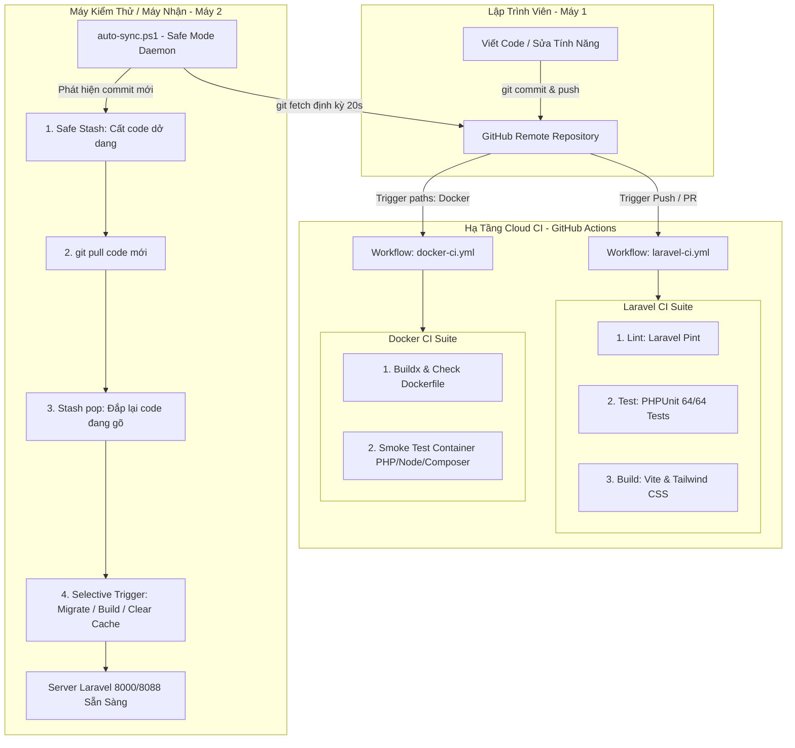

# BÁO CÁO TỔNG QUAN HỆ THỐNG CI/CD & ĐỒNG BỘ MÃ NGUỒN TỰ ĐỘNG
**Dự án:** SmartRoom & Renty (Hệ sinh thái Quản lý Trọ & Thuê phòng Thông minh)  
**Học phần:** Chuyên đề Phát triển Web 1  
**Ngày cập nhật:** 25/09/2026  

---

## 1. ĐẶT VẤN ĐỀ VÀ MỤC TIÊU HỆ THỐNG

Trong quá trình phát triển dự án nhóm đa nền tảng kết hợp giữa **Quản trị nhà trọ (SmartRoom)** và **Cổng thuê phòng khách hàng (Renty)**, việc đảm bảo chất lượng phần mềm và tính nhất quán giữa các môi trường lập trình là yếu tố sống còn:
* **Tích hợp liên tục (Continuous Integration - CI)**: Tự động hóa kiểm tra chuẩn định dạng code (Code Style), chạy toàn bộ bộ kiểm thử tự động (Unit & Feature Tests), và biên dịch tài nguyên giao diện mỗi khi có commit mới.
* **Đồng bộ hóa & Triển khai liên tục (Continuous Deployment - CD)**: Giải quyết bài toán đồng bộ mã nguồn thời gian thực giữa các máy tính phát triển trong nhóm (Máy 1 $\rightarrow$ Git $\rightarrow$ Máy 2) mà không cần thao tác gõ lệnh thủ công, hạn chế tối đa rủi ro xung đột (Merge Conflict).
* **Đóng gói chuẩn hóa (Docker Containerization)**: Đảm bảo ứng dụng chạy đồng nhất trên mọi máy tính cá nhân (XAMPP, WAMPP hoặc Docker Compose độc lập).

---

## 2. KIẾN TRÚC TỔNG THỂ HỆ THỐNG

Hệ thống kết hợp giữa **Cloud CI (GitHub Actions)** trên đám mây và **Local Auto-Sync Daemon** tại máy trạm cục bộ:



---

## 3. CHI TIẾT CÁC PIPELINE TRÊN GITHUB ACTIONS (CLOUD CI)

### 3.1. Pipeline Ứng Dụng Laravel Core: `.github/workflows/laravel-ci.yml`
* **Điều kiện kích hoạt**: Khi có sự kiện `push` hoặc tạo `pull_request` trên các nhánh `main`, `CI/CD`, và các nhánh thành viên (`AnhQuy/**`, `Hien/**`, `VinhEm/**`).
* **Quản lý Concurrency**: Bật `cancel-in-progress: true` để tự động hủy các lượt build cũ bị dồn ứ khi có commit mới.
* **Bao gồm 3 Jobs chạy song song (Parallel execution)**:

| STT | Job Name | Nhiệm vụ chính | Công nghệ & Tối ưu |
| :---: | :--- | :--- | :--- |
| **1** | **🎨 Code Style** | Kiểm tra định dạng mã nguồn PHP theo chuẩn PSR-12 | Chạy `Laravel Pint --test -v`. Tích hợp Composer Cache để rút ngắn thời gian cài gói. |
| **2** | **🧪 PHPUnit Tests** | Kiểm tra toàn bộ logic nghiệp vụ hệ thống | Chạy **64/64 Feature & Unit Tests** (290 Assertions) trên cơ sở dữ liệu **SQLite in-memory**, không phụ thuộc MySQL bên ngoài, thời gian chạy < 7 giây. |
| **3** | **⚡ Frontend Build** | Biên dịch tài nguyên giao diện người dùng | Node.js 22, kích hoạt npm cache, biên dịch Vite (`npm run build`), xác thực file `public/build/manifest.json`. |

---

### 3.2. Pipeline Đóng Gói Docker Container: `.github/workflows/docker-ci.yml`
* **Cơ chế kích hoạt thông minh (Path Filtering)**: Chỉ chạy khi có thay đổi trong `Dockerfile`, thư mục `docker/**`, `docker-compose.yml`, giúp tiết kiệm tài nguyên runner GitHub.
* **Nhiệm vụ**:
  1. Cấu hình Docker Buildx đa nền tảng.
  2. Build thử nghiệm Docker Image (`smartroom-app:ci-test`).
  3. **Smoke Tests trực tiếp**: Khởi động container tạm để kiểm tra tính toàn vẹn của runtime (`php -v`, `node -v`, `composer --version`, và lệnh `artisan --version`).

---

## 4. HỆ THỐNG ĐỒNG BỘ MÃ NGUỒN TỰ ĐỘNG NỘI BỘ (LOCAL CD & AUTO-SYNC)

### 4.1. Bản chất vấn đề & Giải pháp
* **Vấn đề**: Máy 2 là máy tính cá nhân nằm sau mạng Wi-Fi gia đình (NAT/Router, không có IP tĩnh Public), GitHub không thể trực tiếp bắn webhook vào máy.
* **Giải pháp**: Xây dựng tiến trình **Auto-Sync Daemon (`auto-sync.ps1`)** hoạt động theo mô hình **Long-Polling** kết hợp **Selective Trigger** và **Safe Stash Mode**.

### 4.2. Cơ chế kích hoạt có chọn lọc (Selective Trigger)
Script không chạy lặp lại các lệnh nặng nề một cách vô tội vạ, mà dùng lệnh `git diff --name-only` giữa `$LOCAL` và `$REMOTE` để phân loại:
* **Có file trong `database/migrations/`**: $\rightarrow$ Tự động chạy `php artisan migrate --force`.
* **Có file `composer.lock` thay đổi**: $\rightarrow$ Tự động chạy `composer install --no-interaction`.
* **Có file giao diện (`resources/`, `package.json`)**: $\rightarrow$ Tự động biên dịch lại Vite (`npm run build`).
* **Luôn thực hiện**: Dọn dẹp cache cấu hình và view với `php artisan optimize:clear`.

### 4.3. Chế độ An toàn (Safe Stash Mode) chống xung đột (Conflict)
* Trước khi kéo code: Tự động phát hiện code đang viết dở chưa commit trên Máy 2 $\rightarrow$ Tự động đưa vào ngăn tạm:
  ```powershell
  git stash push -u -m "auto-sync-stash-..."
  ```
* Kéo code mới từ Git về: `git pull origin <branch>`
* Khôi phục lại code đang viết dở: `git stash pop`
* **Xử lý xung đột**: Nếu trùng lặp trên cùng 1 dòng, script sẽ **phát âm thanh cảnh báo (Beep)**, giữ nguyên đánh dấu `<<<<<<< HEAD` và nhắc nhở lập trình viên mở IDE giải quyết mà **không bao giờ làm mất code đang gõ**.

---

## 5. TÍCH HỢP VÀO BỘ ĐIỀU PHỐI HỆ THỐNG (ORCHESTRATOR)

Tính năng Auto-Sync đã được gắn trực tiếp vào 2 bộ khởi chạy chính của dự án:

1. **Giao diện đồ họa WPF GUI (`launcher.ps1`)**:
   * Chuẩn hóa bảng mã hiển thị **UTF-8 with BOM**, đảm bảo tiếng Việt và icon sắc nét.
   * Tab **⚙️ Menu Nâng Cao** $\rightarrow$ Nút bấm nổi bật:
     > **`[🔄 Bật Tự Động Kéo Code Từ Git (Auto-Sync Git Daemon)]`**
   * Mở cửa sổ riêng biệt để chạy ngầm, không làm phiền người dùng.

2. **Giao diện Console Command Line (`start.bat`)**:
   * Khi khởi chạy chế độ dòng lệnh: `start.bat --cli` $\rightarrow$ chọn **[4] Menu Nâng Cao**.
   * Bổ sung mục lựa chọn:
     > **`[12] AUTO-SYNC GIT - [MỚI] Bật tiến trình tự động lắng nghe và kéo code từ Git`**

---

## 6. LƯU Ý QUAN TRỌNG VỀ ĐỒNG BỘ CSDL (DATABASE)

Git **chỉ quản lý mã nguồn (Text/Code)**, không tự động quản lý hay đồng bộ dịch vụ CSDL MySQL đang chạy trên ổ cứng:

| Loại dữ liệu | Cơ chế quản lý | Cách đồng bộ sang Máy 2 |
| :--- | :--- | :--- |
| **Cấu trúc bảng (Schema)** | File Migration trong `database/migrations` | **Tự động 100%**: `auto-sync.ps1` tự chạy `php artisan migrate` khi phát hiện file migration mới. |
| **Dữ liệu mẫu kiểm thử (Mock Data)** | File Seeder trong `database/seeders` | **Bán tự động**: Chạy nút **Seed** trên Launcher hoặc chọn `[3] RESET DATABASE` trong menu `start.bat`. |
| **Dữ liệu thực tế phát sinh (Real Data)** | MySQL Storage (`data/` hoặc Docker Volume) | **Thủ công**: Xuất file `.sql` từ phpMyAdmin/mysqldump trên Máy 1 và Import vào Máy 2. |

---

## 7. HƯỚNG DẪN KIỂM THỬ THỰC TẾ (DEMO CHECKLIST)

| Bước | Thao tác | Hiện tượng kỳ vọng |
| :---: | :--- | :--- |
| **1** | Mở `start.bat` $\rightarrow$ Menu Nâng Cao $\rightarrow$ Nhấn **Auto-Sync Git**. | Cửa sổ console màu đen/xanh hiện lên thông báo: `Đang lắng nghe thay đổi từ Git Server... (20s/lần)`. |
| **2** | Trên trình duyệt (GitHub.com) hoặc Máy 1: Thêm dòng test vào `README.md` hoặc tạo migration mới rồi `commit & push`. | Trong vòng 20 giây, cửa sổ Auto-Sync trên Máy 2 đổi màu, nhận diện commit hash mới. |
| **3** | Quan sát tiến trình tự động trên Máy 2. | Tự động chạy `git pull`, nếu có migration thì tự `migrate`, dọn sạch cache và báo: `>> ĐỒNG BỘ HOÀN TẤT! <<`. |
| **4** | Mở file trên Máy 2 kiểm tra. | Mã nguồn mới nhất đã xuất hiện ngay lập tức mà không cần bất kỳ thao tác thủ công nào. |

---
**Người lập báo cáo:** Nhóm Phát triển SmartRoom & Renty  
**Trạng thái hệ thống:** Đã kiểm thử thành công, hoạt động ổn định trên cả môi trường Local & GitHub Cloud.
