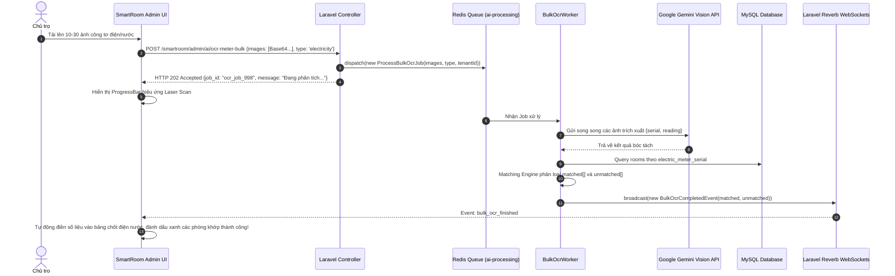
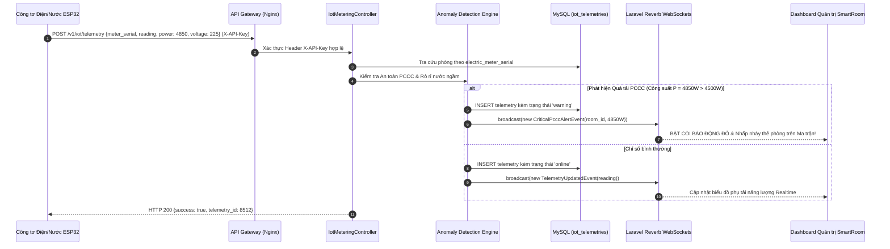

## C. PHÂN HỆ DO NGUYỄN ANH QUÝ (THÀNH VIÊN) PHỤ TRÁCH

### 1. ĐẶC TẢ KỸ THUẬT: CRUD QUẢN LÝ CƠ SỞ LƯU TRÚ & CƠ CHẾ GUARD CHECK AN TOÀN

| Thông Tin Chung | Chi Tiết |
| :--- | :--- |
| **Mã Chức Năng (Feature Code)** | `FEAT-QUY-01` |
| **Loại tác vụ (Type)** | Property Management / Data Integrity / SoftDeletes |
| **Nhánh Git (Branches)** | `main`, `feature/building-management-guard-checks` |
| **Người thực hiện (Assignee)** | Nguyễn Anh Quý (Thành Viên) |
| **Package / Standards** | Laravel Eloquent SoftDeletes, FormRequest Validation, Multi-tenancy Scope |

#### 1. Phạm vi & Endpoints API
| Method | Endpoint URL | Middlewares | Mô Tả Chức Năng Nghiệp Vụ |
| :---: | :--- | :--- | :--- |
| GET | `/smartroom/admin/buildings` | `auth`, `tenant.scope` | Danh sách cơ sở lưu trú (Tòa nhà / Khách sạn / Dãy trọ) |
| POST | `/smartroom/admin/buildings/store` | `auth`, `tenant.scope` | Thêm mới cơ sở lưu trú kèm cấu hình tiện ích và ảnh đại diện |
| POST | `/smartroom/admin/buildings/{id}/update` | `auth`, `tenant.scope` | Cập nhật thông tin cơ sở lưu trú |
| DELETE | `/smartroom/admin/buildings/{id}/delete` | `auth`, `tenant.scope` | Xóa cơ sở lưu trú (Cơ chế Guard Check chặn khi còn phòng) |

#### 2. Thuật toán & Luồng xử lý nghiệp vụ (Business Logic Flow)
- **Quản trị Cơ sở Lưu trú Đa mô hình:** Cho phép chủ tài khoản quản lý danh mục nhiều tòa nhà độc lập, gán tiện ích chung (Thang máy, Bảo vệ 24/7, Camera an ninh, Hệ thống PCCC đạt chuẩn).
- **Cơ chế Xóa An Toàn (Safety Guard Check Logic):**
  1. Khi người dùng gửi yêu cầu xóa tòa nhà (`DELETE /smartroom/admin/buildings/{id}/delete`):
  2. Hệ thống kiểm tra: `$activeRoomsCount = Room::where('building_id', $id)->count();`.
  3. Nếu `$activeRoomsCount > 0`: Lập tức chặn đứng thao tác, ném ngoại lệ với mã lỗi `BUILDING_HAS_ACTIVE_ROOMS` và phản hồi HTTP 400 Bad Request.
  4. Nếu `$activeRoomsCount == 0`: Tiến hành thực hiện SoftDeletes (`$building->delete()`), ghi nhận nhật ký vào `audit_logs` và trả về thông báo thành công.

#### 3. Hợp đồng Dữ liệu (API Contract)
##### 3.1. Output khi Thêm Mới Cơ Sở Thành Công
- **HTTP Status Code:** `201 Created`
```json
{
  "success": true,
  "message": "Thêm cơ sở lưu trú mới thành công!",
  "data": {
    "id": 12,
    "name": "Tòa Nhà Sunrise Thủ Đức",
    "address": "128 Võ Văn Ngân, TP. Thủ Đức",
    "total_floors": 5,
    "status": "active",
    "rooms_count": 0,
    "created_at": "2026-10-01 14:20:00"
  }
}
```
##### 3.2. Quy tắc Xác thực Dữ liệu Đầu vào (`POST /smartroom/admin/buildings/store`)
| Tên Field | Kiểu Dữ Liệu | Bắt Buộc | Validation Rules (Laravel) | Thông Báo Lỗi Nghiệp Vụ (Message) |
| :--- | :--- | :---: | :--- | :--- |
| `name` | String | Có | `required\|string\|max:255` | Tên cơ sở lưu trú bắt buộc nhập và tối đa 255 ký tự. |
| `address` | String | Có | `required\|string\|max:255` | Địa chỉ cơ sở bắt buộc nhập. |
| `phone` | String | Không | `nullable\|string\|max:50` | Hotline liên hệ cơ sở lưu trú. |
| `total_floors` | Integer | Có | `required\|integer\|min:1\|max:100` | Tổng số tầng tối thiểu từ 1 đến 100 tầng. |
| `status` | String | Có | `required\|in:active,maintenance,inactive` | Trạng thái hoạt động không hợp lệ. |
| `amenities` | Array | Không | `nullable\|array` | Tiện ích tòa nhà phải là mảng hợp lệ. |
| `image_file` | File | Không | `nullable\|image\|mimes:jpeg,png,jpg,webp\|max:5120` | Ảnh đại diện tòa nhà tối đa 5MB. |

#### 4. Tương tác Cơ sở Dữ liệu & Quản lý Trạng thái (Database Interactions)
- **Bảng tác động:** `buildings` (lưu thông tin cơ sở), `rooms` (đối soát khóa ngoại `building_id`).
- **Phạm vi bảo mật Multi-tenancy:** Tự động áp dụng Global Scope `tenant_id` tránh can thiệp cơ sở của tài khoản khác.

#### 5. Ma trận Xử lý Ngoại lệ (Exception & Error Handling)
##### A. Kịch bản Ngoại lệ & Kiểm thử Giao diện (UI/UX Edge Cases & Error States)
| Nguyên Nhân / Tình Huống Thao Tác | Hiện Tượng Lỗi & Hướng Khắc Phục UI/UX |
| :--- | :--- |
| Nhấp nút Xóa cơ sở lưu trú khi bên trong vẫn còn phòng | Chặn hoàn toàn thao tác, mở Modal cảnh báo màu đỏ: "Không thể xóa cơ sở lưu trú này vì vẫn còn {count} phòng trọ trực thuộc! Vui lòng chuyển hoặc xóa hết phòng trước." |
| Nhập trùng tên cơ sở lưu trú trong cùng tài khoản | Báo lỗi ngay dưới ô nhập liệu: "Bạn đã có một cơ sở lưu trú trùng tên này. Vui lòng đặt tên phân biệt!" |
| Nhập tổng số tầng bằng 0 hoặc lớn hơn 100 tầng | Viền đỏ ô số tầng kèm thông báo: "Tổng số tầng hợp lệ từ 1 đến 100 tầng." |
| Tải ảnh đại diện tòa nhà không đúng định dạng (.pdf, .exe) | Báo lỗi ngay khi chọn tệp: "Định dạng tệp không hợp lệ. Vui lòng chọn ảnh JPG, PNG hoặc WebP." |
| Danh sách cơ sở lưu trú chưa có dữ liệu nào (Empty State) | Hiển thị thẻ trống với nút bấm lớn ở giữa: "Thêm cơ sở đầu tiên để bắt đầu quản lý kinh doanh." |

##### B. Tầng Máy chủ Backend (Server-side / HTTP Response)
| Tình Huống Phát Sinh Lỗi | Mã HTTP | Error Code | Xử Lý Kỹ Thuật & Thông Báo Lỗi / Gotchas |
| :--- | :---: | :--- | :--- |
| Cố tình xóa cơ sở khi còn phòng trực thuộc | 400 | `BUILDING_HAS_ACTIVE_ROOMS` | Ném lỗi: "Không thể xóa cơ sở lưu trú này vì vẫn còn {count} phòng trọ trực thuộc! Vui lòng chuyển hoặc xóa các phòng trước." |
| Trùng tên cơ sở lưu trú trong cùng tài khoản | 422 | `BUILDING_NAME_DUPLICATE` | Báo lỗi: "Bạn đã có một cơ sở lưu trú trùng tên này. Vui lòng đặt tên phân biệt!" |

#### 6. Tiêu chí Nghiệm thu (Definition of Done - DoD)
- [ ] CRUD cơ sở lưu trú hoạt động chuẩn xác, lưu ảnh vào storage an toàn.
- [ ] Guard Check chặn đứng thao tác xóa tòa nhà đang có phòng với mã HTTP 400.
- [ ] Cơ chế SoftDeletes bảo tồn dữ liệu cho phép khôi phục khi cần thiết.

---

### 2. ĐẶC TẢ KỸ THUẬT: CRUD QUẢN LÝ PHÒNG LƯU TRÚ & KIỂM SOÁT XUNG ĐỘT (OPTIMISTIC LOCKING)

| Thông Tin Chung | Chi Tiết |
| :--- | :--- |
| **Mã Chức Năng (Feature Code)** | `FEAT-QUY-02` |
| **Loại tác vụ (Type)** | Core Room Inventory / Concurrency Control / Optimistic Locking |
| **Nhánh Git (Branches)** | `main`, `feature/room-crud-optimistic-locking` |
| **Người thực hiện (Assignee)** | Nguyễn Anh Quý (Thành Viên) |
| **Package / Standards** | Optimistic Locking (`version` column), Multi-photo Upload, Laravel Eloquent |

#### 1. Phạm vi & Endpoints API
| Method | Endpoint URL | Middlewares | Mô Tả Chức Năng Nghiệp Vụ |
| :---: | :--- | :--- | :--- |
| GET | `/smartroom/admin/rooms` | `auth`, `tenant.scope` | Danh sách phòng lưu trú kèm bộ lọc tòa nhà, tầng và trạng thái |
| POST | `/smartroom/admin/rooms/store` | `auth`, `tenant.scope` | Thêm mới buồng phòng kèm số seri công tơ điện nước |
| POST | `/smartroom/admin/rooms/{id}/update` | `auth`, `tenant.scope` | Cập nhật phòng với cơ chế kiểm soát xung đột Optimistic Locking |
| DELETE | `/smartroom/admin/rooms/{id}/delete` | `auth`, `tenant.scope` | Xóa phòng (chỉ cho phép khi phòng trống và không còn công nợ) |

#### 2. Thuật toán & Luồng xử lý nghiệp vụ (Business Logic Flow)
- **Kiểm soát Xung đột Ghi đè Đồng thời (Optimistic Locking Flow):**
  1. Mỗi bản ghi trong bảng `rooms` chứa cột `version` (INT, khởi tạo = 1).
  2. Khi Client mở form chỉnh sửa phòng P.101, nhận `version` hiện tại (ví dụ: `version = 3`).
  3. Khi gửi yêu cầu cập nhật (`POST /smartroom/admin/rooms/{id}/update`), gửi kèm giá trị `version: 3`.
  4. Máy chủ thực hiện câu lệnh kiểm tra nguyên tử:
     `UPDATE rooms SET price = ?, version = version + 1 WHERE id = ? AND version = ?;`
  5. Nếu số bản ghi cập nhật = 0 (do quản trị viên khác đã sửa và tăng version lên 4 trước đó):
     - Hệ thống ném ngoại lệ `HTTP 409 Conflict` kèm thông báo lỗi và phiên bản mới nhất.
  6. Nếu hợp lệ: Cập nhật thành công và trả về dữ liệu phòng mới với `version = 4`.

#### 3. Hợp đồng Dữ liệu (API Contract)
##### 3.1. Output khi Xảy Ra Xung Đột Dữ Liệu
- **HTTP Status Code:** `409 Conflict`
```json
{
  "success": false,
  "error_code": "ROOM_VERSION_CONFLICT",
  "message": "Dữ liệu phòng P.101 đã bị sửa đổi bởi một quản trị viên khác trong lúc bạn thao tác. Vui lòng tải lại trang để xem thông tin mới nhất!",
  "current_version": 4
}
```
##### 3.2. Quy tắc Xác thực Dữ liệu Đầu vào (`POST /smartroom/admin/rooms/{id}/update`)
| Tên Field | Kiểu Dữ Liệu | Bắt Buộc | Validation Rules (Laravel) | Thông Báo Lỗi Nghiệp Vụ (Message) |
| :--- | :--- | :---: | :--- | :--- |
| `version` | Integer | Có | `required\|integer` | Phiên bản dữ liệu bắt buộc để kiểm tra xung đột ghi đè. |
| `room_number` | String | Có | `required\|string\|max:50` | Mã số phòng không được để trống. |
| `price` | Integer | Có | `required\|integer\|min:100000` | Giá thuê niêm yết tối thiểu 100.000 VNĐ. |
| `status` | String | Có | `required\|in:empty,occupied,overdue,maintenance` | Trạng thái phòng không hợp lệ. |
| `electric_meter_serial` | String | Không | `nullable\|string\|max:100` | Số seri công tơ điện (hỗ trợ AI OCR & IoT). |
| `water_meter_serial` | String | Không | `nullable\|string\|max:100` | Số seri đồng hồ nước (hỗ trợ AI OCR & IoT). |

#### 4. Tương tác Cơ sở Dữ liệu & Quản lý Trạng thái (Database Interactions)
- **Bảng tác động:** `rooms` (cập nhật thông số và trường `version`), `room_images` (liên kết đa ảnh).
- **Đánh chỉ mục (Index):** `INDEX idx_rooms_building_status (building_id, status)` giúp tối ưu tốc độ lọc phòng.

#### 5. Ma trận Xử lý Ngoại lệ (Exception & Error Handling)
##### A. Kịch bản Ngoại lệ & Kiểm thử Giao diện (UI/UX Edge Cases & Error States)
| Nguyên Nhân / Tình Huống Thao Tác | Hiện Tượng Lỗi & Hướng Khắc Phục UI/UX |
| :--- | :--- |
| Xung đột phiên bản dữ liệu (Optimistic Lock - HTTP 409) | Mở Modal cảnh báo màu cam: "Dữ liệu phòng P.101 đã bị sửa đổi bởi quản trị viên khác trong lúc bạn thao tác. Bấm 'Tải lại' để đồng bộ dữ liệu mới nhất!" kèm nút Reload trang. |
| Nhập giá thuê niêm yết nhỏ hơn 100.000 VNĐ | Viền đỏ ô nhập giá và hiển thị thông báo: "Giá thuê niêm yết không được nhỏ hơn 100.000 VNĐ." |
| Nhập trùng mã số phòng trong cùng một tòa nhà | Báo lỗi: "Mã số phòng {room_number} đã tồn tại trong tòa nhà này. Vui lòng chọn số khác!" |
| Tải lên vượt quá 10 ảnh cho 1 phòng lưu trú | Khóa chọn thêm tệp và hiển thị Toast thông báo: "Chỉ được tải lên tối đa 10 ảnh cho mỗi phòng." |
| Chuyển trạng thái phòng sang "Bảo trì" | Bắt buộc nhập lý do bảo trì vào ô ghi chú để các nhân viên lễ tân khác cùng nắm được thông tin. |

##### B. Tầng Máy chủ Backend (Server-side / HTTP Response)
| Tình Huống Phát Sinh Lỗi | Mã HTTP | Error Code | Xử Lý Kỹ Thuật & Thông Báo Lỗi / Gotchas |
| :--- | :---: | :--- | :--- |
| Lệch phiên bản version giữa client và CSDL | 409 | `ROOM_VERSION_CONFLICT` | Chặn đứng thao tác ghi đè và trả về mã lỗi 409 Conflict kèm `current_version`. |
| Trùng mã số phòng trong cùng một tòa nhà | 422 | `ROOM_NUMBER_DUPLICATE` | Báo lỗi: "Mã số phòng {room_number} đã tồn tại trong tòa nhà này. Vui lòng chọn số khác!" |

#### 6. Tiêu chí Nghiệm thu (Definition of Done - DoD)
- [ ] Thêm và sửa thông tin buồng phòng đầy đủ, lưu số seri công tơ điện nước chuẩn xác.
- [ ] Mô phỏng 2 tab trình duyệt cùng sửa 1 phòng: Tab lưu sau bị chặn với mã HTTP 409 Conflict.
- [ ] Cập nhật thành công tự động tăng trường `version` lên 1 đơn vị.

---

### 3. ĐẶC TẢ KỸ THUẬT: SƠ ĐỒ MA TRẬN PHÒNG TRỰC QUAN & ĐỒNG BỘ REALTIME SSE

| Thông Tin Chung | Chi Tiết |
| :--- | :--- |
| **Mã Chức Năng (Feature Code)** | `FEAT-QUY-03` |
| **Loại tác vụ (Type)** | Realtime Monitoring / Room Matrix / Server-Sent Events (SSE) |
| **Nhánh Git (Branches)** | `main`, `feature/visual-room-matrix-sse` |
| **Người thực hiện (Assignee)** | Nguyễn Anh Quý (Thành Viên) |
| **Package / Standards** | Server-Sent Events (SSE), Redis Hash Storage, Tailwind CSS Grid |

#### 1. Phạm vi & Endpoints API
| Method | Endpoint URL | Middlewares | Mô Tả Chức Năng Nghiệp Vụ |
| :---: | :--- | :--- | :--- |
| GET | `/smartroom/admin/rooms/matrix` | `auth`, `tenant.scope` | Giao diện sơ đồ ma trận buồng phòng trực quan phân bổ theo tầng |
| GET | `/smartroom/admin/rooms/matrix/stream` | `auth`, `tenant.scope` | Kênh luồng dữ liệu thời gian thực Server-Sent Events (SSE) |

#### 2. Thuật toán & Luồng xử lý nghiệp vụ (Business Logic Flow)
- **Quy chuẩn Bảng Mã Màu Ma trận Phòng:**
  - 🟢 Xanh lá (`bg-emerald-500`): Phòng trống sạch sẽ, sẵn sàng đón khách (`empty` + `clean`).
  - 🔴 Đỏ (`bg-rose-500`): Phòng đang có khách ở (`occupied`).
  - 🟠 Cam (`bg-amber-500`): Phòng bẩn vừa check-out, chờ dọn buồng (`dirty` / `cleaning`).
  - 🟡 Vàng (`bg-yellow-500`): Phòng đang nợ cước phí chưa thanh toán (`overdue`).
  - ⚫ Xám (`bg-slate-600`): Phòng đang bảo trì hỏng hóc kỹ thuật (`maintenance`).
- **Luồng Đồng bộ Realtime SSE (Server-Sent Events Flow):**
  1. Frontend khởi tạo kết nối `new EventSource('/smartroom/admin/rooms/matrix/stream')`.
  2. Máy chủ thiết lập Response Headers: `Content-Type: text/event-stream`, `Cache-Control: no-cache`, `Connection: keep-alive`.
  3. Vòng lặp duy trì kết nối: Máy chủ lắng nghe Redis Pub/Sub kênh `room_matrix_updates`.
  4. Khi có sự kiện đổi trạng thái phòng: Phát bản tin `event: room_status_updated` kèm dữ liệu JSON.
  5. Gọi hàm xả đệm đầu ra bắt buộc: `ob_flush(); flush();`.
  6. Gửi bản tin Heartbeat Ping (`: ping`) mỗi 15 giây để ngăn Nginx / Proxy ngắt kết nối.

#### 3. Hợp đồng Dữ liệu (API Contract)
##### 3.1. Cấu trúc Bản tin SSE Event (Payload Structure)
- **Response Headers:** `Content-Type: text/event-stream`
```text
event: room_status_updated
data: {"room_id": 102, "status": "occupied", "cleaning_status": "clean", "tenant_name": "Nguyễn Văn A", "updated_at": "2026-10-01 14:15:00"}
```
##### 3.2. Quy tắc Xác thực Dữ liệu Đầu vào (`GET /smartroom/admin/rooms/matrix`)
| Tên Field | Kiểu Dữ Liệu | Bắt Buộc | Validation Rules (Laravel) | Thông Báo Lỗi Nghiệp Vụ (Message) |
| :--- | :--- | :---: | :--- | :--- |
| `building_id` | Integer | Không | `nullable\|integer\|exists:buildings,id` | Tòa nhà lọc ma trận phải tồn tại trong CSDL. |
| `floor` | Integer | Không | `nullable\|integer\|min:1` | Tầng lọc phải là số nguyên dương. |

#### 4. Tương tác Cơ sở Dữ liệu & Quản lý Trạng thái (Database Interactions)
- **Bảng tác động:** `rooms`, `tenants`, `contracts`.
- **Cơ chế Caching:** Trạng thái ma trận được cache trong Redis Hash `matrix:tenant_{id}` giúp phục vụ hàng trăm kết nối đồng thời mà không nghẽn CSDL.

#### 5. Ma trận Xử lý Ngoại lệ (Exception & Error Handling)
##### A. Kịch bản Ngoại lệ & Kiểm thử Giao diện (UI/UX Edge Cases & Error States)
| Nguyên Nhân / Tình Huống Thao Tác | Hiện Tượng Lỗi & Hướng Khắc Phục UI/UX |
| :--- | :--- |
| Mất kết nối mạng Internet đột ngột khi đang theo dõi ma trận | Biểu tượng thời gian thực đổi sang chấm đỏ "Mất kết nối", hệ thống tự động thử kết nối lại sau mỗi 3 giây. |
| Kết nối mạng Internet phục hồi trở lại | Đổi sang chấm xanh "Thời gian thực hoạt động" và tự động kéo lại toàn bộ trạng thái ma trận mới nhất mà không cần F5. |
| Thẻ phòng đổi trạng thái ở thiết bị của quản trị viên khác | Thẻ phòng trên màn hình nhấp nháy nhẹ và đổi màu tương ứng trong thời gian dưới 300ms. |
| Tầng nhà chưa có phòng nào được tạo | Hiển thị hàng rỗng với nhãn xám: "Tầng {x} chưa có phòng nào được thiết lập." |
| Nhấp chuột vào một thẻ phòng bất kỳ trên ma trận | Mở ngăn kéo (Drawer) bên phải hiển thị toàn bộ thông tin hợp đồng, cư dân hiện tại và lịch sử thanh toán của phòng. |

##### B. Tầng Máy chủ Backend (Server-side / HTTP Response)
| Tình Huống Phát Sinh Lỗi | Mã HTTP | Error Code | Xử Lý Kỹ Thuật & Thông Báo Lỗi / Gotchas |
| :--- | :---: | :--- | :--- |
| Nginx đóng ngắt kết nối do quá hạn idle | 200 (Stream) | `SSE_TIMEOUT` | Bổ sung Header `X-Accel-Buffering: no` và gửi bản tin ping định kỳ mỗi 15 giây. |
| Lỗi bộ đệm Output Buffering của PHP-FPM | 500 | `SSE_BUFFERING_OVERFLOW` | Tắt hoàn toàn `zlib.output_compression` trong controller SSE và gọi `flush()` liên tục. |

#### 6. Tiêu chí Nghiệm thu (Definition of Done - DoD)
- [ ] Ma trận buồng phòng hiển thị đầy đủ theo từng tầng, đúng mã màu theo trạng thái CSDL.
- [ ] Đổi trạng thái ở một thiết bị sẽ làm thẻ phòng ở các thiết bị khác đổi màu tức thì trong $< 500\text{ ms}$.
- [ ] Kết nối SSE chạy ổn định, tự phục hồi khi có sự cố mạng.

---

### 4. ĐẶC TẢ KỸ THUẬT: AI VISION BULK OCR QUÉT HÀNG LOẠT & ĐỐI SOÁT KHỚP MÃ ĐỒNG HỒ

| Thông Tin Chung | Chi Tiết |
| :--- | :--- |
| **Mã Chức Năng (Feature Code)** | `FEAT-QUY-04` |
| **Loại tác vụ (Type)** | Computer Vision / Generative AI / Bulk Extraction / Matching Engine |
| **Nhánh Git (Branches)** | `main`, `feature/ai-bulk-ocr-meter-matching` |
| **Người thực hiện (Assignee)** | Nguyễn Anh Quý (Thành Viên) |
| **Package / Standards** | Google Gemini Vision API, Redis Queue (`ai-processing`), Laravel Reverb WebSockets |

#### 1. Phạm vi & Endpoints API
| Method | Endpoint URL | Middlewares | Mô Tả Chức Năng Nghiệp Vụ |
| :---: | :--- | :--- | :--- |
| POST | `/smartroom/admin/ai/ocr-meter-bulk` | `auth`, `tenant.scope`, `throttle:10,1` | Tiếp nhận mảng 1-30 ảnh công tơ điện nước và đẩy Job xử lý hàng loạt |
| GET | `/smartroom/admin/ai/ocr-meter-bulk/{jobId}/status` | `auth`, `tenant.scope` | Kiểm tra tiến độ phân tích và lấy kết quả bóc tách chỉ số |

#### 2. Thuật toán & Luồng xử lý nghiệp vụ (Business Logic Flow)
- **Sơ đồ Tuần tự Luồng AI Bulk OCR Xử lý Hàng Loạt (Sequence Diagram):**

- **Thuật toán Động cơ Đối soát (Matching Engine Algorithm):**
  1. Worker trích xuất cặp `{serial, reading}` từ Gemini Vision.
  2. Lấy toàn bộ phòng thuộc Tenant có `electric_meter_serial` hoặc `water_meter_serial` cấu hình sẵn.
  3. Chuẩn hóa số seri về chữ thường không dấu: `strtolower(trim($serial))`.
  4. Nếu tìm thấy phòng khớp: Thêm vào mảng `matched[]` gồm `room_id`, `new_reading`, `confidence`.
  5. Nếu không khớp hoặc số seri mờ: Thêm vào mảng `unmatched[]` kèm hình ảnh crop mặt số để người dùng chọn gán phòng thủ công 1-chạm.

#### 3. Hợp đồng Dữ liệu (API Contract)
##### 3.1. Output khi Tiếp Nhận Phân Tích Thành Công
- **HTTP Status Code:** `202 Accepted`
```json
{
  "success": true,
  "job_id": "ocr_job_104",
  "status": "processing",
  "total_images": 15,
  "message": "Đang phân tích bóc tách song song qua Gemini Vision. Kết quả sẽ tự động đồng bộ lên giao diện trong giây lát!"
}
```
##### 3.2. Quy tắc Xác thực Dữ liệu Đầu vào (`POST /smartroom/admin/ai/ocr-meter-bulk`)
| Tên Field | Kiểu Dữ Liệu | Bắt Buộc | Validation Rules (Laravel) | Thông Báo Lỗi Nghiệp Vụ (Message) |
| :--- | :--- | :---: | :--- | :--- |
| `images` | Array | Có | `required\|array\|min:1\|max:30` | Mảng ảnh chụp đồng hồ phải từ 1 đến 30 ảnh mỗi lượt quét. |
| `images.*` | String | Có | `required\|string\|starts_with:data:image/` | Mỗi tệp ảnh phải ở định dạng chuỗi Base64 hợp lệ. |
| `type` | String | Có | `required\|in:electricity,water` | Loại công tơ bắt buộc chọn: electricity hoặc water. |

#### 4. Tương tác Cơ sở Dữ liệu & Quản lý Trạng thái (Database Interactions)
- **Bảng tác động:** `rooms` (tra cứu theo số seri), `utility_records` (lưu chỉ số chốt mới).
- **Hàng đợi Redis:** `QUEUE_CONNECTION=redis`, queue `ai-processing` giúp cô lập tải nặng không nghẽn luồng HTTP chính.

#### 5. Ma trận Xử lý Ngoại lệ (Exception & Error Handling)
##### A. Kịch bản Ngoại lệ & Kiểm thử Giao diện (UI/UX Edge Cases & Error States)
| Nguyên Nhân / Tình Huống Thao Tác | Hiện Tượng Lỗi & Hướng Khắc Phục UI/UX |
| :--- | :--- |
| Tải lên ảnh công tơ quá mờ hoặc lóa đèn Flash | Đưa ảnh vào danh sách chưa khớp, hiển thị viền vàng kèm thông báo: "Ảnh bị mờ/lóa sáng. Vui lòng chọn phòng thủ công." |
| Số seri công tơ trên ảnh không khớp với phòng nào | Đưa vào danh sách "Chưa khớp phòng" kèm ảnh phóng to mặt số và Dropdown chọn phòng nhanh 1-chạm. |
| Người dùng chọn quá 30 ảnh trong một lần quét | Client kiểm tra mảng tệp và báo lỗi: "Vui lòng chọn tối đa 30 ảnh trong một lần chốt số để đảm bảo hiệu năng." |
| Trong khi chờ Gemini AI bóc tách chỉ số (Job Queue) | Hiển thị thanh tiến trình Laser Scan hiệu ứng sóng và tỷ lệ phần trăm phân tích ảnh. |
| Bóc tách thành công | Tự động điền số liệu vào bảng chốt điện nước, tô màu xanh lá những phòng khớp số seri thành công. |

##### B. Tầng Máy chủ Backend (Server-side / HTTP Response)
| Tình Huống Phát Sinh Lỗi | Mã HTTP | Error Code | Xử Lý Kỹ Thuật & Thông Báo Lỗi / Gotchas |
| :--- | :---: | :--- | :--- |
| Tải lên vượt quá 30 ảnh cùng lúc | 422 | `OCR_MAX_IMAGES_EXCEEDED` | Báo lỗi: "Chỉ được tải lên tối đa 30 ảnh trong một lần quét." |
| Gemini API quá tải hoặc gián đoạn mạng | 500 (Worker) | `GEMINI_API_FAILURE` | Worker tự động Retry 2 lần với Exponential Backoff (10s, 20s). Nếu vẫn lỗi, chuyển Job sang bảng `failed_jobs`. |

#### 6. Tiêu chí Nghiệm thu (Definition of Done - DoD)
- [ ] Tải lên 20 ảnh xử lý ngầm qua hàng đợi Redis mượt mà không treo giao diện.
- [ ] Độ chính xác bóc tách chỉ số và số seri đạt trên 90% với ảnh rõ nét.
- [ ] Matching Engine tự động ghép đúng phòng dựa trên số seri đã cấu hình.
- [ ] Laravel Reverb WebSockets cập nhật kết quả lên màn hình không cần reload trang.

---

### 5. ĐẶC TẢ KỸ THUẬT: MẠNG LƯỚI ĐO XA IOT SMART METERING & CẢNH BÁO CHÁY NỔ PCCC

| Thông Tin Chung | Chi Tiết |
| :--- | :--- |
| **Mã Chức Năng (Feature Code)** | `FEAT-QUY-05` |
| **Loại tác vụ (Type)** | IoT Telemetry Ingestion / Fire Safety PCCC / Anomaly Detection |
| **Nhánh Git (Branches)** | `main`, `feature/iot-smart-metering-pccc-alerts` |
| **Người thực hiện (Assignee)** | Nguyễn Anh Quý (Thành Viên) |
| **Package / Standards** | Vi điều khiển ESP32 / LoRaWAN, Webhook REST API, Redis FIFO Queue, Reverb |

#### 1. Phạm vi & Endpoints API
| Method | Endpoint URL | Middlewares | Mô Tả Chức Năng Nghiệp Vụ |
| :---: | :--- | :--- | :--- |
| POST | `/v1/iot/telemetry` | `iot.auth` (`X-API-Key`), `throttle:120,1` | Webhook tiếp nhận bản tin telemetry định kỳ từ công tơ phần cứng |
| GET | `/smartroom/admin/iot/telemetry/live` | `auth`, `tenant.scope` | Lấy dữ liệu công suất và phụ tải năng lượng trực tiếp theo thời gian thực |

#### 2. Thuật toán & Luồng xử lý nghiệp vụ (Business Logic Flow)
- **Sơ đồ Tuần tự Luồng Đo xa IoT & Kích hoạt Cảnh báo PCCC (Sequence Diagram):**

- **Thuật toán Phát hiện Dị thường (Anomaly Detection Rules):**
  1. **Nguy cơ Chập cháy PCCC:** $P > 4500\text{ W}$ hoặc Cường độ $I > 20\text{ A}$ $\implies$ Kích hoạt `CriticalPcccAlertEvent` khẩn cấp.
  2. **Dị thường Điện áp Nguy hiểm:** $U < 175\text{ V}$ hoặc $U > 250\text{ V}$ $\implies$ Cảnh báo nguy cơ phá hủy thiết bị điện.
  3. **Rò rỉ Nước Ban đêm (Night Leak):** Khung giờ $01:00 - 05:00$ sáng VÀ Lưu lượng $Q > 0.05\text{ L/phút}$ $\implies$ Gắn cờ `IOT_WATER_LEAK_NIGHT` cảnh báo bồn cầu rò rỉ hoặc vỡ ống âm tường.

#### 3. Hợp đồng Dữ liệu (API Contract)
##### 3.1. Output khi Tiếp Nhận Telemetry Thành Công
- **HTTP Status Code:** `200 OK`
```json
{
  "success": true,
  "message": "Tiếp nhận telemetry thành công",
  "telemetry_id": 8512,
  "room_number": "P.101",
  "current_reading": 1420.5,
  "alerts": [
    "CẢNH BÁO QUÁ TẢI ĐIỆN PCCC: Công suất tức thời đạt 4850W (Vượt ngưỡng an toàn 4500W)!"
  ]
}
```
##### 3.2. Quy tắc Xác thực Dữ liệu Đầu vào (`POST /v1/iot/telemetry`)
| Tên Field | Kiểu Dữ Liệu | Bắt Buộc | Validation Rules (Laravel) | Thông Báo Lỗi Nghiệp Vụ (Message) |
| :--- | :--- | :---: | :--- | :--- |
| `meter_serial` | String | Có | `required\|string\|max:100` | Số sản xuất công tơ vật lý gửi tin. |
| `meter_type` | String | Có | `required\|in:electricity,water` | Loại công tơ đo đạc: electricity hoặc water. |
| `reading` | Numeric | Có | `required\|numeric\|min:0` | Chỉ số tiêu thụ tích lũy (kWh hoặc m3). |
| `voltage` | Numeric | Không | `nullable\|numeric\|between:100,300` | Điện áp lưới tức thời (V). |
| `current` | Numeric | Không | `nullable\|numeric\|min:0` | Cường độ dòng điện tức thời (A). |
| `power` | Numeric | Không | `nullable\|numeric\|min:0` | Công suất tiêu thụ tức thời (W). |
| `flow_rate` | Numeric | Không | `nullable\|numeric\|min:0` | Lưu lượng nước tức thời (Lít/phút). |

#### 4. Tương tác Cơ sở Dữ liệu & Quản lý Trạng thái (Database Interactions)
- **Bảng tác động:** `iot_meter_telemetries` (lưu trữ lịch sử đo xa), `rooms` (tra cứu theo số seri).
- **Partitioning:** Bảng `iot_meter_telemetries` được phân vùng theo tháng (`PARTITION BY RANGE (MONTH(created_at))`) để đảm bảo hiệu năng truy vấn khi dữ liệu đạt hàng triệu bản ghi.

#### 5. Ma trận Xử lý Ngoại lệ (Exception & Error Handling)
##### A. Kịch bản Ngoại lệ & Kiểm thử Giao diện (UI/UX Edge Cases & Error States)
| Nguyên Nhân / Tình Huống Thao Tác | Hiện Tượng Lỗi & Hướng Khắc Phục UI/UX |
| :--- | :--- |
| Công suất điện tức thời vượt ngưỡng an toàn ($P > 4500	ext{ W}$) | Toàn bộ màn hình nhấp nháy đỏ, phát còi báo động qua Web Audio API: "CẢNH BÁO NGUY CƠ CHÁY NỔ PCCC TẠI PHÒNG P.101 - CÔNG SUẤT {P}W! Vui lòng ngắt cầu dao ngay!" |
| Phát hiện rò rỉ nước ngầm ban đêm (Khung giờ 01h-05h sáng) | Thẻ phòng trên ma trận gắn cờ màu vàng cảnh báo: "Nghi vấn rò rỉ bồn cầu hoặc bục vỡ ống nước âm tường." |
| Công tơ IoT bị mất tín hiệu truyền tin quá 30 phút | Biểu tượng sóng của phòng chuyển sang màu xám kèm chữ "Mất tín hiệu kết nối". |
| Điện áp sụt giảm dưới 175V hoặc tăng vọt trên 250V | Hiển thị cảnh báo vàng: "Điện áp không ổn định - Nguy cơ chập cháy thiết bị điện tử của cư dân." |
| Quản trị viên bấm nút "Tắt còi báo động" | Tắt âm thanh hú còi và ghi nhận nhật ký quản trị viên đã tiếp nhận thông tin sự cố. |

##### B. Tầng Máy chủ Backend (Server-side / HTTP Response)
| Tình Huống Phát Sinh Lỗi | Mã HTTP | Error Code | Xử Lý Kỹ Thuật & Thông Báo Lỗi / Gotchas |
| :--- | :---: | :--- | :--- |
| Sai hoặc thiếu Header `X-API-Key` | 401 | `IOT_DEVICE_UNAUTHORIZED` | Từ chối tiếp nhận dữ liệu telemetry từ thiết bị không rõ nguồn gốc. |
| Cơn bão dữ liệu dồn dập vượt giới hạn | 429 | `IOT_RATE_LIMIT_EXCEEDED` | Throttling `throttle:120,1` bảo vệ MySQL và phản hồi mã lỗi 429 Too Many Requests. |

#### 6. Tiêu chí Nghiệm thu (Definition of Done - DoD)
- [ ] Tiếp nhận bản tin telemetry và lưu vào CSDL trong $< 50\text{ ms}$.
- [ ] Gửi dữ liệu công suất $4850\text{ W}$ kích hoạt tức thì còi báo động PCCC trên màn hình quản trị.
- [ ] Phát hiện lưu lượng nước ban đêm trong khung 01h-05h sáng và gắn cờ cảnh báo rò rỉ chuẩn xác.

---

### 6. ĐẶC TẢ KỸ THUẬT: TỰ ĐỘNG ĐỒNG BỘ SỐ LIỆU IOT SANG HÓA ĐƠN (ZERO-TOUCH BILLING)

| Thông Tin Chung | Chi Tiết |
| :--- | :--- |
| **Mã Chức Năng (Feature Code)** | `FEAT-QUY-06` |
| **Loại tác vụ (Type)** | Automated Billing / IoT Synchronization / Zero-touch Billing |
| **Nhánh Git (Branches)** | `main`, `feature/zero-touch-iot-billing-sync` |
| **Người thực hiện (Assignee)** | Nguyễn Anh Quý (Thành Viên) |
| **Package / Standards** | Anti-regression Algorithm, Laravel Scheduled Tasks, Database Transactions |

#### 1. Phạm vi & Endpoints API
| Method | Endpoint URL | Middlewares | Mô Tả Chức Năng Nghiệp Vụ |
| :---: | :--- | :--- | :--- |
| POST | `/smartroom/admin/iot/sync-billing` | `auth`, `tenant.scope` | 1-Click đồng bộ toàn bộ chỉ số IoT sang hóa đơn tiền trọ tháng hiện tại |
| GET | `/smartroom/admin/iot/sync-preview` | `auth`, `tenant.scope` | Xem trước bảng chốt số điện nước trước khi áp dụng |

#### 2. Thuật toán & Luồng xử lý nghiệp vụ (Business Logic Flow)
- **Thuật toán Đồng bộ & Cơ chế Chống Ngược Dòng (Anti-regression Logic):**
  1. Lấy danh sách tất cả các phòng có người ở (`status != 'empty'`) thuộc cơ sở.
  2. Với mỗi phòng:
     - Truy vấn chỉ số mới nhất từ `iot_meter_telemetries` (điện và nước).
     - Lấy chỉ số chốt của kỳ liền kề trước đó từ `utility_records`.
     - **Kiểm tra chống lỗi số mới nhỏ hơn số cũ:** `$finalNewReading = max($newReading, $oldReading)`.
     - Nếu có cờ `$meterReplaced == true` (thay đồng hồ mới): Chấp nhận chỉ số mới và ghi chú biên bản thay thiết bị.
  3. Tính toán sản lượng tiêu thụ: $\Delta = Reading_{\text{new}} - Reading_{\text{old}}$.
  4. Tạo bản ghi mới trong `utility_records` với `status = 'sent'`.
  5. Chuyển trạng thái phòng sang `overdue` trên sơ đồ ma trận để nhắc thu tiền.

#### 3. Hợp đồng Dữ liệu (API Contract)
##### 3.1. Output khi Đồng Bộ Thành Công
- **HTTP Status Code:** `200 OK`
```json
{
  "success": true,
  "billing_month": "2026-10",
  "total_rooms_synced": 18,
  "synced_rooms": [
    {
      "room_number": "P.101",
      "electricity": {"old": 1320, "new": 1420.5, "usage": 100.5, "amount": 351750},
      "water": {"old": 45, "new": 52, "usage": 7, "amount": 105000},
      "total_utility_amount": 456750
    }
  ],
  "message": "Đã hoàn tất đồng bộ số liệu IoT sang hóa đơn tiền trọ tháng 10/2026!"
}
```
##### 3.2. Quy tắc Xác thực Dữ liệu Đầu vào (`POST /smartroom/admin/iot/sync-billing`)
| Tên Field | Kiểu Dữ Liệu | Bắt Buộc | Validation Rules (Laravel) | Thông Báo Lỗi Nghiệp Vụ (Message) |
| :--- | :--- | :---: | :--- | :--- |
| `building_id` | Integer | Có | `required\|integer\|exists:buildings,id` | Tòa nhà cần chốt hóa đơn không tồn tại. |
| `billing_date` | Date | Có | `required\|date` | Ngày chốt số điện nước hợp lệ. |
| `force_override` | Boolean | Không | `nullable\|boolean` | Cho phép ghi đè hóa đơn tháng đã tạo trước đó. |

#### 4. Tương tác Cơ sở Dữ liệu & Quản lý Trạng thái (Database Interactions)
- **Bảng tác động:** `utility_records` (thêm bản ghi hóa đơn mới), `rooms` (đổi trạng thái sang `overdue`).
- **Giao dịch Cơ sở Dữ liệu (Database Transaction):** Toàn bộ tiến trình đồng bộ được bọc trong `DB::transaction(function() { ... })` đảm bảo tính toàn vẹn dữ liệu.

#### 5. Ma trận Xử lý Ngoại lệ (Exception & Error Handling)
##### A. Kịch bản Ngoại lệ & Kiểm thử Giao diện (UI/UX Edge Cases & Error States)
| Nguyên Nhân / Tình Huống Thao Tác | Hiện Tượng Lỗi & Hướng Khắc Phục UI/UX |
| :--- | :--- |
| Nhấn nút "Đồng bộ IoT sang hóa đơn" | Mở Modal xem trước (Preview) bảng tính tiền điện nước chi tiết từng phòng trước khi lưu chính thức vào CSDL. |
| Phòng chưa gắn thiết bị công tơ đo xa IoT | Dòng dữ liệu phòng được tô màu cam kèm nhãn "Chốt tay" để chủ trọ tự nhập chỉ số trực tiếp. |
| Người dùng bấm nút Đồng bộ 2 lần liên tiếp do sốt ruột | Nút bấm lập tức bị khóa và hiển thị Spinner xoay tròn: "Đang đồng bộ dữ liệu..." để tránh tạo trùng hóa đơn. |
| Chỉ số mới nhỏ hơn chỉ số cũ do thay mới đồng hồ điện | Hiển thị ô tích chọn "Xác nhận đã thay đồng hồ mới" để cho phép chốt số mà không bị chặn lỗi ngược dòng. |
| Đồng bộ hoàn tất thành công | Tự động chuyển màu thẻ các phòng trên Sơ đồ ma trận sang màu vàng `overdue` (Chờ thu tiền). |

##### B. Tầng Máy chủ Backend (Server-side / HTTP Response)
| Tình Huống Phát Sinh Lỗi | Mã HTTP | Error Code | Xử Lý Kỹ Thuật & Thông Báo Lỗi / Gotchas |
| :--- | :---: | :--- | :--- |
| Hóa đơn tháng hiện tại đã tồn tại và chưa bật override | 422 | `BILLING_PERIOD_ALREADY_EXISTS` | Báo lỗi: "Hóa đơn kỳ tháng {MM/YYYY} của tòa nhà này đã được tạo trước đó. Vui lòng kiểm tra lại!" |
| Quá trình tính toán bị gián đoạn do lỗi dữ liệu | 500 | `SYNC_TRANSACTION_FAILED` | Tự động Rollback toàn bộ dữ liệu và ghi log chi tiết phòng gây lỗi. |

#### 6. Tiêu chí Nghiệm thu (Definition of Done - DoD)
- [ ] 1-Click đồng bộ thành công toàn bộ phòng có thiết bị IoT trong vòng $< 2$ giây.
- [ ] Tính toán chính xác số tiêu thụ = Chỉ số mới - Chỉ số cũ.
- [ ] Tự động chuyển trạng thái phòng sang `overdue` trên sơ đồ ma trận trực quan.

---

### 7. ĐẶC TẢ KỸ THUẬT: BỘ MÁY TÍNH CƯỚC, XUẤT VIETQR NAPAS247 & NHẮC NỢ ZALO/SMS

| Thông Tin Chung | Chi Tiết |
| :--- | :--- |
| **Mã Chức Năng (Feature Code)** | `FEAT-QUY-07` |
| **Loại tác vụ (Type)** | Financial Billing / NAPAS247 Integration / Automated Reminders |
| **Nhánh Git (Branches)** | `main`, `feature/billing-engine-vietqr-reminders` |
| **Người thực hiện (Assignee)** | Nguyễn Anh Quý (Thành Viên) |
| **Package / Standards** | BillingEngine, VietQR Image API, Zalo ZNS / SMS Gateway, Redis Queue |

#### 1. Phạm vi & Endpoints API
| Method | Endpoint URL | Middlewares | Mô Tả Chức Năng Nghiệp Vụ |
| :---: | :--- | :--- | :--- |
| POST | `/smartroom/admin/utility/calculate` | `auth`, `tenant.scope` | Tính toán tổng cước phí hóa đơn theo công thức động |
| POST | `/smartroom/admin/utility/auto-remind` | `auth`, `tenant.scope`, `throttle:10,1` | Gửi tin nhắn thông báo cước và nhắc nợ qua Zalo ZNS / SMS Gateway |
| GET | `/smartroom/admin/utility/{id}/vietqr` | `auth`, `tenant.scope` | Xuất mã QR thanh toán động VietQR NAPAS247 chuẩn ngân hàng |

#### 2. Thuật toán & Luồng xử lý nghiệp vụ (Business Logic Flow)
- **Công thức Bộ máy Tính cước (BillingEngine Mathematical Formula):**
  $$\text{Tổng tiền} = \text{Tiền phòng} + (E_{\text{mới}} - E_{\text{cũ}}) \times G_e + (W_{\text{mới}} - W_{\text{cũ}}) \times G_w + \sum \text{Phí dịch vụ}$$
  - Trong đó: $G_e, G_w$ là đơn giá điện và nước theo cấu hình phòng/tòa nhà.
  - Làm tròn tiền về số nguyên: `$totalAmount = (int) round($totalAmount);`.
- **Cấu trúc Sinh Mã VietQR Động Chuẩn NAPAS247:**
  - URL Format: `https://img.vietqr.io/image/{bank_bin}-{bank_account_no}-compact.png?amount={amount}&addInfo={addInfo}&accountName={accountName}`
  - Cú pháp nội dung chuyển khoản (`addInfo`): `TT TIEN PHONG {ROOM_NUMBER} THANG {MM/YYYY}`.
- **Hệ thống Quét Nợ & Gửi Tin Nhắn Nhắc Tiền:**
  - Quét danh sách hóa đơn có `status IN ('sent', 'overdue')`.
  - Giải mã số điện thoại cư dân từ bản mã PII AES-256.
  - Đẩy Job vào hàng đợi `notifications` gửi tin nhắn kèm link VietQR thanh toán 1-chạm.

#### 3. Hợp đồng Dữ liệu (API Contract)
##### 3.1. Output khi Gửi Nhắc Nợ Thành Công
- **HTTP Status Code:** `200 OK`
```json
{
  "success": true,
  "total_processed": 15,
  "sent_count": 15,
  "failed_count": 0,
  "message": "Đã tiến hành gửi tin nhắn nhắc nợ tiền phòng qua Zalo thành công!"
}
```
##### 3.2. Quy tắc Xác thực Dữ liệu Đầu vào (`POST /smartroom/admin/utility/auto-remind`)
| Tên Field | Kiểu Dữ Liệu | Bắt Buộc | Validation Rules (Laravel) | Thông Báo Lỗi Nghiệp Vụ (Message) |
| :--- | :--- | :---: | :--- | :--- |
| `utility_ids` | Array | Không | `nullable\|array` | Mảng ID hóa đơn cần nhắc nợ. |
| `utility_ids.*` | Integer | Có | `integer\|exists:utility_records,id` | Một trong các hóa đơn chọn không tồn tại. |
| `channel` | String | Có | `required\|in:zalo,sms,both` | Kênh thông báo gửi đi không hợp lệ. |

#### 4. Tương tác Cơ sở Dữ liệu & Quản lý Trạng thái (Database Interactions)
- **Bảng tác động:** `utility_records`, `tenants`, `contracts`, `notification_logs`.
- **Ghi nhật ký:** Mọi tin nhắn gửi đi được lưu vào `notification_logs` kèm trạng thái nhà mạng phản hồi.

#### 5. Ma trận Xử lý Ngoại lệ (Exception & Error Handling)
##### A. Kịch bản Ngoại lệ & Kiểm thử Giao diện (UI/UX Edge Cases & Error States)
| Nguyên Nhân / Tình Huống Thao Tác | Hiện Tượng Lỗi & Hướng Khắc Phục UI/UX |
| :--- | :--- |
| Nhấn nút "Gửi nhắc nợ" khi chưa tích chọn hóa đơn nào | Hiển thị Dialog xác nhận: "Bạn có muốn gửi thông báo nhắc nợ đến TOÀN BỘ các phòng đang nợ tiền không?" |
| Ảnh mã VietQR NAPAS247 tải chậm do mạng | Hiển thị khung hình vuông Skeleton kích thước chuẩn QR tránh xô lệch khung hóa đơn. |
| Quét mã VietQR trên App ngân hàng di động | Hiển thị chính xác số tiền, số tài khoản thụ hưởng và đúng cú pháp nội dung chuyển khoản tự động. |
| Gửi tin nhắn Zalo ZNS thất bại do khách không dùng Zalo | Hệ thống tự động chuyển hướng sang gửi tin nhắn qua kênh SMS Gateway dự phòng. |
| Số tiền cước phí bị lẻ số thập phân | Tự động làm tròn số tiền về số nguyên trước khi sinh mã QR và gửi tin nhắn nhắc nợ. |

##### B. Tầng Máy chủ Backend (Server-side / HTTP Response)
| Tình Huống Phát Sinh Lỗi | Mã HTTP | Error Code | Xử Lý Kỹ Thuật & Thông Báo Lỗi / Gotchas |
| :--- | :---: | :--- | :--- |
| Cấu hình tài khoản ngân hàng chủ trọ bị thiếu BIN/STK | 422 | `VIETQR_CONFIG_MISSING` | Báo lỗi: "Chưa cấu hình Số tài khoản hoặc Mã ngân hàng thụ hưởng trong hồ sơ chủ trọ." |
| Cổng Zalo ZNS / SMS Gateway bị timeout | 500 (Worker) | `GATEWAY_TIMEOUT` | Job thử lại tối đa 2 lần với backoff 10s. Nếu vẫn lỗi, đánh dấu `failed` trong `notification_logs`. |

#### 6. Tiêu chí Nghiệm thu (Definition of Done - DoD)
- [ ] Hóa đơn tính chuẩn xác từng đồng theo công thức và bảng giá dịch vụ.
- [ ] Mã VietQR quét thành công trên App ngân hàng thực tế, hiển thị đúng thông tin nhận tiền.
- [ ] Hàng đợi tin nhắn gửi trơn tru hàng loạt không làm nghẽn máy chủ.

---

### 8. ĐẶC TẢ KỸ THUẬT: QUẢN LÝ THIẾT BỊ KHO & BÀN GIAO THU HỒI KHẤU TRỪ CỌC

| Thông Tin Chung | Chi Tiết |
| :--- | :--- |
| **Mã Chức Năng (Feature Code)** | `FEAT-QUY-08` |
| **Loại tác vụ (Type)** | Inventory / Asset Lifecycle / Room Handover & Deduction |
| **Nhánh Git (Branches)** | `main`, `feature/equipment-inventory-handover` |
| **Người thực hiện (Assignee)** | Nguyễn Anh Quý (Thành Viên) |
| **Package / Standards** | Pivot Table (`room_equipment`), Stock Decrement / Increment, Audit Log |

#### 1. Phạm vi & Endpoints API
| Method | Endpoint URL | Middlewares | Mô Tả Chức Năng Nghiệp Vụ |
| :---: | :--- | :--- | :--- |
| GET | `/smartroom/admin/equipment` | `auth`, `tenant.scope` | Danh mục tài sản, trang thiết bị trong kho và số lượng tồn |
| POST | `/smartroom/admin/equipment/store` | `auth`, `tenant.scope` | Nhập trang thiết bị mới vào kho tài sản |
| POST | `/smartroom/admin/equipment/allocate` | `auth`, `tenant.scope` | Bàn giao thiết bị từ kho vào phòng lưu trú |
| POST | `/smartroom/admin/equipment/return-and-deduct` | `auth`, `tenant.scope` | Thu hồi thiết bị và tính toán khấu trừ hư hỏng vào tiền cọc |

#### 2. Thuật toán & Luồng xử lý nghiệp vụ (Business Logic Flow)
- **Quy trình Bàn giao Thiết bị vào Phòng:**
  1. Kiểm tra số lượng tồn kho: `if ($equipment->stock_quantity < $quantity) throw Exception;`.
  2. Giảm số lượng tồn kho: `$equipment->decrement('stock_quantity', $quantity);`.
  3. Thêm hoặc cập nhật bản ghi trong bảng trung gian `room_equipment` kèm tình trạng ban đầu: `condition = 'good'`.
- **Quy trình Thu hồi & Khấu trừ Đền bù khi Trả phòng:**
  1. Khi thanh lý hợp đồng: Kiểm tra hiện trạng từng thiết bị đã bàn giao.
  2. Nếu phát hiện hư hại (ví dụ: mất điều khiển điều hòa, vỡ cánh quạt):
     - Ghi nhận chi phí bồi thường hư hại `$deductionAmount`.
     - Tự động cấn trừ khoản này vào tiền hoàn cọc của cư dân:
       $$\text{Tiền cọc thực trả} = \text{Tiền cọc ban đầu} - \sum \text{Tiền nợ cước} - \sum \text{Khấu trừ hư hại thiết bị}$$
  3. Hoàn trả số lượng thiết bị còn dùng được về kho: `$equipment->increment('stock_quantity', $returnedQty);`.

#### 3. Hợp đồng Dữ liệu (API Contract)
##### 3.1. Output khi Bàn Giao Thiết Bị Thành Công
- **HTTP Status Code:** `200 OK`
```json
{
  "success": true,
  "message": "Bàn giao thiết bị vào phòng thành công!",
  "data": {
    "equipment_name": "Máy lạnh Inverter 1.5HP",
    "allocated_quantity": 1,
    "remaining_stock": 4,
    "room_number": "P.101"
  }
}
```
##### 3.2. Quy tắc Xác thực Dữ liệu Đầu vào (`POST /smartroom/admin/equipment/allocate`)
| Tên Field | Kiểu Dữ Liệu | Bắt Buộc | Validation Rules (Laravel) | Thông Báo Lỗi Nghiệp Vụ (Message) |
| :--- | :--- | :---: | :--- | :--- |
| `room_id` | Integer | Có | `required\|integer\|exists:rooms,id` | Phòng tiếp nhận thiết bị không tồn tại. |
| `equipment_id` | Integer | Có | `required\|integer\|exists:equipment,id` | Trang thiết bị kho không tồn tại. |
| `quantity` | Integer | Có | `required\|integer\|min:1` | Số lượng bàn giao tối thiểu là 1. |

#### 4. Tương tác Cơ sở Dữ liệu & Quản lý Trạng thái (Database Interactions)
- **Bảng tác động:** `equipment` (quản lý tồn kho), `room_equipment` (bảng liên kết pivot), `contracts` (cập nhật khấu trừ cọc).
- **Tính toàn vẹn:** Sử dụng `DB::transaction` khi bàn giao hoặc thu hồi để tránh sai lệch tồn kho.

#### 5. Ma trận Xử lý Ngoại lệ (Exception & Error Handling)
##### A. Kịch bản Ngoại lệ & Kiểm thử Giao diện (UI/UX Edge Cases & Error States)
| Nguyên Nhân / Tình Huống Thao Tác | Hiện Tượng Lỗi & Hướng Khắc Phục UI/UX |
| :--- | :--- |
| Bàn giao thiết bị khi số lượng trong kho bằng 0 | Ô nhập số lượng bị khóa, hiển thị nhãn màu đỏ: "Hết hàng trong kho!" và nút "Nhập thêm hàng". |
| Nhập số lượng bàn giao lớn hơn số lượng tồn kho | Báo lỗi ngay dưới ô nhập: "Trong kho chỉ còn {stock} thiết bị, không đủ để bàn giao {requested} cái." |
| Biên bản trả phòng ghi nhận thiết bị bị hư hại, mất mát | Hiển thị bảng kê chi phí đền bù và tự động khấu trừ khoản tiền này vào tiền cọc hoàn trả của cư dân. |
| Thiết bị đã thanh lý không còn sử dụng | Tự động ẩn khỏi danh mục bàn giao mới nhưng vẫn lưu vết đầy đủ trong lịch sử tài sản. |
| Danh mục tài sản kho chưa có dữ liệu (Empty State) | Hiển thị hình minh họa thùng hàng rỗng kèm nút bấm: "Nhập kho trang thiết bị đầu tiên." |

##### B. Tầng Máy chủ Backend (Server-side / HTTP Response)
| Tình Huống Phát Sinh Lỗi | Mã HTTP | Error Code | Xử Lý Kỹ Thuật & Thông Báo Lỗi / Gotchas |
| :--- | :---: | :--- | :--- |
| Số lượng tồn kho không đủ để bàn giao | 422 | `EQUIPMENT_STOCK_DEPLETED` | Phản hồi lỗi: "Số lượng tồn kho hiện tại chỉ còn {stock} thiết bị, không đủ để bàn giao {requested} thiết bị!" |
| Cố tình xóa phòng khi còn thiết bị chưa thu hồi | 400 | `ROOM_HAS_EQUIPMENT` | Báo lỗi: "Phòng đang chứa trang thiết bị bàn giao. Vui lòng thu hồi về kho trước khi xóa phòng." |

#### 6. Tiêu chí Nghiệm thu (Definition of Done - DoD)
- [ ] Bàn giao thiết bị tự động trừ số lượng tồn kho chính xác.
- [ ] Biên bản thanh lý hợp đồng tự động cấn trừ chi phí hư hại vào tiền cọc minh bạch.
- [ ] Toàn bộ lịch sử luân chuyển thiết bị được lưu vết đầy đủ trong CSDL.

---

### 9. ĐẶC TẢ KỸ THUẬT: SỔ QUỸ THU - CHI VÀ GHI NHẬN DÒNG TIỀN PHÁT SINH

| Thông Tin Chung | Chi Tiết |
| :--- | :--- |
| **Mã Chức Năng (Feature Code)** | `FEAT-QUY-09` |
| **Loại tác vụ (Type)** | Financial Ledger / Cash Flow Management / Analytics |
| **Nhánh Git (Branches)** | `main`, `feature/financial-cash-flow-transactions` |
| **Người thực hiện (Assignee)** | Nguyễn Anh Quý (Thành Viên) |
| **Package / Standards** | Financial Ledger Engine, Chart.js Analytics, CSV Export Engine |

#### 1. Phạm vi & Endpoints API
| Method | Endpoint URL | Middlewares | Mô Tả Chức Năng Nghiệp Vụ |
| :---: | :--- | :--- | :--- |
| GET | `/smartroom/admin/reports/cashflow` | `auth`, `tenant.scope` | Báo cáo dòng tiền, tổng thu, tổng chi và số dư quỹ lũy kế |
| POST | `/smartroom/admin/reports/transactions` | `auth`, `tenant.scope` | Ghi nhận giao dịch phát sinh vào sổ quỹ thu - chi |
| GET | `/smartroom/admin/reports/export-excel` | `auth`, `tenant.scope` | Xuất báo cáo giao dịch thu chi ra tệp Excel / CSV chuẩn định dạng |

#### 2. Thuật toán & Luồng xử lý nghiệp vụ (Business Logic Flow)
- **Quy tắc Quản trị Sổ Quỹ Thu - Chi (Cash Flow Ledger):**
  - **Khoản Thu (`income`):** Thu tiền phòng, tiền điện nước, thu cọc giữ chỗ, phụ thu dịch vụ minibar, thu thanh lý tài sản phế liệu.
  - **Khoản Chi (`expense`):** Chi thanh toán hóa đơn điện/nước tổng, chi trả lương bảo vệ/tạp vụ, chi sửa chữa máy bơm/ống nước, chi mua sắm thiết bị.
  - **Công thức Cập nhật Số dư Quỹ Tức thời:**
    $$\text{Số dư quỹ lũy kế} = \sum \text{Khoản Thu} - \sum \text{Khoản Chi}$$
- **Trực quan hóa Dữ liệu Dòng Tiền (Chart.js):**
  - Kết xuất biểu đồ cột đôi so sánh trực quan Doanh thu vs Chi phí theo từng tháng trong năm.

#### 3. Hợp đồng Dữ liệu (API Contract)
##### 3.1. Output khi Ghi Nhận Giao Dịch Thành Công
- **HTTP Status Code:** `201 Created`
```json
{
  "success": true,
  "message": "Đã ghi nhận giao dịch sổ quỹ thành công!",
  "data": {
    "id": 89,
    "type": "income",
    "amount": 4500000,
    "category": "Tiền thuê phòng P.101",
    "balance_after": 32800000,
    "transaction_date": "2026-10-01"
  }
}
```
##### 3.2. Quy tắc Xác thực Dữ liệu Đầu vào (`POST /smartroom/admin/reports/transactions`)
| Tên Field | Kiểu Dữ Liệu | Bắt Buộc | Validation Rules (Laravel) | Thông Báo Lỗi Nghiệp Vụ (Message) |
| :--- | :--- | :---: | :--- | :--- |
| `type` | String | Có | `required\|in:income,expense` | Loại giao dịch bắt buộc là thu (income) hoặc chi (expense). |
| `category` | String | Có | `required\|string\|max:100` | Hạng mục giao dịch không được để trống. |
| `amount` | Integer | Có | `required\|integer\|min:1000` | Số tiền giao dịch tối thiểu từ 1.000 VNĐ. |
| `transaction_date` | Date | Có | `required\|date` | Ngày phát sinh giao dịch hợp lệ. |
| `description` | String | Không | `nullable\|string\|max:500` | Ghi chú diễn giải tối đa 500 ký tự. |

#### 4. Tương tác Cơ sở Dữ liệu & Quản lý Trạng thái (Database Interactions)
- **Bảng tác động:** `cash_flow_transactions` (lưu vết toàn bộ dòng tiền thu chi).
- **Index:** `INDEX idx_transactions_tenant_date (tenant_id, transaction_date)` giúp tối ưu tốc độ kết xuất báo cáo và biểu đồ.

#### 5. Ma trận Xử lý Ngoại lệ (Exception & Error Handling)
##### A. Kịch bản Ngoại lệ & Kiểm thử Giao diện (UI/UX Edge Cases & Error States)
| Nguyên Nhân / Tình Huống Thao Tác | Hiện Tượng Lỗi & Hướng Khắc Phục UI/UX |
| :--- | :--- |
| Nhập số tiền thu chi có ký tự chữ hoặc số âm | Input mask tự động loại bỏ ký tự lạ, tự động phân cách hàng nghìn bằng dấu chấm (ví dụ: `4.500.000`). |
| Nhập khoản chi lớn hơn số dư quỹ tiền mặt hiện tại | Hiển thị cảnh báo màu vàng: "Khoản chi này sẽ làm số dư quỹ bị âm! Bạn có chắc chắn muốn ghi nhận không?" |
| Lọc báo cáo thu chi với ngày bắt đầu lớn hơn ngày kết thúc | Báo lỗi ngay dưới bộ chọn ngày: "Ngày bắt đầu lọc báo cáo không được lớn hơn ngày kết thúc." |
| Biểu đồ dòng tiền Chart.js đang tải dữ liệu | Hiển thị khung mờ Placeholder trước khi vẽ các cột Doanh thu (Xanh) và Chi phí (Đỏ). |
| Bấm nút "Xuất Excel / CSV" | Tải ngay tệp bảng tính thu chi với định dạng tiếng Việt chuẩn UTF-8 không bị lỗi font chữ. |

##### B. Tầng Máy chủ Backend (Server-side / HTTP Response)
| Tình Huống Phát Sinh Lỗi | Mã HTTP | Error Code | Xử Lý Kỹ Thuật & Thông Báo Lỗi / Gotchas |
| :--- | :---: | :--- | :--- |
| Số tiền giao dịch nhỏ hơn 1.000 VNĐ | 422 | `TRANSACTION_AMOUNT_INVALID` | Báo lỗi: "Số tiền giao dịch sổ quỹ phải là số nguyên dương tối thiểu từ 1.000 VNĐ." |
| Khoảng ngày lọc dữ liệu không hợp lệ | 422 | `DATE_RANGE_INVALID` | Phản hồi lỗi: "Khoảng ngày lọc báo cáo không hợp lệ." |

#### 6. Tiêu chí Nghiệm thu (Definition of Done - DoD)
- [ ] Ghi nhận thu/chi mượt mà, tính toán số dư quỹ lũy kế tức thời không sai lệch.
- [ ] Biểu đồ Chart.js trực quan thể hiện rõ biến động doanh thu và chi phí theo thời gian.
- [ ] Xuất báo cáo sổ quỹ ra tệp Excel/CSV chuẩn định dạng tiếng Việt UTF-8.

---

### 10. ĐẶC TẢ KỸ THUẬT: AI TỰ ĐỘNG SOẠN BÀI VIẾT MÔ TẢ PHÒNG CHUẨN SEO

| Thông Tin Chung | Chi Tiết |
| :--- | :--- |
| **Mã Chức Năng (Feature Code)** | `FEAT-QUY-10` |
| **Loại tác vụ (Type)** | Generative AI / Marketing Copywriting / SEO Optimization |
| **Nhánh Git (Branches)** | `main`, `feature/ai-room-description-seo` |
| **Người thực hiện (Assignee)** | Nguyễn Anh Quý (Thành Viên) |
| **Package / Standards** | Google Gemini 2.5 Flash, SEO Prompt Engineering, HTML5 Clipboard API |

#### 1. Phạm vi & Endpoints API
| Method | Endpoint URL | Middlewares | Mô Tả Chức Năng Nghiệp Vụ |
| :---: | :--- | :--- | :--- |
| POST | `/smartroom/admin/rooms/description/ai` | `auth`, `tenant.scope`, `throttle:15,1` | Sinh bài viết mô tả phòng tự động bằng Gemini AI chuẩn SEO |

#### 2. Thuật toán & Luồng xử lý nghiệp vụ (Business Logic Flow)
- **Quy trình Soạn Bài Viết Marketing Tự Động (AI Copywriting Flow):**
  1. Hệ thống thu thập thông số phòng: Mã phòng, diện tích, giá thuê, danh mục tiện ích nổi bật (gác lửng, ban công, máy lạnh, khóa vân tay, giờ tự do) và địa chỉ cơ sở.
  2. Xây dựng System Prompt định hướng chuyên gia Marketing bất động sản:
     `"Hãy đóng vai chuyên gia content bất động sản, viết một bài đăng cho thuê phòng trọ cực kỳ thu hút, có icon sinh động, làm nổi bật tiện ích và có lời kêu gọi hành động (CTA) chốt xem phòng ngay."`
  3. Gửi yêu cầu đến Google Gemini 2.5 Flash API với cấu hình `temperature: 0.7`, `max_output_tokens: 1024`.
  4. Trả về bài viết hoàn chỉnh và kích hoạt nút "Sao chép bài viết" (HTML5 Clipboard API).

#### 3. Hợp đồng Dữ liệu (API Contract)
##### 3.1. Output khi Sinh Bài Viết Thành Công
- **HTTP Status Code:** `200 OK`
```json
{
  "success": true,
  "description": "🌟 CHO THUÊ PHÒNG TRỌ BAN CÔNG THOÁNG MÁT TẠI THỦ ĐỨC - GIÁ CHỈ 3.5 TRIỆU/THÁNG 🌟\n\nBạn đang tìm kiếm một không gian sống văn minh, yên tĩnh và tiện nghi? Phòng P.201 chính là sự lựa chọn lý tưởng dành cho bạn!\n- Diện tích 25m2 rộng rãi, có gác lửng đúc cao không đụng đầu.\n- Ban công đón ánh sáng tự nhiên, WC khép kín sạch sẽ.\n- Giờ giấc tự do, khóa cổng vân tay an toàn tuyệt đối, trang bị PCCC đạt chuẩn.\n\n📞 Liên hệ ngay hôm nay để đặt lịch xem phòng trực tiếp kẻo lỡ!"
}
```
##### 3.2. Quy tắc Xác thực Dữ liệu Đầu vào (`POST /smartroom/admin/rooms/description/ai`)
| Tên Field | Kiểu Dữ Liệu | Bắt Buộc | Validation Rules (Laravel) | Thông Báo Lỗi Nghiệp Vụ (Message) |
| :--- | :--- | :---: | :--- | :--- |
| `room_number` | String | Có | `required\|string\|max:50` | Mã số phòng cần sinh mô tả. |
| `price` | Integer | Có | `required\|integer\|min:100000` | Giá thuê phòng hợp lệ. |
| `area` | Integer | Có | `required\|integer\|min:5` | Diện tích phòng tối thiểu 5m2. |
| `amenities` | Array | Không | `nullable\|array` | Tiện ích phòng phải là mảng hợp lệ. |
| `address` | String | Có | `required\|string\|max:255` | Địa chỉ cơ sở lưu trú. |

#### 4. Tương tác Cơ sở Dữ liệu & Quản lý Trạng thái (Database Interactions)
- **Bảng tác động:** `rooms` (lưu bài viết vào trường `description`), `buildings` (lấy địa chỉ).
- **Lưu trữ:** Bài viết sinh ra có thể được người dùng chỉnh sửa thêm trước khi lưu chính thức vào CSDL.

#### 5. Ma trận Xử lý Ngoại lệ (Exception & Error Handling)
##### A. Kịch bản Ngoại lệ & Kiểm thử Giao diện (UI/UX Edge Cases & Error States)
| Nguyên Nhân / Tình Huống Thao Tác | Hiện Tượng Lỗi & Hướng Khắc Phục UI/UX |
| :--- | :--- |
| Trong khi chờ Gemini AI viết bài quảng cáo (1-3 giây) | Hiển thị Skeleton hiệu ứng sóng và nút sinh bài chuyển sang trạng thái "AI đang viết bài...". |
| Quá hạn 5 giây chưa nhận được phản hồi từ AI | Tự động nạp mẫu bài đăng chuẩn SEO định dạng sẵn theo thông số phòng để người dùng không phải chờ đợi. |
| Nhấp nút "Sao chép bài viết" | Hiển thị Toast thông báo màu xanh: "Đã sao chép nội dung bài viết vào bộ nhớ tạm!" trong 2 giây. |
| Chưa nhập giá thuê hoặc diện tích phòng khi bấm tạo bài | Chặn nút bấm và nhắc nhở: "Vui lòng nhập giá thuê và diện tích cơ bản trước khi tạo bài viết AI." |
| Bài viết sinh ra được tự động điền vào khung mô tả | Cho phép người dùng chỉnh sửa thêm văn bản trực tiếp trước khi bấm Lưu vào hệ thống. |

##### B. Tầng Máy chủ Backend (Server-side / HTTP Response)
| Tình Huống Phát Sinh Lỗi | Mã HTTP | Error Code | Xử Lý Kỹ Thuật & Thông Báo Lỗi / Gotchas |
| :--- | :---: | :--- | :--- |
| Quá hạn phản hồi API Gemini (> 5s) | 200 (Fallback) | `GEMINI_TIMEOUT_FALLBACK` | Tự động kích hoạt cơ chế Fallback nạp mẫu bài đăng chuẩn SEO định dạng sẵn theo thông số phòng để người dùng không phải chờ đợi. |
| Thiếu thông tin cơ bản về giá hoặc diện tích | 422 | `MISSING_ROOM_ATTRIBUTES` | Báo lỗi: "Vui lòng nhập đầy đủ giá thuê và diện tích cơ bản trước khi tạo bài viết AI." |

#### 6. Tiêu chí Nghiệm thu (Definition of Done - DoD)
- [ ] Sinh bài viết quảng cáo hoàn chỉnh đầy đủ tiêu đề, tiện ích, icon và CTA trong dưới 3 giây.
- [ ] Nút "Sao chép bài viết" hoạt động mượt mà với HTML5 Clipboard API.
- [ ] Tự động điền nội dung sinh được vào trường mô tả phòng trên form quản lý.
